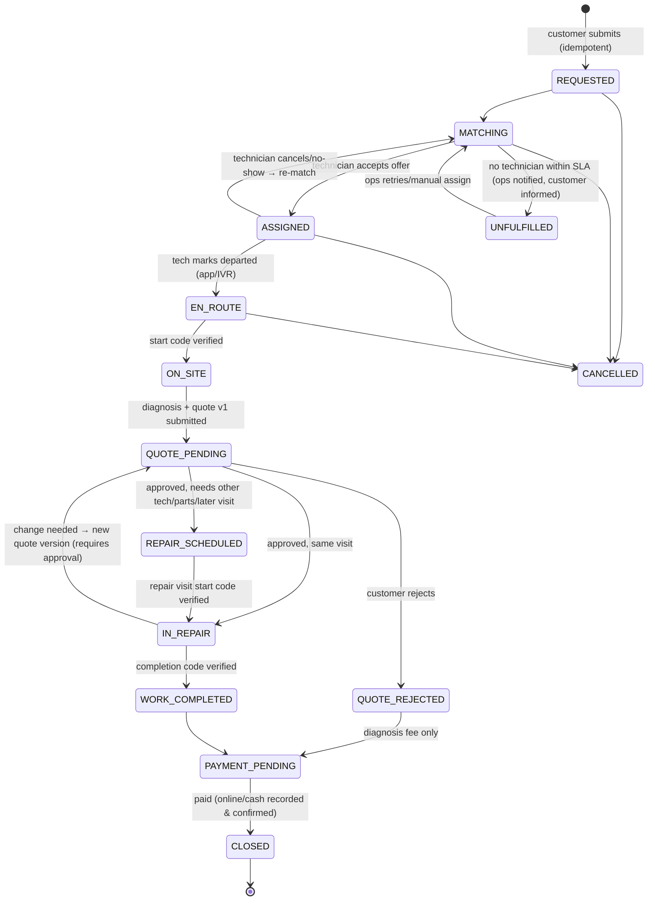

# Phase 0 · Part 1 — Product (Sections 1–6)

> Status: **DRAFT for review** · Date: 2026-10-08 · Owner: Founding tech team
> Nothing in this document is final until the questions in [05-delivery.md §24](05-delivery.md#24-questions--assumptions-to-resolve-before-coding) are answered.

---

## 1. Product vision

**Vision statement**
> Any household in a Tier-2/Tier-3 Indian city can get a trustworthy, fairly priced home repair, and any skilled local technician can earn from it with dignity, whether or not they own a smartphone.

**What makes Housefi different**

| Typical metro marketplace | Housefi |
|---|---|
| Technician must have a smartphone app | **Phone-agnostic workforce.** Smartphone app, basic phone (IVR/voice), or field-agent assisted. All three are first-class. |
| Customer picks a fixed-price SKU ("AC gas refill ₹2,499") | **Customer describes a symptom** ("AC chal raha hai par thanda nahi kar raha"). A technician diagnoses it and gives an itemised quote. The customer approves it before any work starts. |
| GPS-centric dispatch | **Zone/locality-centric dispatch.** GPS is an optional extra, used only with consent. |
| Penalties are automated on ratings and complaints | **Investigation before penalty**, with appeals, so technicians are treated fairly. |
| English-first UI | **Local language and voice first.** Large targets, icons, minimal text. |
| Trust signal is a star rating | **Layered trust:** verified identity, background check, skill verification, warranty, transparent quotes, human support. |

**North-star metric (proposed):** *Trusted Completed Jobs per week.* A job counts when it was completed, paid, and had no upheld complaint, dispute or warranty failure within its warranty window. This metric punishes growth that harms trust.

**Guardrail metrics:** median technician net earnings per active day · job fill rate · time-to-assign · quote approval rate · no-show rate (both sides) · safety incidents per 1,000 jobs · dispute resolution time · repeat-customer rate.

---

## 2. Target users

### 2.1 Customers

| Persona | Profile | Implications |
|---|---|---|
| **Sunita, 46, homemaker, Gorakhpur** | Hindi only. Uses WhatsApp and YouTube on a shared ₹8k Android. Pays by UPI via her son, or in cash. | Hindi UI, voice input, big icons, WhatsApp updates, cash option, simple status screens. |
| **Rahul, 29, bank employee, Nashik** | Comfortable with apps, uses UPI daily, works long hours. | Fast booking, scheduled slots, clear pricing, digital invoice, warranty record. |
| **Mr. Iyer, 68, retired, Madurai** | Prefers phone calls. Distrusts apps. Lives alone or with spouse. | **Phone/assisted booking** by calling a number. Safety features. Agent callbacks. Tamil support. |
| **Later:** small shop owners, landlords, PG operators | Repeat jobs at several addresses. | Multiple addresses (supported now). B2B later. |

### 2.2 Technicians

| Persona | Profile | Implications |
|---|---|---|
| **Ramesh, 42, plumber** | Button phone. Hindi/Bhojpuri. 15 years of experience. Has a Jan Dhan bank account and prefers cash. Gets work from a hardware shop. | IVR job offers. Daily zone check-in by call or missed call. Payouts to a bank account. Agent-assisted onboarding. No forced app. |
| **Imran, 27, appliance technician (refrigerator, AC)** | Low-end Android (2–3 GB RAM). Patchy 4G. Works for a local shop and also freelances. | Lightweight Android app. Offline queue. Big Accept/Reject buttons. Earnings shown before accepting. |
| **Kavita, 31, electrician (ITI/PMKVY trained)** | Smartphone user. Safety-conscious. | Customer-safety and technician-safety features, the ability to decline jobs, women-customer preference matching (opt-in). |
| **Helper/apprentice** | Works under a senior technician. | Later: team/crew model. V1: not modeled separately. |

### 2.3 Field / service agents
Local people the platform contracts to onboard technicians and help them: document collection, explaining jobs, IVR training, and resolving issues for basic-phone technicians. Examples: a hardware-shop owner or a community coordinator. **High fraud risk.** They are tightly scoped, audited and paid per *verified outcome*, not per signup.

### 2.4 Internal users
Support agent (L1/L2), dispatch/ops desk, verification officer, safety officer, finance/reconciliation, pricing/catalog admin, city manager, auditor (read-only), super-admin (break-glass only).

---

## 3. Core problems being solved

**Customers**
1. **Trust:** a stranger enters the home. Who is this person, and are they verified?
2. **Price opacity:** "₹200 for checking", then ₹1,500 with no explanation. Prices change mid-job.
3. **Unreliability:** no-shows, "kal aaunga", nobody to call.
4. **Technical vocabulary:** the customer cannot say "capacitor failure". They can only say "not cooling".
5. **No recourse:** no warranty record, no dispute mechanism, no proof of what was done.
6. **Language and literacy barriers** in most apps.

**Technicians**
1. **Irregular demand:** depends on word of mouth and shop referrals, with middlemen taking a cut.
2. **Digital exclusion:** most platforms require a smartphone and English-ish literacy.
3. **Unfair platform treatment:** automated penalties, opaque deductions, deactivation without a hearing.
4. **Late or uncertain payment,** including customers haggling after the work is done.
5. **No safety net:** accidents, tool theft, health shocks.
6. **Reputation isn't portable:** 15 years of skill leaves no verifiable record.

**Market**
- Supply is fragmented and quality is inconsistent. Metro-focused players under-serve Tier-2/3 because their model assumes smartphone-native supply and higher ticket sizes.

---

## 4. V1 scope

**Principle:** V1 runs in **one pilot city**, with **3 categories** and **real money, real customers and real technicians**. It is production-grade in security, data handling and reliability, and deliberately narrow in features.

| Area | In V1 |
|---|---|
| Geography | 1 pilot city, divided into admin-defined service zones and localities. The data model is multi-city from day one. |
| Categories | **Plumbing, Electrical, Appliance & Home Equipment** (revised 2026-10-08, ADR-020). Under each category, **service types** (e.g., Refrigerator, RO/Water Purifier, AC under Appliance & Home Equipment) are enabled per city by configuration, each with its own **repair catalog** (standard repair codes with reference prices). The pilot enables a small validated subset. |
| Customer channels | (a) Mobile-first **PWA** (installable, low-bandwidth). (b) **Phone booking** through the ops desk (agent-assisted). (c) **WhatsApp/SMS** notifications and approval links. |
| Customer features | Phone+OTP login. Choose category. Describe the problem with tap-to-choose symptoms, optional voice note or text, optional photo. Address with landmark and map pin. Choose "As soon as possible" or a slot. See the visit/diagnosis fee upfront. Track status. See verified technician info. Approve/reject the quote. Pay by UPI or cash. Invoice. Warranty record. Rate. Complain. SOS. Data rights requests. |
| Technician: smartphone | Android app with OTP login, profile, KYC docs (via agent/verification desk), skills, zones, availability toggle, job offers with expected earnings, accept/reject, job details, navigation hand-off (opens maps app), arrival via customer **start code**, structured diagnosis (repair catalog + custom items), photos, quote, completion via **completion code**, cash collection record, earnings and ledger, history, ratings, support, SOS, offline action queue. |
| Technician: basic phone | IVR job offers (accept/reject/repeat). SMS job summary after acceptance. Inbound IVR for arrival check-in (job code + start code), status, completion, availability/daily check-in, earnings summary, SOS, connect to agent. **Diagnosis is captured through the ops desk**: the technician calls, an agent enters it with the repair catalog, and the customer approves on their own phone. |
| Field agents | Assisted onboarding, document capture, technician support and on-behalf actions. These are scoped and audited in the admin console. |
| Matching | Rule-based filtering plus weighted scoring. Sequential/cascading offers. Fairness rotation. Configurable weights. Every decision is logged. |
| Diagnosis & quote | First-class diagnosis entity. Versioned, immutable quotes. Any change creates a new version that needs customer approval. Material reference prices with markup rules. |
| Pricing | Everything is configured in admin: versioned, effective-dated, maker-checker approved. Each job stores a snapshot of the price rules applied. |
| Payments | Online UPI/cards through a regulated payment aggregator (PA), plus cash on completion. Double-entry ledger. Refunds to source. Weekly (configurable) technician payouts to verified bank/UPI. Invoices. |
| Warranty | Configurable policies per service/repair type. Coverage is snapshotted at completion. Claims link to the original job. Free revisit for eligible claims. Dispute path. |
| Trust & safety | Two-way ratings (the technician's rating of a customer is private). Complaints, disputes with investigation and appeal, customer SOS, technician SOS (app and IVR), fraud flags, customer↔technician block lists. |
| Admin console | Core modules listed in [04-ux-admin-voice-matching.md §14](04-ux-admin-voice-matching.md#14-admin-architecture). |
| Privacy | Consent notices (Hindi + English + the pilot city's regional language), per-purpose consent, data-rights requests (access/correction/erasure/grievance), retention jobs, PII field encryption, masked calling. |
| AI (assistive only) | (1) Suggests a category/symptom from the customer's text or voice note; the customer or agent confirms. (2) Transcribes voice notes and summarizes them for ops. Both run outside the critical path behind feature flags. |
| Languages | Hindi + English + **one** regional language (depends on the pilot city; see Q2). |

---

## 5. Explicitly excluded from V1

| Excluded | Why / when |
|---|---|
| **Care Visit / Helping Hand** | Needs female-worker supply, enhanced verification, a separate safety SOP and legal review. **Schema placeholders only** (service-type eligibility rules, worker attributes, scope checklist). Feature-flagged off. |
| Insurance, health benefits, tool protection, emergency loans | Must come through **regulated partners** (IRDAI-licensed insurers/brokers, RBI-regulated lenders). V1 has only an integration-ready `benefits` module skeleton, with no money flows. |
| **Wallets, stored value, savings, credits, "Housefi cash"** | Avoids prepaid payment instrument (PPI) and deposit-taking regulatory exposure. Refunds always go back to the original payment method. |
| Technician loans/advances, EMI for customers | Regulated lending. Possible later through partners only. |
| Customer native app (Android/iOS) | The PWA covers V1. Build native when retention data justifies it. |
| Real-time continuous GPS tracking of technicians | Privacy cost is high and V1 does not need it. Only a one-time "share my location now" with consent. |
| In-app chat between customer and technician | Moderation and safety burden. **Masked calls** cover the need. |
| Surge/dynamic pricing | Hurts trust in a new market. Pricing is only configurable, not algorithmic. |
| Subscriptions/AMC plans, B2B accounts | Later, once the core loop works. |
| Referral/promo engine beyond simple admin-issued coupons | Referral programs attract fraud. Add with fraud controls later. |
| Material marketplace/inventory, parts supply chain | Technicians buy locally in V1, using reference price lists. |
| Fully autonomous voice-AI agent for technicians | V1 is DTMF-first IVR, with optional speech recognition plus confirmation and a human fallback. |
| Public free-text reviews | Moderation and defamation risk. V1 shows star aggregates and curated tags ("On time", "Explained clearly"). Text is visible to ops only. |
| Multi-city launch, iOS technician app | Architecture supports both; operations don't yet. |
| Tipping | Possible V1.1. It adds payment complexity and expectation pressure on customers. |

---

## 6. Complete user journeys

### 6.0 Job lifecycle (canonical state machine)

The customer-facing **Job** is distinct from the physical **Visits** and from the **Assignments** that link technicians to it. This separation is what makes "a different technician does the repair", revisits and warranty jobs clean to model.



Cross-cutting **flags** (not states): `has_open_complaint`, `has_open_dispute`, `safety_hold`, `warranty_parent_job_id`. A dispute never rewrites job history. It produces adjustments: refunds, ledger corrections, penalties.

Every transition is: (1) validated by the state machine, (2) written to `job_status_history` (append-only) with actor, channel (app/ivr/agent/system) and reason, and (3) published as a domain event through the transactional outbox.

### 6.1 J1 — Customer books via PWA (happy path)

1. Customer opens the link from WhatsApp/Google. The language is auto-detected from the browser and city, with a one-tap switch.
2. Picks a category from **3 big icon tiles** (Plumbing / Electrical / Appliances), then an appliance tile where relevant (e.g., Refrigerator, RO, Washing Machine). Only service types enabled for the city are shown.
3. **Describes the problem** in one of three ways:
   - taps symptom chips ("Not cooling", "Water leaking", "Making noise", "Not starting", "Other"), *or*
   - holds the 🎤 button and speaks (voice note, ≤60 s), *or*
   - types. A photo is optional.
   - AI suggests a service type and symptom ("Appliances → Refrigerator – Not cooling"). **The customer confirms. Nothing is auto-committed.**
4. Address: "Use my location" (one-time, with consent) or locality search. The **landmark field is mandatory** ("Near Hanuman Mandir, blue gate"). House/flat number is required. Saved for reuse.
5. When: **"As soon as possible"** or a slot (today/tomorrow, 2-hour windows).
6. **Price screen, before booking:**
   ```
   Visit & diagnosis fee      ₹149
   (adjusted in your repair bill if you go ahead)
   Repair cost                Technician will check and show you the price.
                              No work starts without your approval.
   ```
7. Login is deferred to here: phone → OTP (auto-read on Android via WebOTP). The booking is created with a client-generated **request ID** (idempotent; see [02 §7.6](02-architecture-stack-data.md#76-reliability-patterns)).
8. Status screen: *Finding technician → Technician assigned (photo, first name + initial, verified badges, rating, languages) → On the way → Arrived*. Updates are mirrored to WhatsApp/SMS.
9. Customer receives a **4-digit start code** to give the technician only when they are at the door. This verifies arrival without GPS.
10. → Diagnosis and quote journey (6.5).

**Edge cases:** no technician found within the SLA → honest message with options ("Schedule for tomorrow morning" / "Request a callback"), and ops is alerted. Customer outside service zones → "Not yet available in your area. Notify me" (stores only phone + locality, with consent).

### 6.2 J2 — Customer books by phone (assisted)

1. Customer calls the Housefi number → IVR language selection → "Press 1 for new repair, 2 for existing booking, 9 for an agent".
2. An ops agent books on the customer's behalf in the admin console. The record shows `channel=agent` and `created_by=agent_id`.
3. The customer receives an **SMS/WhatsApp confirmation with an OTP-protected link**. Booking without the customer's OTP is allowed, but the job is marked `customer_unverified` until the first contact succeeds. This prevents fake bookings against someone else's number.
4. All later approvals happen through the link, or through an **outbound IVR approval call** to the customer's number ("Total ₹400. Press 1 to approve, 2 to reject, 3 to talk to an agent").

### 6.3 J3 — Smartphone technician job lifecycle

1. **Offer** arrives as a high-priority push with a full-screen notification and sound. Offer card:
   ```
   🔧 Refrigerator — Not cooling  [Diagnosis visit]
   📍 Civil Lines (≈3.2 km)       ⏰ Today 4–6 PM
   💰 You earn: ₹120 for visit
      + typical repair earnings ₹200–₹600
   🗣 Customer language: Hindi
   [ ✅ ACCEPT ]      [ ❌ REJECT ]      ⏳ 0:58
   ```
   Rejecting asks for an optional reason (one tap) and is **not penalized** below a configurable threshold.
2. On accept: the exact address, landmark, customer first name and a **masked call** button are revealed. "Navigate" opens Google Maps/Mappls with the pin.
3. "I'm leaving now" → status EN_ROUTE. This timestamp matters for cancellation compensation.
4. At the door: the technician asks for the customer's start code and enters it → ON_SITE. Wrong code: 5 attempts, then lockout and ops is alerted.
5. **Diagnosis** (6.5) → quote → wait for customer approval in-app (push received when approved).
6. Repair. Material receipts (photo) are needed above a configurable value. A required change goes through a new quote version.
7. Completion: the technician takes after-photos (optional/required per service type) and asks for the customer's **completion code** → WORK_COMPLETED.
8. Payment: the customer pays online (the technician sees "Paid ✓") or in cash (the technician taps "Cash received ₹400"; the customer is asked to confirm on their phone or IVR).
9. Earnings screen updates: gross, commission (explicit line), net, payout date.

### 6.4 J4 — Basic-phone technician job lifecycle

**Offer (outbound IVR call)**, pre-recorded human voice plus TTS for the dynamic parts:
> "Namaste Ramesh ji. Housefi se bol rahe hain. Aapke liye ek **plumbing** ka kaam hai. Jagah: **Civil Lines, Hanuman Mandir ke paas**. Samay: **aaj shaam 4 se 6 baje**. Is visit ke liye aapki kamaai: **ek sau bees rupaye**, aur repair hone par alag se. Kaam sweekar karne ke liye **1** dabayein. Mana karne ke liye **2**. Dobara sunne ke liye **3**. Kisi agent se baat karne ke liye **9**."

- **1** → "Dhanyavaad. Kaam aapka hai. Job number **4-7-2-9**. Poora pata SMS mein bheja gaya hai." The SMS carries a job code, locality, landmark, address and the masked customer number. Retention is limited (see privacy).
- **2** → optional reason ("1 busy, 2 too far, 3 not my skill"). No penalty.
- No answer/busy → one retry after a configurable delay, then the offer moves to the next candidate. Unanswered calls are **not** counted as rejections for reliability scoring.
- Speech: "haan"/"nahi" accepted when ASR confidence is ≥ threshold, **always confirmed with "Aapne haan kaha. Sahi hai to 1 dabayein."**

**Departure / arrival / completion (inbound IVR, toll-free)**
1. The technician calls the toll-free Housefi technician line. Caller ID is matched to the registered number and a 4-digit **IVR PIN** is asked (PIN is only required for sensitive actions).
2. Menu: "1 Nikal gaye hain · 2 Pahunch gaye · 3 Kaam poora · 4 Aaj ki uplabdhata · 5 Kamaai · 8 Madad/SOS · 9 Agent".
3. Arrival: enter job code `4729` → enter the customer's start code → "Code sahi hai."
4. **Diagnosis via ops desk (V1):** at the site, the technician presses "Diagnosis batana hai". The call is bridged to the ops desk (or callback within N minutes). The agent asks structured questions and selects **repair-catalog items** ("AC indoor wiring repair, wire 2 m, connector"). The system computes the quote. The quote goes to the **customer's phone** as WhatsApp/SMS link + IVR call. The agent never approves on the customer's behalf.
   - V1.1 option: keypad repair codes for the top ~20 standard repairs per category ("Capacitor badla: 21 dabayein").
5. Completion: job code + customer's completion code → done. The customer gets the payment link, or the cash confirmation prompt.
6. After completion: an SMS with the earnings summary. The address is no longer retrievable via IVR.

**Daily availability (journey J12)**
- Morning outbound call (opt-in, time chosen by the technician) or a **missed call** to a dedicated number:
  > "Kya aap aaj kaam ke liye uplabdh hain? Aapka kshetra: Civil Lines. 1 haan, 2 nahi, 3 kshetra badalna hai."
- "3" offers a **pre-registered** secondary locality list, so no free-text location is needed.
- This creates a `technician_daily_checkin` row, which is the strongest location signal for non-GPS technicians.

### 6.5 J5 — Diagnosis → quote → approval → repair

1. The technician (app) or ops agent (basic phone) creates a **Diagnosis**:
   - problem category (from catalog), observed issue (chips + optional voice note), severity (`minor/moderate/major/safety_hazard`), recommended repair (one or more **repair-catalog items** or a custom item with a reason), materials (catalog material + qty + unit price; reference price shown; deviation >X% needs a reason/receipt), labour (catalog price, editable within a configured band ±Y% with reason), photos, notes.
   - `safety_hazard` (e.g., exposed live wire): the customer is shown a plain-language safety note. The technician may recommend not using the appliance. **This is never upsold.**
2. The system produces **Quote v1** from the diagnosis using the active rate card snapshot:
   ```
   Problem: Damaged indoor wiring (AC)
   ─────────────────────────────────────────
   Labour – wiring repair                 ₹250
   Wire (2 m) + connector                 ₹150
   Visit & diagnosis fee                  ₹149
   Less: diagnosis fee adjusted          −₹149
   ─────────────────────────────────────────
   Total to pay                           ₹400
   Warranty: 30 days on this repair
   ```
   (GST lines appear when applicable; see Q5 on tax model.)
3. Customer approval on **their own device/number only**: in-app tap, WhatsApp/SMS link (signed, single-use, expiring, plus session or OTP), or outbound IVR. The approval record stores channel, timestamp, the exact quote version hash, and the device/call ID.
4. Rejected → the customer pays only the visit fee. The technician is still paid the visit payout. The job closes with reason codes, which help detect technicians whose quotes are always rejected.
5. Approved:
   - **Same-visit repair** (default when the technician has the skill and materials are obtainable). The technician may go out to buy material; the job stays IN_REPAIR with an optional "Buying material, back in ~30 min" status.
   - **Separate repair assignment** when a different skill/specialization is needed or parts must be ordered. The diagnosing technician is offered the repair first if eligible; otherwise matching runs again with the `required_skill` from the diagnosis. The customer sees the new technician's profile.
6. **Mid-repair change** (found a second fault): the technician submits **Quote v2**. Work on new items **must not proceed** until v2 is approved. Quote v1 stays immutable. The final invoice can only equal an approved quote version (enforced in the DB; see [02 §9](02-architecture-stack-data.md)).
7. Material actually used is recorded (`material_usage`). Unused quoted material leads to an invoice reduction, never an increase.

### 6.6 J6 — Payment & payout

- **Online:** the customer pays via a PA payment page/UPI intent/QR shown on the customer's phone. The status is confirmed **only by server-side verification + signed webhook**, never by the client redirect.
- **Cash:** the technician records the amount. The customer confirms ("Did you pay ₹400 in cash? 1 Yes 2 No"). If they don't match, a dispute is raised automatically. The platform's commission on cash jobs becomes a **receivable** from the technician in the ledger and is netted against future payouts. Above a configurable negative balance, cash jobs pause until settled, and the technician is told why.
- **Payout:** on a configured schedule (default weekly) to a **verified** bank account/UPI. The account is checked by penny-drop/name-match. Any payout-method change has a cooling period plus SMS alert plus agent verification. The statement shows gross, platform commission, fees and net, per job.
- **Invoice:** generated at closure. Who the issuer is (technician vs platform, marketplace model) depends on Q4/Q5.

### 6.7 J7 — Warranty claim

1. The customer opens a past job → "Problem came back" (or calls support). The system checks the **coverage snapshot**: within the window, same appliance/area, covered repair type.
2. Eligible → a **warranty job** is created with `warranty_parent_job_id`, **no visit/diagnosis fee**, and is offered first to the original technician (configurable) with a "warranty revisit" label.
3. The technician (or a different one) diagnoses it as either *same issue (covered)* or *new/unrelated issue (not covered)*. If not covered, the customer sees why and gets a normal quote. They can **dispute** it, which creates a human review with photos from both jobs.
4. Who bears the revisit cost (original technician unpaid / partially paid / platform-funded) is configurable per policy (Q14).
5. Ineligible (expired, different issue) → a clear explanation plus a "Book normal service" option and an "I disagree" link to support.

### 6.8 J8 — Cancellation & no-show

| Scenario | Default handling (all values configurable) |
|---|---|
| Customer cancels before assignment | Free. |
| Customer cancels after assignment, **before** technician departs | Free, or a small fee after the configured grace window. |
| Customer cancels **after** technician departed (EN_ROUTE) | Cancellation fee. The technician gets **travel compensation** (shown in their earnings). |
| Customer not home / doesn't open (technician on site, verified by location/call attempts) | The technician must call through masked calling (logged) and wait a configured time. After that, the job becomes a customer no-show: the technician is compensated and the customer is charged per policy. Disputable. |
| Customer makes technician wait beyond grace | **Waiting fee**: grace minutes, rate per block, cap. Shown to the customer in real time ("Technician waiting since 4:10"). |
| Technician cancels before departure | Automatic re-match with priority. The customer is notified. The technician gets a reliability event (weighted; reason codes; small counts forgiven). |
| Technician no-show | The customer gets priority re-match and optional fee waiver/goodwill (no wallet; discount on the next order or refund to source). The technician gets a no-show event → review, never automatic deactivation on a single event. |
| Technician cancels on site (unsafe/abusive situation) | **No penalty.** Safety flow (6.10). The customer may be blocked. |

### 6.9 J9 — Complaint → investigation → dispute

1. The customer or technician raises a complaint (app/IVR/call/WhatsApp), selects a type, and adds a description/voice note/photos.
2. Triage: automatic category + severity → **SLA queue**. Safety categories go straight to the safety officer.
3. The investigation collects job timeline, quote versions, approvals, call metadata, photos, and both parties' statements. **The technician is notified and heard before any penalty.**
4. Outcomes: no action / refund (partial/full, to source) / free revisit / technician coaching / warning / temporary suspension / deactivation (needs senior approval) / customer warning/block.
5. Either party can **appeal** once to a different reviewer.
6. Unsubstantiated complaints never affect technician metrics. Only *upheld* complaints count toward complaint rate.

### 6.10 J10 — SOS & safety

| Who | Trigger | What happens |
|---|---|---|
| Customer (PWA) | Persistent "Help/SOS" in active job | Two choices: **"Call 112 now"** (dials directly; we never delay emergency services) and **"Alert Housefi safety team"** → P1 incident with job context, the technician's identity, last known location; safety-officer callback SLA (e.g., ≤5 min); call recording with consent. |
| Technician (app) | SOS button always visible during jobs | Same options. The technician may leave the site with no penalty. |
| Technician (basic phone) | Dedicated **SOS number** (also menu option 8) | Calling or missed-calling from the registered number → P1 incident tied to their active job → immediate callback by the safety desk. |
| Silent/false SOS | — | Every SOS is handled as real. Abuse is dealt with only after review. |

The safety officer can put a **safety hold** on a job, suspend a party pending investigation, and escalate to police/legal per SOP. Safety incidents are **Restricted** data.

### 6.11 J11 — Technician onboarding

1. **Self (smartphone):** phone+OTP → name, languages, skills, experience, primary/secondary localities → document upload (ID, address proof, skill certificates optional) → bank/UPI → video/phone interview slot → BGV consent → skill check (practical or test job) → **Active (Probation)**.
2. **Agent-assisted (basic phone):** the agent meets the technician and captures details in the admin field-agent view → consent is captured **from the technician's own phone** (OTP via IVR/SMS plus a recorded verbal consent in their language) → documents photographed by the agent → the verification officer (not the agent) approves → **IVR training call** with a practice job.
3. Verification levels are shown as badges: `phone_verified` → `identity_verified` → `background_verified` → `skill_verified`. **Job eligibility per service type requires a minimum level** (configurable). Care Visit, when it exists, will need the highest level.
4. Aadhaar: **no Aadhaar number storage.** Use DigiLocker or a licensed KYC provider; store only the verification result, a reference ID and the masked last 4 digits.

### 6.12 J13 — Customer data-rights request

Profile → Privacy → "Download my data / Correct / Delete my account / Withdraw consent / Grievance". Identity is re-verified by OTP. Requests are tracked with SLAs. Deletion runs **erasure or anonymisation of PII** while keeping legally required financial records in pseudonymised form. The customer gets a confirmation that lists what was retained and why.

### 6.13 J14 — Ratings

- After closure, the customer gives 1–5 stars plus optional tags ("On time", "Explained problem", "Clean work", "Polite"). Negative tags lead to an optional follow-up.
- The technician rates the customer (private; used for safety and matching).
- Ratings are tied to verified completed jobs only, one per job per side, editable for 48 h, then locked.
- Displayed technician ratings use **Bayesian smoothing** with a minimum-count threshold.
- Segment-specific stats (e.g., ratings from women customers) appear only above a k-threshold (e.g., ≥20 ratings from ≥15 distinct customers), and only if the self-declared gender data is collected with consent (Q17).
