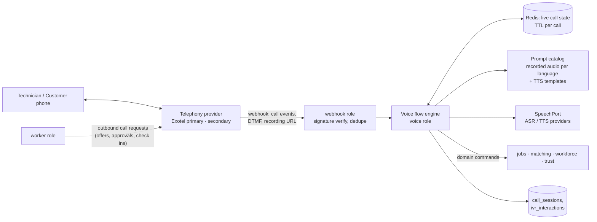

# Phase 0 · Part 4 — UX, Admin, Voice/IVR, Matching (Sections 12–16)

> Status: **DRAFT for review** · Date: 2026-10-08

---

## 12. Customer UX principles

**Design target:** a 50-year-old first-time smartphone user, on a ₹8k Android with a cracked screen, on patchy 3G, reading Hindi slowly, must be able to book a repair in **under 90 seconds without help**.

| # | Principle | Concrete rule |
|---|---|---|
| 1 | **One decision per screen** | Booking takes ≤ 5 screens: Category → Problem → Address → Time → Confirm. No forms with more than 3 inputs. |
| 2 | **Icons + words, never words alone** | Every tile has a recognisable illustration plus a 1–3 word label in the user's language. |
| 3 | **Big touch targets** | ≥ 48×48 dp, primary buttons full-width ≥ 56 dp tall, ≥ 8 dp spacing. Primary action always bottom-fixed (thumb zone). |
| 4 | **Speak instead of type** | 🎤 on every free-text field (voice note recorded and stored; transcription assistive). Symptom chips preferred over typing. |
| 5 | **Local language by default** | Language picked once (big flags/script samples: "हिन्दी", "मराठी", "English"). Changeable from every screen's header. Numbers in Indian format (₹1,25,000). |
| 6 | **Price before commitment** | The visit fee and "No work without your approval" are visible **before** login and booking. Quotes show line items with plain-language labels and a single bold total. |
| 7 | **Status always obvious** | Single progress tracker with icons (🔍 Finding → 👤 Assigned → 🛵 On the way → 🏠 Arrived → 🔧 Working → ✅ Done). The same messages are sent on WhatsApp. |
| 8 | **Who is coming** | Technician photo, first name, verified badges explained in one line ("ID checked by Housefi"), rating, languages, and a **call button (masked)**. |
| 9 | **Help is one tap away** | "Need help?" on every screen → call support / WhatsApp support / SOS (during active jobs). |
| 10 | **Forgiving** | Undo for cancellations within seconds. Confirmations for irreversible actions in plain words ("Cancel booking? Technician is already on the way. ₹50 will be charged."). |
| 11 | **Low bandwidth** | Initial load ≤ 200 KB (HTML+CSS+critical JS). Images lazy-loaded at small sizes. System fonts plus Noto Sans for Indic scripts (subset). Offline shell with cached last job status. Retry queue for actions. No autoplay video. |
| 12 | **Accessibility** | **WCAG 2.2 AA**: contrast ≥ 4.5:1, text scales to 200% without breakage, screen reader (TalkBack) labels in local language, no colour-only meaning, focus order, captions for any audio/video. Minimum body font 16 px (18 px default for Indic scripts). |
| 13 | **Trust language** | No dark patterns. No fake urgency, pre-ticked consents or hidden fees. Cancellation as easy as booking. |
| 14 | **Assisted parity** | Everything possible in the app is possible by calling the support number. |

**Key screens (V1):** Language → Home (3 category tiles + "My bookings" + "Help") → Problem (chips/voice/photo) → Address (pin + landmark) → Time → Price & confirm → OTP → Tracking → Quote approval → Payment → Rating → Invoice & warranty card → Profile/Privacy.

**UX risks to test early:** (1) Do customers understand that the "visit fee" is adjusted against the repair? (2) Will they accept a two-step price (visit fee, then quote)? (3) Do they trust the masked number? (4) Can they find and read out the start code? (Test with 15–20 real users in the pilot city before Phase 5 is finalised.)

---

## 13. Technician UX principles

**Design target:** a technician with gloves on or dirty hands, in sunlight, limited reading ability, on a 2 GB RAM phone with intermittent data, has to understand an offer **in 3 seconds** and act with **one tap**.

| # | Principle | Concrete rule |
|---|---|---|
| 1 | **Job info first** | Home is either "No jobs right now — you're Online ✅" or the current/next job card. No feeds or banners. |
| 2 | **Earnings visible before accept** | Every offer shows "You earn ₹X" (visit payout) plus the typical repair earning range. **Net of commission**, with a link to the breakdown. |
| 3 | **Huge Accept/Reject** | Two half-screen buttons (green ✅ / grey ❌) with icons and words. Countdown visible. A **read-aloud** of the offer in the technician's language (TTS, auto-play option). |
| 4 | **Minimal typing** | Diagnosis is built from catalog chips and steppers (+/– quantity). Material search by icon and voice. Free text optional. Voice notes allowed. |
| 5 | **Offline-friendly** | Job details cached on accept. Actions queued offline with clear "Saved — will send when online" state. Photos compressed (≤ 200 KB) and uploaded in background with resume. |
| 6 | **Safety always visible** | Persistent red SOS button on every job screen (and in notification during active job). Long-press, or tap + confirm, to avoid accidental triggers. |
| 7 | **Clear money** | Earnings tab: Today / This week / Next payout date. Each job shows gross → commission → net. Cash jobs show "Commission to settle". No unexplained numbers. |
| 8 | **Respectful tone** | Neutral language; "Not available" instead of "Rejected". Reasons for any reliability flag shown with a way to explain/appeal. |
| 9 | **Low-end device budget** | Cold start ≤ 4 s on a 2 GB device, APK ≤ 30 MB, memory ≤ 150 MB, works on Android 8+. Dark/high-contrast mode for sunlight. |
| 10 | **Shared-phone safe** | Optional app lock. Customer details hidden from notifications on the lock screen. Job data purged from device after closure + 24 h. |
| 11 | **Training built in** | First-run walkthrough with voice. A "Practice job" mode. Help videos ≤ 60 s, small size, in the local language. |
| 12 | **Parity with IVR** | Core flows map 1:1 to IVR options, so technicians can switch modes (phone broken → IVR still works). |

**Key screens:** Login (OTP) → Status toggle (Online/Offline + today's area) → Offer (full screen) → Job (address, call, navigate, "Leaving", "Arrived – enter code") → Diagnosis builder → Quote preview → Waiting for approval → Work → Completion code → Payment status → Earnings → History → Profile/Documents → Support/SOS.

---

## 14. Admin architecture

### 14.1 Principles
- **Separate app, separate auth realm, separate network path** (see 10.9).
- **Task-oriented work queues** instead of raw CRUD tables. An ops agent's day is spent in queues (Unassigned jobs, Pending verifications, Disputes due today, SOS).
- **Masked by default. Reveal is audited.** **Maker-checker** on money, pricing and access.
- **City scoping:** every admin grant has a scope. Lists filter by scope automatically.
- Every mutation goes through the same domain module facades as the public API (no "admin backdoor" SQL), with `actor_type=admin`.

### 14.2 Modules

| Module | Key capabilities |
|---|---|
| **Live ops / dispatch** | Map and list of open jobs by status and SLA. Unfulfilled jobs. Manual assignment (with reason). Offer cascade visibility. Call-out to technicians/customers through masked bridge. |
| **Customers** | Search by phone hash/job ref. Profile (masked). Jobs. Complaints. Blocks. Data-rights requests. |
| **Technicians** | Onboarding pipeline. Profile. Skills. Areas. Availability. Device mode. Metrics. Sanctions & appeals. Agent links. Payout methods (finance-only reveal). |
| **Verification** | Document review queue (side-by-side view, zoom, no download by default). BGV vendor status. Decisions with reason codes. Expiry tracking. |
| **Field agents** | Agent roster. Linked technicians. Agent performance and fraud signals (onboard → active conversion, early-churn, duplicate documents). |
| **Jobs** | Full timeline (status history, offers, calls, diagnosis, quote versions, approvals, payments) on one screen. |
| **Service zones / geo** | Draw/edit zone polygons. Localities and aliases (local names, Hindi/regional spellings). Coverage heatmap (supply vs demand). |
| **Catalog** | Categories, service types, symptoms, repair catalog (with keypad codes), materials, translations. |
| **Pricing** | Rate cards (draft → approval → scheduled activation), fee rules, commissions, cancellation/waiting policies. **Simulator:** "what would this job cost and what would the technician earn under draft vs active?" |
| **Payments & refunds** | Payment search. Refunds (threshold-based approval). Cash reconciliation. Technician balances. Payout runs (preview → approve → execute). PA reconciliation exceptions. |
| **Complaints & disputes** | Queues by SLA and severity. Evidence panel. Investigation notes. Outcomes with templated communications. Appeals routed to a different reviewer. |
| **Warranty** | Policies (versioned). Claims queue. Eligibility overrides (with reason). Cost-bearer outcomes. |
| **Safety** | SOS live board (P1 alerts with sound). Incident timeline. Safety holds. Escalation SOP checklist. Restricted access. |
| **Ratings** | Distributions. Flagged ratings (suspected manipulation). Review text moderation. |
| **Voice calls** | Call logs (metadata). IVR funnel analytics (drop-off per step). Failed-call queues. Prompt catalog (recordings per language). Recordings (restricted, consent-checked). |
| **Fraud** | Signals dashboard. Linked-entity graph (shared devices/phones/bank accounts/addresses). Case management. |
| **Analytics** | Funnel, fill rate, time-to-assign, quote approval, technician earnings distribution, cancellation reasons, zone supply/demand. Pseudonymised. |
| **Audit logs** | Search by actor/resource/time. Export restricted to the auditor role. Hash-chain verification status. |
| **Access management** | Roles, permissions, scoped grants, JIT elevation, access reviews. |
| **Config & flags** | Feature flags, kill switches (AI, providers), notification templates, DLT template mappings. |

### 14.3 Roles (initial)

| Role | Scope | Notable permissions | Not allowed |
|---|---|---|---|
| Support L1 | City | View jobs (masked), create complaints, book on behalf, resend notifications, reveal phone **with reason** | Refunds, pricing, verification decisions |
| Support L2 | City | L1 + refunds ≤ threshold, goodwill, dispute investigation | Payouts, pricing |
| Dispatch/Ops | City | Manual assignment, offer management, technician availability edits on behalf (logged) | Payment actions |
| Verification officer | City | Document access, verification decisions | Job/payment edits |
| Safety officer | City/Region | Safety board, holds, suspensions pending investigation, restricted incident data | Pricing, payouts |
| Finance | Global | Payouts, reconciliation, refunds > threshold (as checker), payout-method reveal | Verification, safety data |
| Pricing admin | City | Draft rate cards/fees (maker) | Approve own changes |
| City manager | City | Checker for pricing/zone changes, sanction approvals, reports | Role grants |
| Auditor | Global (read-only) | Audit logs, configs, history | Any mutation, PII reveal |
| Security admin | Global | Role grants (maker-checker), access reviews | Business operations |
| Super-admin | Break-glass only | Everything | Routine use |

---

## 15. Voice / IVR architecture

### 15.1 Components

- **Flow definitions are data, not code:** versioned JSON/YAML state machines (nodes: play prompt, gather DTMF, gather speech, confirm, branch, call domain command, bridge to agent, hang up). They are validated at load, unit-tested with simulated inputs, and editable only through deploys in V1 (admin editing later).
- **Prompts:** fixed sentences are **pre-recorded by native speakers** for each language (better comprehension and trust than TTS). Dynamic parts (amounts, times, locality names) are TTS. **High-frequency locality names are pre-recorded** for quality. Prompts are cached at the provider where supported for latency.
- **Response latency:** the provider expects flow responses fast. The voice role keeps call state in Redis, makes no slow downstream calls in the hot path, uses pre-computed offer details, and falls back to a "please hold" prompt plus async processing.

### 15.2 Call flows (V1)

| Flow | Direction | Summary |
|---|---|---|
| **Job offer** | Outbound | Greeting by name → job summary → 1 accept / 2 reject / 3 repeat / 9 agent. Accept → confirmation + job code + SMS. Timeout/no input twice → treated as unreachable (no penalty) → next candidate. |
| **Technician hotline** | Inbound (toll-free) | Caller-ID lookup → language → menu (departed / arrived / diagnosis via agent / completed / availability / earnings / help / SOS). PIN for job-state actions. |
| **Daily check-in** | Outbound (opt-in time) or missed call | Available today? Primary locality or pick a secondary. Writes `technician_daily_checkins`. |
| **Customer quote approval** | Outbound | Reads quote summary and total → 1 approve / 2 reject / 3 repeat / 9 agent. Records `quote_approvals` with `channel=ivr` and the call id. Explicit consent prompt for amounts above a threshold ("Press 1 again to confirm ₹1,850"). |
| **Customer cash confirmation** | Outbound | "Did you pay ₹400 in cash? 1 yes / 2 no." |
| **Masked calling** | Bridge | Customer ↔ technician through a virtual number bound to the job window. Calls are logged (metadata), not recorded by default. |
| **SOS line** | Inbound | Immediate P1 incident plus connection to the safety desk. No menus before connection. |
| **Customer booking line** | Inbound | Language → new booking / existing booking / agent. V1 routes to agents for booking. |

### 15.3 DTMF first, speech second

- **DTMF is the reliable baseline** (works on every phone and in noise).
- Speech input is optional per step: short closed vocabularies ("haan/nahi", numbers). It requires **ASR confidence ≥ threshold** and **always repeats back for DTMF confirmation** on state-changing actions.
- Free-form speech is used only for **problem descriptions** (recorded, transcribed asynchronously, reviewed by ops). It never directly drives a transaction.
- Two failed inputs → simpler prompt → agent transfer (business hours) or callback promise.

### 15.4 Reliability & cost

- Provider abstraction (`TelephonyPort`) with a **secondary provider** for outbound offer calls and the SOS line. Health checks and automatic failover for outbound. Inbound failover needs number-porting/forwarding (plan this with the provider).
- Call attempt policy (configurable): max 2 attempts per offer, ≥ 45 s apart, inside the technician's working hours. **No calls at night except opted-in emergency categories.**
- Per-call cost tracking (`call_sessions.cost_paise`). Budget alerts per city. IVR funnel analytics show where minutes are wasted.
- Toll fraud guard: outbound only to registered Indian numbers, per-number daily caps, no user-controlled dialing.
- Compliance: register numbers/headers as required under **TRAI TCCCPR** (transactional/service calls; confirm series requirements such as the 140/160-series rules with the provider). DLT templates for SMS. Recording announcement and consent.

### 15.5 AI in voice (phased)

| Phase | Capability | Safeguard |
|---|---|---|
| V1 | Transcribe customer/technician voice notes (async) for ops; suggest job category | Human/customer confirms; confidence threshold; redaction |
| V1.1 | Speech "haan/nahi" + digit recognition in IVR | DTMF confirmation on state changes |
| V2 | Conversational customer booking line (LLM + ASR + TTS) with structured slot-filling | Constrained outputs (enums/slots), human handoff on low confidence, full transcript review sample, no price commitments by AI |
| V2+ | Technician diagnosis by voice → structured draft quote | Draft only; agent/technician confirms; customer approval unchanged |

**AI safeguards (all phases):** AI never approves prices, assigns penalties, decides disputes, verifies identity, or handles SOS. Prompts are versioned. Inputs are treated as untrusted (prompt-injection resistant: AI output is parsed into a closed schema; no tool use with side effects). PII is redacted before the provider call. Per-request token caps and daily budget caps with kill switch. Eval sets per language. Logs are kept in a restricted store with 30–90 day retention.

---

## 16. Technician matching algorithm

### 16.1 Goals (in priority order)
1. **Safety and eligibility:** only verified, skilled, active technicians who aren't blocked.
2. **Customer outcome:** someone who will actually show up, on time, and do good work.
3. **Fairness to technicians:** work is distributed fairly. New and basic-phone technicians are not starved. No race-to-click.
4. **Efficiency:** short travel, fast assignment.
5. **Explainability:** every decision can be explained to a technician, customer or auditor.

### 16.2 Stage 1: hard filters (eligibility)

A technician is a candidate only if **all** of these hold:
- `status ∈ {active, probation}` and the verification level ≥ the service type's minimum
- Has the required skill (and specialization, if the diagnosis or service type requires one)
- **Service area covers the job locality:** primary/secondary locality match, or zone match, or (smartphone, consented) distance ≤ their declared radius
- **Available:** within the weekly schedule, no leave override, **and** (for basic-phone technicians) has checked in today *or* has a check-in policy of "always available on schedule"
- Not at capacity (configurable concurrent active jobs, default 1; next-slot bookings allowed)
- Not blocked by or blocking this customer; not under a safety hold or sanction
- Language: shares at least one language with the customer **if** the customer marked it as required (otherwise a soft score)
- Future (Care Visit): gender requirement from `service_type_rules`

Excluded candidates are recorded with an `exclusion_reason` (for coverage-gap analytics and debugging).

### 16.3 Stage 2: scoring (weighted, configurable, versioned)

`score = Σ wᵢ · fᵢ`, where each feature `fᵢ` is normalised to [0,1]:

| Feature | Definition | Default weight (illustrative) |
|---|---|---|
| Proximity | Smartphone with consented location: 1 − min(km/radius, 1). Otherwise: locality graph distance (same locality = 1, adjacent = 0.7, same zone = 0.5, secondary area = 0.4) using today's check-in or the last confirmed working area | 0.25 |
| Reliability | 1 − (weighted no-show + late-cancel rate, last 90 days, Bayesian-smoothed) | 0.20 |
| Quality | Bayesian rating: (C·m + Σratings)/(C + n), with upheld-complaint rate as a penalty | 0.15 |
| On-time | On-time arrival rate (verified by start-code time vs window) | 0.10 |
| Specialization fit | Exact specialization or assessed/certified skill level | 0.10 |
| **Fairness / rotation** | Higher if the technician has had fewer jobs/earnings today/this week relative to zone peers (reduces winner-take-all) | 0.10 |
| Acceptance propensity | Acceptance rate for similar offers (time/distance). *Only affects ordering; never penalises.* | 0.05 |
| Customer preference | Previous technician the customer rated ≥ 4 ("rebook favourite"), language match | 0.05 |
| New-technician boost | Decaying boost for the first N jobs while on probation, with a quality floor | (additive, capped) |

**Cold start:** new technicians use zone-average priors, so they are neither unfairly penalised nor over-trusted.

**What is never used:** religion, caste or any protected attribute. Gender is used **only** as a hard filter for opted-in services/preferences (Care Visit, or a customer's explicit women-technician request if offered), never in scoring.

### 16.4 Stage 3: dispatch strategy

- **Sequential cascade with small waves** (default): offer to the top-1 candidate. If there is no response within the window (push: 60 s; IVR: one call cycle ~90 s plus a retry), move to the next. After K sequential misses, or under SLA pressure, send a **wave of 2–3 in parallel**, where the first accept wins and the others get "taken".
- **Basic-phone parity:** IVR offers get longer windows. In parallel waves, an IVR candidate is called *first*, and app candidates are offered after a short delay, so app technicians can't always out-tap them.
- **Scheduled jobs:** offered T−X hours in advance, with a reminder before the slot.
- **Exhaustion:** the cascade ends → `UNFULFILLED` → ops queue + customer informed with options. Matching runs again when new check-ins arrive.
- **Re-match** after technician cancellation/no-show excludes that technician and adds urgency weight.
- **Repair assignment:** the diagnosing technician gets the first offer if eligible (continuity), then a normal cascade with the diagnosis's `required_skill`.

### 16.5 Metric hygiene (technician dignity)

- Rejections below a configurable share of offers do **not** reduce score. Unanswered IVR calls (network issues) are not counted as rejections.
- Only **upheld** complaints count. Ratings from customers flagged for abuse are excluded.
- Metrics use rolling windows with forgiveness (old events decay).
- Technicians can see their own key metrics and why they changed. An appeal path exists.
- Every match run stores `score_breakdown`, so the ops team can answer "Why didn't I get jobs this week?" with data.

### 16.6 Evolution
V1 is rules plus weights, tunable per city in admin (versioned). After about 3–6 months of data, offline evaluation of weight changes with A/B tests per zone becomes possible, followed later by ML ranking for acceptance/no-show prediction, but **always within the hard filters, fairness constraints and explainability**.
