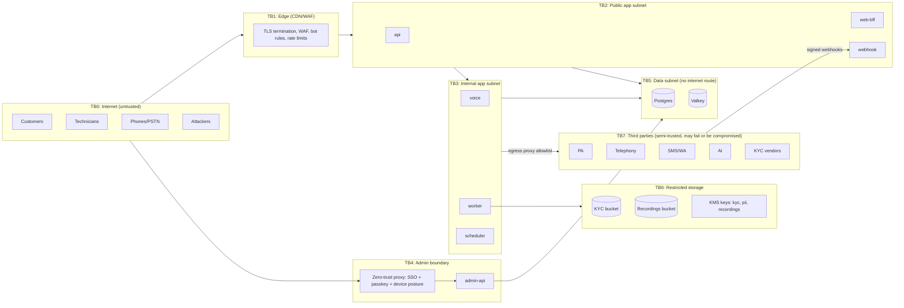
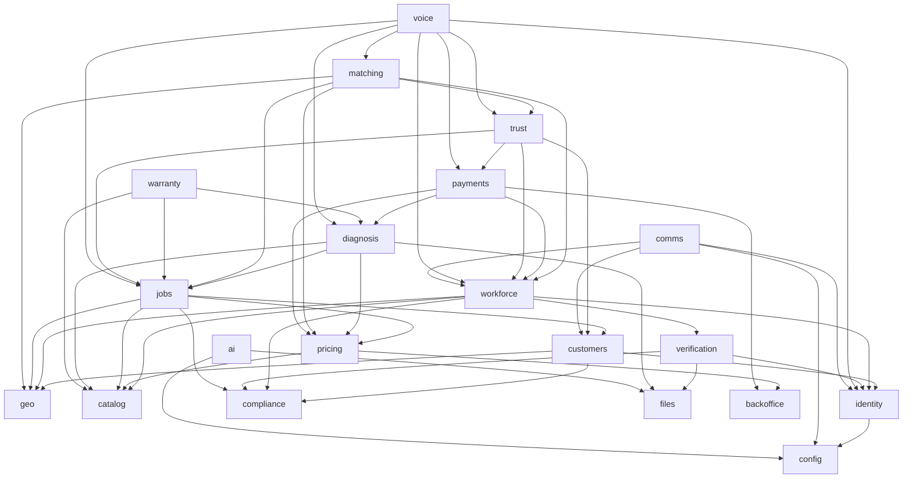

# Phase 1 · 01 — System Architecture

> Status: **DRAFT for founder review** · Date: 2026-10-08 · Supersedes: Phase 0 §7 where they differ (differences are listed in [README §6](README.md#6-phase-0-contradictions--changes))
> "Housefi" is an internal codename. All user-facing names come from configuration (`brand.*`; see [ADR-016](15-architecture-decisions.md#adr-016-configurable-brand-identity)).

---

## 1. Architecture at a glance

The system is one **modular monolith** with one codebase and one container image. It runs as **seven process roles**, all against one **PostgreSQL + PostGIS** system of record. Modules have strict boundaries and talk through **facades** (synchronous, in-process) and **domain events** (asynchronous, via a transactional outbox). Every external provider sits behind a **port/adapter**. Every long-running workflow is **persisted state plus durable timers**, never in-memory.

```mermaid
flowchart TB
  subgraph C["Customer-facing"]
    PWA["Customer PWA<br/>(Next.js SSR, mobile-first)"]
    WAc["WhatsApp / SMS links<br/>(quote approval, payment)"]
    CPH["Customer phone<br/>(booking line, approval IVR)"]
  end
  subgraph T["Technician-facing"]
    APP["Technician Android app<br/>(React Native, offline queue)"]
    BPH["Basic/button phone<br/>(IVR, missed call, SMS)"]
    AGT["Field agent<br/>(agent web view)"]
  end
  subgraph A["Admin"]
    ADM["Admin console<br/>(internal SPA)"]
  end
  subgraph EDGE["Edge"]
    CF["CDN + WAF<br/>public hostnames"]
    ZT["Zero-trust proxy<br/>admin hostname only"]
  end
  subgraph CORE["Modular monolith: one image, seven process roles"]
    API["api"]
    BFF["web-bff<br/>(PWA SSR + session cookies)"]
    ADMAPI["admin-api"]
    HOOK["webhook"]
    VOICE["voice"]
    WORK["worker"]
    SCHED["scheduler"]
  end
  subgraph DATA["Data plane (private subnets)"]
    PG[("PostgreSQL 17 + PostGIS<br/>Multi-AZ")]
    RD[("Valkey<br/>ephemeral only")]
    S3Q[("S3 quarantine")]
    S3C[("S3 clean / kyc / recordings")]
  end
  subgraph FIN["Financial (external, regulated)"]
    PA["Payment aggregator<br/>collections, refunds, payouts"]
  end
  subgraph TEL["Telephony (external)"]
    TP1["Telephony primary"]
    TP2["Telephony secondary"]
  end
  subgraph X["Other third parties"]
    FCM["FCM"]; SMS["SMS (DLT) ×2"]; WAB["WhatsApp BSP"]; MAP["Maps/geocoding"]; KYC["KYC/BGV vendors"]; SPE["STT/TTS"]; LLM["LLM"]
  end

  PWA --> CF --> BFF --> API
  APP --> CF --> API
  AGT --> CF
  WAc --> CF
  ADM --> ZT --> ADMAPI
  BPH <--> TP1 & TP2
  CPH <--> TP1
  TP1 & TP2 -- signed callbacks --> HOOK
  PA -- signed webhooks --> HOOK
  WAB -- webhooks --> HOOK
  HOOK -- IVR step requests --> VOICE
  API & BFF & ADMAPI & HOOK & VOICE & WORK & SCHED --> PG
  API & VOICE & WORK & BFF --> RD
  API --> S3Q
  WORK --> S3C
  WORK --> PA & FCM & SMS & WAB & MAP & KYC & SPE & LLM & TP1 & TP2
```

---

## 2. Process roles

All roles are built from the same image. They are separate ECS services with different entrypoints, IAM roles, DB roles, security groups and autoscaling policies.

| Role | Exposed? | Purpose | DB role (see [03 §12](03-database.md#12-database-roles-grants-and-rls)) | Scales on |
|---|---|---|---|---|
| `web-bff` | Public via CDN (`app.<domain>`) | SSR for the customer PWA **and the field-agent web surface** (SR-02). Forwards the `__Host-sid` cookie to `api`, which validates the session (X-13). Passes the verified client IP in a signed internal header over mTLS (X-15/SR-10). Holds no tokens and has no DB access. | none (calls `api`) | RPS |
| `api` | Public via CDN (`api.<domain>`) | Customer, technician and field-agent REST APIs (`/v1/...`) | `app_api` | RPS / CPU |
| `admin-api` | **Only via zero-trust proxy** (`admin.<internal-domain>`) | Admin console APIs (`/admin/v1/...`) and admin SPA static files | `app_admin` | low, fixed 2 |
| `webhook` | Public, provider IP allowlist where available (`hooks.<domain>`) | Verify signature → persist raw event → 200 fast → enqueue processing | `app_webhook` | RPS bursts |
| `voice` | Internal only (called by `webhook`) | IVR flow engine. Must answer flow steps in < 800 ms p95. | `app_voice` | concurrent calls |
| `worker` | Not exposed | Outbox relay, event subscribers, provider calls, matching cascades, file scanning, reconciliation | `app_worker` | queue depth |
| `scheduler` | Not exposed | Singleton (leader-elected via advisory lock). Cron-like sweeps: overdue-state sweeper, payout runs, retention, partition maintenance | `app_worker` | 1 (+1 standby) |

**Why `voice` is separate from `api`:** a slow deploy, CPU spike or bug in customer APIs must not break live phone calls with technicians. Separate service, separate scaling, separate deploy health gates.

**Why `admin-api` is separate:** it has a different network boundary (never on the public load balancer) and a different auth realm. A different DB role means a public-API compromise cannot use admin-only grants.

---

## 3. Network & trust boundaries

| Boundary | What crosses it | Controls |
|---|---|---|
| TB0→TB1 | All client traffic | TLS 1.2+/1.3, HSTS, WAF managed + custom rules, geo rules (India + allowlisted), bot management, L7 rate limits |
| TB1→TB2 | Filtered HTTP | Origin only accepts CDN (secret header + security group with managed prefix list). `X-Forwarded-For` trusted only from the CDN |
| TB0→TB4 | Admin traffic | Identity-aware proxy. Admin is not resolvable or reachable without it |
| TB2/3→TB5 | SQL/Redis | Security groups per role, TLS, IAM DB auth or rotated secrets, per-role DB grants |
| TB3→TB6 | Restricted objects | Only `worker` (file pipeline, verification) has KMS decrypt on `kyc`/`recordings` keys. Bucket policies deny all other principals |
| TB3→TB7 | Outbound provider calls | **Egress proxy with domain allowlist** (SSRF containment). Per-provider credentials. Timeouts and circuit breakers |
| TB7→TB2 | Webhooks | Signature/HMAC verification, timestamp window, replay dedupe, IP allowlist where published. Payload is treated as untrusted input |

**Trust stance:** no network location is trusted by itself (zero-trust). Every request is authenticated and authorized at the application layer, including internal `webhook → voice` calls (mTLS or signed internal tokens).

---

## 4. Module map (bounded contexts)

### 4.1 Rules that prevent a "big ball of mud"

1. **Physical layout:** `src/modules/<module>/{public, application, domain, infrastructure, http}`. **Only `public/`** (facade interface, DTOs, event types) can be imported by other modules. `dependency-cruiser` rules fail CI on violations.
2. **Data ownership:** each module owns one Postgres schema. **No module queries another module's schema.** Enforced by (a) per-module table definitions that can't be imported cross-module (lint), and (b) an **architecture fitness test**: integration tests tag every SQL statement with `/* module=<name> */`, and a test asserts each statement touches only its own schema (plus `platform`).
3. **Cross-module references are by ID.** Cross-schema foreign keys are not allowed (only intra-schema FKs). Orphan checks run nightly.
4. **Synchronous calls go through facades only.** A facade call normally runs in its own transaction. A small, explicitly listed set of **Transactional Coupling Points (TCPs)** may join the caller's transaction (§6.3). Each TCP is documented and would become a saga if the module were extracted.
5. **Events carry IDs and facts, not PII.** Consumers that need PII must fetch it through an authorized facade call.
6. **No shared "utils" dumping ground.** The `platform` shared kernel is small and versioned (ids, money, clock, errors, outbox, idempotency, audit writer, policy engine, field crypto, logger, config reader). Changes need tech-lead review.
7. **Dependency direction is acyclic.** The allowed-dependency graph is in §4.3. Cycles fail CI.
8. **Each module has its own test suite, metrics prefix (`app_<module>_*`) and CODEOWNERS entry.**

### 4.2 Module specifications

Notation: **Cmd** = commands (writes through the facade). **Evt** = domain events published. **RM** = read models exposed or maintained. **Deps** = allowed facade/event dependencies. **✗** = prohibited dependencies.

#### identity
- **Responsibility:** user identities (phone-based), OTP challenges, sessions, refresh tokens, devices, IVR PIN credentials, step-up auth. **No admin identities** (see backoffice).
- **Owns:** `users`, `devices`, `sessions`, `refresh_tokens`, `otp_challenges`, `ivr_credentials`, `subject_keys` (per-subject data keys for crypto-shredding).
- **Facade:** `requestOtp`, `verifyOtp`, `refreshSession`, `revokeSession(s)`, `getUserStatus(userId)`, `resolveByPhoneHash(hash)`, `verifyIvrPin(userId, pin)`, `stepUp(userId, method)`, `getSubjectKey(userId)` (platform crypto only).
- **Cmd:** RequestOtp, VerifyOtp, RotateRefreshToken, RevokeSession, SetIvrPin, ResetIvrPin (agent-assisted plus verification), SuspendUser, ReinstateUser, EraseIdentity.
- **Evt:** `UserRegistered`, `SessionRevoked`, `RefreshTokenReuseDetected`, `UserSuspended`, `UserReinstated`, `IvrPinLocked`, `NewDeviceLogin`, `IdentityErased`.
- **RM:** none externally (status lookups via facade).
- **Deps:** comms (send OTP, through an event-free direct facade call for latency), config.
- **✗:** must not depend on jobs, payments, trust or any business module.

#### customers
- **Responsibility:** customer profile, address book, communication and language preferences, optional sensitive attributes (consent-gated).
- **Owns:** `customer_profiles`, `addresses`, `customer_sensitive_attributes` (restricted, e.g., self-declared gender).
- **Facade:** `getProfile`, `getAddressForJob(addressId, customerId)` (returns an encrypted snapshot for the job), `getContactHandle(customerId)` (phone hash and encrypted phone, for comms/voice only), `getSegmentForRating(customerId)` (returns a segment code only when consent exists; used by trust aggregation jobs).
- **Cmd:** UpdateProfile, AddAddress, UpdateAddress, DeleteAddress, SetSensitiveAttribute, ClearSensitiveAttribute.
- **Evt:** `CustomerProfileUpdated`, `AddressAdded`, `AddressDeleted`, `SensitiveAttributeChanged`.
- **Deps:** identity, geo (locality validation), compliance (consent checks).
- **✗:** jobs/payments/trust internals.

#### workforce
- **Responsibility:** technician and field-agent profiles, skills, service areas, weekly availability, overrides, daily check-ins, online status, device mode, payout methods (with security controls), technician metrics read model.
- **Owns:** `technician_profiles`, `technician_skills`, `technician_service_areas`, `technician_weekly_availability`, `technician_availability_overrides`, `technician_daily_checkins`, `technician_presence`, `technician_location_shares`, `payout_methods`, `field_agents`, `agent_technician_links`, `technician_metrics` (projection).
- **Facade:** `getEligibilitySnapshot(technicianIds)`, `findCandidatePool(criteria)` (for matching), `getPublicCard(technicianId)`, `getPayoutDestination(technicianId)` (payments only), `isAgentLinked(agentId, technicianId)`.
- **Cmd:** RegisterTechnician, UpdateSkills, SetServiceAreas, SetWeeklyAvailability, AddOverride, RecordCheckin, SetPresence, ShareLocationOnce, AddPayoutMethod, ActivatePayoutMethod (after cooling-off), LinkAgent, ChangeTechnicianStatus.
- **Evt:** `TechnicianRegistered`, `TechnicianActivated`, `TechnicianStatusChanged`, `SkillsChanged`, `ServiceAreasChanged`, `AvailabilityChanged`, `CheckinRecorded`, `PresenceChanged`, `PayoutMethodAdded`, `PayoutMethodActivated`.
- **RM:** `technician_metrics`, built from jobs/matching/trust events.
- **Deps:** identity, geo, verification (level lookups via facade), catalog (skill validation), compliance.
- **✗:** payments ledger internals, jobs tables.

#### verification
- **Responsibility:** document intake, KYC/BGV orchestration via vendors, verification decisions and levels, expiry, re-verification.
- **Owns:** `documents`, `verification_cases`, `verification_records` (append-only), `verification_levels` (current level projection).
- **Facade:** `getLevel(technicianId)`, `getBadges(technicianId)` (public-safe), `startCase(...)`.
- **Cmd:** SubmitDocument, StartVerification, RecordVendorResult, DecideVerification (verification officer only, not agents), ExpireVerification, RevokeVerification.
- **Evt:** `VerificationDecided`, `VerificationExpired`, `VerificationRevoked`, `DocumentRejected`.
- **Deps:** files, identity, compliance (BGV consent), `VerificationPort` adapters.
- **✗:** jobs, payments.

#### catalog
- **Responsibility:** categories, service types, specializations, symptoms, repair catalog items (with keypad codes), materials, reference prices, service rules (including same-visit-repair permission, required verification level, Care Visit placeholders), translations.
- **Owns:** `service_categories`, `service_types`, `specializations`, `symptoms`, `repair_items`, `materials`, `material_reference_prices`, `service_rules`, `*_i18n`.
- **Facade:** `getServiceType`, `getRepairItems`, `getServiceRules(serviceTypeId, cityId)`, `listSymptoms`, `getMaterialReference(materialId, cityId, at)`.
- **Cmd:** admin CRUD with versioning (catalog changes are effective-dated where price-relevant).
- **Evt:** `CatalogChanged`.
- **Deps:** config. **✗:** everything business-transactional.

#### pricing
- **Responsibility:** rate cards, fee rules, commission rules, cancellation/waiting/travel policies, tax configuration, **pure price calculation**, price snapshots, the simulator. Maker-checker on activation.
- **Owns:** `rate_cards`, `rate_card_items`, `fee_rules`, `commission_rules`, `tax_rules`, `price_snapshots`.
- **Facade:** `priceQuote(input) → PriceResult + snapshotId` (deterministic; persists the snapshot), `priceCancellation(ctx)`, `priceWaiting(ctx)`, `estimateTechnicianEarnings(visitContext)`, `getVisitFee(serviceType, city, at)`.
- **Cmd:** DraftRateCard, SubmitForApproval, ApproveRateCard (checker ≠ maker), ScheduleActivation, Retire.
- **Evt:** `RateCardActivated`, `RateCardRetired`.
- **Deps:** catalog, backoffice (approvals). **✗:** payments, jobs (pricing never reads job state; callers pass context).

#### jobs (fulfilment context: Job, Visit, Assignment, RepairOrder)
Visits and assignments are first-class **aggregates** in this module, not sub-records of a job. They live in the same module as Job because visit, assignment and repair-order transitions must be strongly consistent with each other (for example "one active assignment per visit" and "repair visit requires an approved repair order").

| Component | Responsibility | Owns |
|---|---|---|
| **Job** | The customer's request: symptom, address snapshot, lifecycle coordinator, cancellation | `jobs`, `job_status_history`, `job_cancellations` |
| **Visit** | One physical trip to the customer: purpose(s), schedule window, required skill, presence proof (start/completion codes), waiting, no-show | `visits`, `visit_status_history`, `visit_presence_proofs`, `visit_waits` |
| **Assignment** | Binding of a technician to a visit, with lifecycle and release reasons | `assignments` |
| **RepairOrder** | Execution of an approved quote version: required skill, materials, scheduling preference. The visit(s) that perform it reference it via `visits.repair_order_id`. | `repair_orders`, `repair_order_status_history` |

- **Facade:** `createJob`, `cancelJob`, `getJobForCustomer`, `getVisitForTechnician(visitId, techId)` (stage-gated DTO), `assignVisit(visitId, techId, offerId)` *(TCP-1)*, `releaseAssignment`, `recordDeparture`, `verifyArrival(startCode)`, `completeVisit`, `checkoutDiagnosisVisit`, `startWaiting`, `markNoShow`, `scheduleRepair`, `getDisclosureWindow(visitId, techId)`.
- **Cmd:** CreateJob, CancelJob, CreateVisit, RescheduleVisit, AssignVisit, ReleaseAssignment, RecordDeparture, VerifyArrival, StartWaiting, MarkCustomerNoShow, MarkTechnicianNoShow, CompleteVisit, CheckoutDiagnosisVisit, CreateRepairOrder (from `QuoteApproved`), ScheduleRepairOrder, AttachSameVisitRepair, CompleteRepairOrder, AbortVisit (safety).
- **Evt:** `JobRequested`, `JobStatusChanged`, `JobCancelled`, `JobWorkCompleted`, `JobClosed`, `VisitCreated`, `VisitReadyForMatching`, `VisitAssigned`, `VisitRescheduled`, `TechnicianDeparted`, `TechnicianArrived`, `CustomerWaitStarted`, `VisitCompleted`, `VisitCancelled`, `VisitNoShow`, `VisitAborted`, `VisitUnfulfilled`, `AssignmentReleased`, `RepairOrderCreated`, `RepairOrderScheduled`, `RepairOrderCompleted`, `RepairOrderCancelled`.
- **RM:** `customer_job_view`, `technician_visit_view` (stage-gated projections), `ops_job_board`.
- **Deps:** customers (address snapshot), catalog (rules), pricing (cancellation/waiting), geo, comms (via events), compliance (disclosure logging).
- **✗:** payments internals, matching internals (matching *calls* jobs, not vice versa, except via events), voice internals.

#### diagnosis (Diagnosis & Quoting context)
| Component | Responsibility | Owns |
|---|---|---|
| **Diagnosis** | What the technician found: problem category, observations, severity, recommended repair items, materials, photos, voice notes, required skill for repair, same-visit feasibility | `diagnoses`, `diagnosis_items`, `diagnosis_media` |
| **Quote** | Logical quote per job with **immutable versions**, items, approvals, content hash | `quotes`, `quote_versions`, `quote_items`, `quote_approvals`, `quote_links` |
| **MaterialUsage** | What material was actually used vs quoted | `material_usage` |

- **Facade:** `startDiagnosis`, `submitDiagnosis`, `createQuoteVersion` (calls `pricing.priceQuote`), `presentQuoteVersion`, `approveQuoteVersion(versionId, contentHash, actor, channel, repairPreferences)`, `rejectQuoteVersion`, `getApprovedVersion(jobId)`, `recordMaterialUsage`, `getBillableItems(repairOrderId)`.
- **Evt:** `DiagnosisSubmitted`, `QuoteVersionPresented`, `QuoteApproved`, `QuoteRejected`, `QuoteExpired`, `QuoteVersionSuperseded`, `MaterialUsageRecorded`.
- **Deps:** pricing, catalog, files, jobs (facade read: visit/assignment validation).
- **✗:** payments (payments pulls billable items through the facade), matching.

#### matching
- **Responsibility:** candidate generation, hard filters, scoring, offer cascade (exclusive offer windows, waves), fairness accounting, match explanations.
- **Owns:** `match_runs`, `match_candidates`, `offers`, `matching_configs` (versioned weights), `fairness_ledger` (offer/opportunity accounting).
- **Facade:** `startMatching(visitId)`, `acceptOffer(offerId, techId, channel)` (opens TCP-1 into `jobs.assignVisit`), `declineOffer`, `listPendingOffers(techId)`, `explain(matchRunId)`.
- **Evt:** `MatchRunStarted`, `OfferCreated`, `OfferAccepted`, `OfferDeclined`, `OfferExpired`, `OfferUnreachable`, `MatchExhausted`.
- **Deps:** workforce (`findCandidatePool`), geo (travel estimates), trust (blocks/holds facade), jobs (`assignVisit`), pricing (`estimateTechnicianEarnings`), comms/voice via events (`OfferCreated` → push or IVR).
- **✗:** payments, diagnosis internals.

#### voice
- **Responsibility:** telephony adapters, IVR flow engine (versioned flow definitions), prompt catalog (with separately recorded brand clip), call sessions, masked-call bindings, missed-call handling, recordings metadata.
- **Owns:** `call_sessions`, `ivr_interactions`, `ivr_flow_versions`, `prompts`, `masked_bindings`, `missed_calls`.
- **Facade:** `placeOfferCall(offerId)`, `placeApprovalCall(quoteVersionId)`, `placeCashConfirmationCall`, `createMaskedBinding(visitId, partyA, partyB, window)`, `handleIvrStep(providerPayload)` (internal from webhook).
- **Evt:** `CallCompleted`, `CallFailed`, `IvrInputReceived` (internal), `MissedCallReceived`, `SosCallReceived`.
- **Deps:** jobs, matching, diagnosis, workforce, identity (PIN), trust (SOS), comms, `TelephonyPort`, `SpeechPort`.
- **✗:** payments ledger (it may *read* earnings summaries through the payments facade), direct table access anywhere.

#### comms
- **Responsibility:** multi-channel notifications (push, SMS, WhatsApp, voice-notification hand-off), templates per locale with DLT IDs and brand variables, channel fallback chains, delivery tracking, preferences, quiet hours.
- **Owns:** `notification_templates`, `notifications`, `delivery_attempts`, `channel_preferences`, `whatsapp_optins`.
- **Facade:** `send(templateKey, recipient, vars, policy)`, `sendOtp(...)` (low-latency path).
- **Evt:** `NotificationDelivered`, `NotificationFailed`.
- **Deps:** identity/customers/workforce (contact handles), config (brand), `SmsPort`, `WhatsAppPort`, `PushPort`.
- **✗:** business decisions. Comms never decides *whether* to notify; it receives explicit requests or subscribes to events with mapping rules.

#### payments (+ ledger)
- **Responsibility:** amount due computation (with pricing and diagnosis), payment intents, PA integration, cash collections, refunds, chargebacks, invoices, **double-entry ledger**, technician balances, payouts, reconciliation.
- **Owns:** schemas `payments` (`bills`, `payment_intents`, `payments`, `cash_collections`, `refunds`, `chargebacks`, `invoices`, `invoice_sequences`, `payouts`, `payout_items`, `payout_batches`, `provider_events`, `reconciliation_runs`, `reconciliation_exceptions`) and `ledger` (`accounts`, `transactions`, `entries`, `balance_snapshots`).
- **Facade:** `getBill(jobId, customerId)`, `createPaymentIntent`, `recordCash`, `confirmCash`, `requestRefund` (admin), `getEarningsSummary(techId)`, `getStatement`, `runPayoutBatch` (scheduler + maker-checker).
- **Evt:** `BillIssued`, `PaymentCaptured`, `PaymentFailed`, `CashRecorded`, `CashConfirmed`, `CashDisputed`, `RefundSucceeded`, `RefundFailed`, `ChargebackOpened`, `ChargebackResolved`, `InvoiceIssued`, `PayoutPaid`, `PayoutFailed`, `PayoutReversed`, `ReconciliationMismatch`.
- **Deps:** diagnosis (`getBillableItems`), pricing (fees/commission), jobs (facts via events), workforce (`getPayoutDestination`), backoffice (approvals), `PaymentPort`, `PayoutPort`.
- **✗:** matching, voice, trust internals. **No module except payments writes to `ledger`.**

#### warranty
- **Responsibility:** warranty policies (versioned), coverage snapshot at job close, claims, eligibility, creation of warranty jobs, cost-bearer outcomes.
- **Owns:** `warranty_policies`, `warranty_coverages`, `warranty_claims`, `warranty_claim_history`.
- **Facade:** `listCoverages(customerId)`, `submitClaim`, `decideClaim` (ops), `getCoverage(jobId)`.
- **Evt:** `CoverageStarted`, `ClaimSubmitted`, `ClaimEligible`, `ClaimIneligible`, `ClaimResolved`.
- **Deps:** jobs (`createJob` with `warranty_parent`), diagnosis (covered items), catalog, payments (via events for cost bearer).

#### trust (Trust & Safety)
- **Responsibility:** ratings (two-way), segment aggregates (threshold-gated), complaints, disputes, appeals, investigations, sanctions, safety incidents/SOS, holds, blocks, fraud signals and cases.
- **Owns:** `ratings`, `rating_aggregates`, `complaints`, `disputes`, `dispute_parties`, `investigation_notes`, `sanctions`, `safety_incidents`, `safety_incident_events`, `blocks`, `fraud_signals`, `fraud_cases`.
- **Facade:** `submitRating`, `raiseComplaint`, `raiseSos`, `getRestrictions(customerId, technicianIds)` (blocks, holds; used by matching), `getPublicRating(techId)`.
- **Evt:** `RatingSubmitted`, `ComplaintRaised`, `DisputeOpened`, `DisputeResolved`, `SanctionApplied`, `SanctionLifted`, `SafetyIncidentRaised`, `SafetyHoldPlaced`, `FraudSignalRaised`.
- **Deps:** jobs, customers (segment code via facade only), workforce, payments (dispute adjustments via facade commands), comms.

#### geo
- **Responsibility:** cities, zones (polygons), localities (centroids, aliases in local scripts), adjacency graph, geocoding/reverse-geocoding through an adapter, serviceability, travel-time estimates (graph + optional routing API).
- **Owns:** `cities`, `zones`, `localities`, `locality_aliases`, `locality_adjacency`, `geocode_cache`.
- **Facade:** `resolveLocality(point|text)`, `isServiceable`, `travelEstimate(fromLocality|point, toLocality|point)`, `zoneOf(locality)`.
- **Deps:** `GeoPort`. **✗:** all business modules.

#### backoffice
- **Responsibility:** admin identities (SSO-linked), roles, permissions, scoped grants, JIT elevation, maker-checker approvals, PII-reveal workflow, admin sessions.
- **Owns:** `admin_users`, `roles`, `permissions`, `role_permissions`, `admin_grants`, `approval_requests`, `admin_sessions`, `pii_reveals`.
- **Facade:** `authorizeAdmin(adminCtx, permission, scope)`, `requestApproval`, `decideApproval`, `revealPii(adminCtx, subject, field, reason)`.
- **Evt:** `ApprovalRequested`, `ApprovalDecided`, `AdminGrantChanged`, `PiiRevealed`.
- **✗:** business logic. Admin endpoints call the business modules' facades.

#### compliance
- **Responsibility:** audit log (hash-chained), consent records, notices, data-rights requests, retention policies and executor, legal holds, disclosure logs (address views, playback).
- **Owns:** `audit_logs`, `audit_anchors`, `consent_notices`, `consents`, `consent_events`, `data_rights_requests`, `retention_policies`, `retention_runs`, `legal_holds`, `disclosure_events`.
- **Facade:** `audit(event)` (platform writer), `hasConsent(userId, purpose)`, `recordConsent`, `withdrawConsent`, `logDisclosure`, `openDataRequest`, `executeErasure` (an orchestrated saga across modules through their `erase(subjectId)` facades).
- **Evt:** `ConsentGranted`, `ConsentWithdrawn`, `ErasureRequested`, `ErasureCompleted`, `LegalHoldPlaced`.

#### ai
- **Responsibility:** provider abstraction, redaction, prompt versions, task-specific functions (categorize symptom, transcribe voice note, summarize for ops), confidence thresholds, budgets, kill switch, eval harness.
- **Owns:** `ai_tasks`, `ai_prompt_versions`, `ai_requests` (restricted, short retention), `ai_budgets`.
- **Facade:** `suggestCategory(text|audioRef, locale)` → `{suggestions[], confidence}`, `transcribe(fileId)`, `summarizeForOps(ticketId)`. **Every output is advisory and typed (closed enums).**
- **✗:** no AI output directly invokes a command in any module. A human or customer confirmation step sits between.

#### files
- **Responsibility:** upload slots (presigned), quarantine → scan → re-encode → clean pipeline, signed download URLs after authZ callback to the owning module, retention/deletion.
- **Owns:** `file_objects`, `file_scan_results`.
- **Facade:** `createUploadSlot(kind, ownerRef)`, `getDownloadUrl(fileId, actor)` (asks the owner module's policy), `deleteFile`.

#### config
- **Responsibility:** feature flags, kill switches, system settings, **brand settings** (name, short name, support numbers, domains, colours, logos, prompt-clip IDs).
- **Owns:** `settings`, `feature_flags`, `brand_profiles`.

#### benefits (skeleton, V1)
- **Responsibility:** catalogue of *future* partner programmes and consent-based enrolment referrals. **No money movement, no balances, no premiums collected by the platform in V1.**
- **Owns:** `benefit_programs` (status `draft` only in V1), `benefit_enrollments` (unused in V1), `benefit_partners`.
- **Facade:** none exposed to public APIs in V1 (feature flag off).
- **✗:** must never depend on `ledger` in V1. Any future money flow requires an ADR, legal review and a regulated partner.

#### platform (shared kernel)
`outbox`, `processed_events`, `idempotency_keys`, `dead_letters`, `job_queue` (Graphile Worker tables), `scheduled_timers`, plus libraries: ids, money, clock, errors, policy engine, audit writer, field crypto, logger, config reader.

### 4.3 Allowed dependency graph (facade calls)

Events flow in any direction (subscriptions don't create compile-time coupling, but every subscription is registered in a reviewed manifest). Notable rule: **`jobs` never calls `matching`, `payments` or `voice` synchronously.** They react to `jobs` events. This keeps the core lifecycle independent of delivery channels and money.

---

## 5. Synchronous vs asynchronous communication

| Interaction | Style | Why |
|---|---|---|
| Client → API | Sync REST | — |
| Offer accept → assignment | **Sync, TCP-1** (one transaction) | The technician must get a definitive "you got it / taken" answer. No double assignment. |
| Quote approval → repair order creation | Async event (`QuoteApproved` → jobs). SLO p95 < 5 s, engineering target 3 s (X-03) | Approval is the source of truth. The repair order is derived, and the technician app waits for a push anyway. |
| Visit completed → bill | **Sync, TCP-3** (bill issued in the completion transaction) | The technician/IVR must know the exact amount due at the door (G-1/X-09). |
| Bill issued → ledger posting | Async event (worker only, G-5) | Ledger writes are restricted to the worker role. Idempotent by bill ID. |
| Payment captured (webhook) → ledger | Inside payments: one transaction (payment + ledger posting + outbox) | Same module. Money consistency. |
| Notifications (push/SMS/WA) | Async | Delivery is best-effort with fallbacks. |
| Offer → IVR call / push | Async (`OfferCreated` → voice/comms) | Channel failures must not block matching. The cascade continues on timers. |
| IVR step → domain command | Sync from `voice` to facades | The caller is waiting on the line. Commands are short and indexed. |
| Matching cascade progression | Durable timers (`offer_expiry:{offerId}`) plus sweeper | Must survive restarts. |
| Reconciliation, payouts, retention | Scheduled jobs | — |

### 5.1 Event delivery mechanics

1. A command transaction writes the state change, the `platform.outbox` row(s) and the audit row. `COMMIT`.
2. The relay (worker) is woken by `LISTEN/NOTIFY`, with a 1 s polling fallback. It reads unpublished outbox rows in order and **fans out one queue job per subscriber**, so each subscriber retries independently.
3. A subscriber handler checks `processed_events(consumer, event_id)` and, if it is new, runs inside a transaction that also inserts into `processed_events`. **Exactly-once effect, at-least-once delivery.**
4. Ordering: events carry `aggregate_id` and `aggregate_version`. Handlers that need ordering compare versions and **defer** (re-enqueue with delay) if an earlier version hasn't been processed.
5. Failures: exponential backoff (max ~24 h), then `dead_letters` plus an alert. Replay is available from the admin "Dead letters" screen (ops-engineer role, audited).

Event envelope (JSON): `{ event_id (uuidv7), type, schema_version, occurred_at, aggregate_type, aggregate_id, aggregate_version, actor {type, id}, correlation_id, causation_id, city_id, payload }`. **The payload contains IDs, enums, amounts and timestamps only, never names, phones or addresses.**

### 5.2 Durable timers & sweepers (no in-memory timers)

- A timer is a queue job with a deterministic `job_key` (e.g., `offer-expire:<offerId>`), scheduled at `run_at`. Re-scheduling replaces it; cancellation deletes it by key. The handler **re-checks state** before acting (a timer firing late or twice is harmless).
- **Sweeper (belt and braces):** every minute, the scheduler queries for overdue states (offers past `expires_at` still `PENDING`, visits `ASSIGNED` past window start + grace without departure, quotes past `expires_at`, payments `PENDING` past TTL, SOS not acknowledged) and enqueues the same handlers. A lost timer therefore delays an action by at most about 1 minute.

### 5.3 Transactional Coupling Points (TCPs)

Each TCP must be listed here, reviewed, and covered by tests.

| ID | Caller → callee | Why it must be atomic | Extraction path |
|---|---|---|---|
| TCP-1 | `matching.acceptOffer` → `jobs.assignVisit` | Offer acceptance and assignment must be atomic. Otherwise a technician is told "accepted" without an assignment, or two technicians are assigned. | Reservation saga (offer `ACCEPTING` → assignment → confirm/compensate) |
| TCP-2 | `jobs.completeVisit` → `diagnosis.recordMaterialUsage` | Completion and the materials actually used must be recorded together, so the bill can't be computed from a half-recorded completion. | Completion command carries usage; diagnosis consumes the event |
| TCP-3 | `jobs.completeVisit` / `jobs.closeWithoutRepair` / cancellation-with-fee → `payments.issueBill` (G-1) | The amount due must exist deterministically when the visit completes, so the technician/IVR reads it and cash recording validates against it. Pure pricing function from the approved quote version + material usage + policy snapshot. **No ledger write** in this transaction | Completion is acknowledged only after a bill-issuance saga step succeeds |

No other synchronous call may share a transaction. The fitness test detects nested transactional facade calls not in this list.

---

## 6. Failure isolation & provider outages

### 6.1 Isolation mechanisms
- Separate ECS services per role, so a crash loop in `worker` doesn't take down `api`, and `voice` is isolated from both.
- **Bulkheads:** separate DB connection pools per role, sized by role. Separate queue concurrency per job type (payouts never starve offer dispatch). Per-provider concurrency limits.
- **Timeouts everywhere:** provider calls 2–10 s depending on type; DB statement timeout 5 s for API roles and 60 s for workers; `lock_timeout` 3 s.
- **Circuit breakers** per provider and endpoint, with half-open probes. The state is in Valkey, with in-process fallback if Valkey is down.
- **Load shedding:** under DB saturation, the API rejects low-priority reads (history, analytics) first and protects booking, offer, IVR, payment-webhook and SOS paths.
- **Valkey failure:** rate limiting degrades to a coarse in-process limiter. IVR call state is reconstructed from `call_sessions` and `ivr_interactions` (persisted per step). Sessions remain valid (JWT/sessions are verified against Postgres, and the denylist falls back to a DB check).

### 6.2 What happens when each provider is unavailable

| Provider down | Customer impact | Technician impact | Automatic behaviour | Manual fallback |
|---|---|---|---|---|
| **Payment aggregator** | Online payment unavailable | Payouts delayed | Payment page shows "Pay later via link / pay cash". Jobs can close as `AWAITING_PAYMENT`. Webhooks are replayed when PA recovers. Reconciliation catches gaps. Payout batch postponed. | Ops sends payment links later. Finance communicates payout delay (SMS/IVR announcement). |
| **Telephony primary** | Masked calls and approval IVR fail over | Offer calls fail over | Circuit opens → **secondary provider** for outbound offers, approvals and masked bindings. Inbound numbers forward to secondary (pre-provisioned). | If both are down: basic-phone offers go via SMS ("call ops desk"), the ops desk dispatches manually from the console, and the SOS backup mobile number (printed on technician ID cards) is used. |
| **SMS provider** | OTP delays | Offer SMS summaries delayed | Failover to the second DLT provider. OTP alternatives: WhatsApp OTP, voice OTP call. | — |
| **WhatsApp BSP** | Status updates missing | — | Fallback to SMS for critical messages (quote ready, payment link). | — |
| **FCM** | — | App offers not delivered | Offer cascade treats push as undelivered after the window → falls back to **IVR call** to the same technician (app technicians also have IVR as backup) or the next candidate. In-app polling every 30 s while the app is foregrounded. | — |
| **Maps/geocoding** | Map pin unavailable | Navigation hand-off may fail | Locality search (our own data) plus landmark text still works. Travel estimates fall back to the locality graph. | — |
| **KYC/BGV vendor** | — | Onboarding stalls | Cases queue and retry. Technicians stay at the current verification level. | Verification officer uses the secondary vendor. |
| **STT/TTS** | Voice notes not transcribed | IVR dynamic prompts degrade | TTS: fall back to pre-recorded number/locality clips. STT: voice notes are kept for ops listening. Speech input disabled (DTMF only). | — |
| **LLM** | No category suggestion | — | Feature flag auto-off on breaker. Manual chips only. | — |
| **Admin SSO IdP** | — | — | Admins can't log in. **Break-glass** accounts (hardware keys, sealed) for the safety desk and on-call, with immediate alert. | — |
| **Zero-trust proxy** | — | — | Same as above. Break-glass path through an AWS SSM-based emergency console (pre-approved). | — |
| **AWS single AZ** | Brief blips | Brief blips | Multi-AZ RDS failover (~60–120 s), ECS tasks spread across 3 AZs. Clients retry with idempotency keys. | — |
| **AWS region (ap-south-1)** | Outage | Outage | DR to ap-south-2 (RTO ≤ 4 h, RPO ≤ 5 min; see [14](14-deployment.md)). | The ops desk switches to the published phone/WhatsApp SOP. The SOS line stays on telephony (independent of AWS) and forwards to safety-desk mobiles. |

**SOS independence:** the SOS phone line is configured at the telephony provider to **forward directly to the safety desk's phones** even if our webhooks fail (provider-side fallback routing). The app SOS screen always shows "Call 112" and the safety desk number as plain `tel:` links that work without our backend.

---

## 7. Scaling strategy (summary; detail in Phase 0 §19)

| Stage | Volume | Architecture changes |
|---|---|---|
| Pilot | ≤ 200 jobs/day, 1 city | 2 tasks per public role, 1–2 workers, RDS `db.m7g.large`-class Multi-AZ, Valkey small, no read replica |
| Growth | ≤ 10k jobs/day, ≤ 10 cities | Read replica for admin/reporting. Monthly partitions in use. Autoscaling. Matching worker pool. |
| Scale | ≤ 200k jobs/day | Bigger primary, RDS Proxy, consider extracting `voice` and `comms`. Regional cells keyed by `city_id`. |

**Never required for V1:** Kafka, Kubernetes, service mesh, multi-region active-active, sharding.

**Data shape decisions made now so later scaling isn't blocked:** `city_id` on every operational row. UUIDv7 keys (shard-friendly). Append-only tables partitionable by time. Events with stable envelopes (they can be bridged to SQS/Kafka unchanged). No cross-schema FKs.

---

## 8. Configuration: never hard-code business rules

The following are **data** (admin-configurable, versioned and effective-dated where money is involved), not code:
visit fee, labour prices, technician share, commission, platform fee, material markup and caps, cancellation tiers, waiting fee (grace, rate, cap), travel compensation, warranty durations and cost bearers, offer windows per channel, max call attempts, matching weights, fairness parameters, disclosure window offsets, rating thresholds (for public and segment display), refund approval thresholds, payout schedule, cash caps, negative-balance limits, quiet hours, supported languages per city, service rules (same-visit repair permitted, min verification level, worker-attribute requirements), brand profile.

Code holds only **invariants** (e.g., "invoice ≤ approved quote + policy fees", "ledger balances") and the **state machines**.
