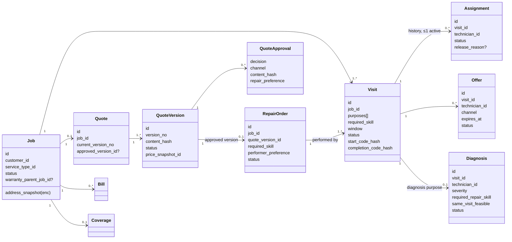

# Phase 1 · 02 — Domain Model

> Status: **DRAFT for founder review** · Date: 2026-10-08
> This document defines the **ubiquitous language**, the aggregates, their relationships and the **business invariants (INV-xx)**. The invariant IDs are referenced by the database constraints ([03](03-database.md)), state machines ([06](06-job-workflows.md)) and tests ([13](13-testing-strategy.md)).

---

## 1. Ubiquitous language

| Term | Meaning | Not to be confused with |
|---|---|---|
| **Job** | A customer's request about one problem at one address ("Refrigerator not cooling", "Kitchen tap leaking"). Lives from booking until financial close and starts the warranty. | Visit, Order |
| **Visit** | **One physical trip** by one technician to the job's address, with a purpose, a time window and presence proof. A job has **1..n visits**. | Assignment |
| **Visit purpose** | `DIAGNOSIS`, `REPAIR`, `WARRANTY_INSPECTION`. A visit may carry `DIAGNOSIS` **and** `REPAIR` when a same-visit repair is permitted and approved. | — |
| **Assignment** | The binding of a technician to a visit. A visit has at most one **active** assignment. Historical (released/no-show) assignments are kept. | Offer |
| **Offer** | A time-boxed, **exclusive** proposal to one technician to take one visit. Accepting it creates an assignment. | Assignment |
| **Diagnosis** | The technician's structured finding from a visit: problem, severity, recommended repair items, materials, required repair skill, same-visit feasibility, evidence. | Quote |
| **Quote** | The logical price proposal for a job. It has **immutable versions**. | — |
| **Quote version** | One frozen set of quote items plus a price snapshot plus a content hash. It is presented, then approved, rejected, expired or superseded. | — |
| **Approval** | A customer's recorded decision on a specific quote version (by content hash), made through the customer's own channel. | — |
| **Repair order** | The execution unit created when a quote version is approved. It holds the approved scope, required skill, materials and scheduling preference. It is performed by **one or more repair visits** (or attached to the diagnosis visit for a same-visit repair). | Job |
| **Presence proof** | Evidence of arrival/completion. **Primary:** customer-held one-time codes (start code, completion code). Secondary: consented location snapshot, call metadata, ops-confirmed call. | GPS tracking |
| **Disclosure window** | The time interval during which a technician may access the exact address and contact bridge for a visit. | — |
| **Bill** | The amount due for a job at a point in time (visit fee, approved items, used materials, policy fees, adjustments). | Invoice |
| **Invoice** | The legally issued, immutable document for a bill. | — |
| **Coverage** | Warranty snapshot (policy version, start/end, covered items) created when a repair order completes and the job closes. | Policy |
| **Service rules** | Configured, per service type and city: e.g., same-visit repair allowed, min verification level, max visit duration, worker-attribute requirements. | — |
| **Field agent** | A contracted local helper who assists technicians. They act **on behalf of** technicians, never as them, and never verify or assign. | Support agent |
| **Ops desk** | Internal staff (support/dispatch). Includes **diagnosis capture** for basic-phone technicians. | — |

---

## 2. Aggregates and their boundaries

| Aggregate | Module | Consistency boundary (what one transaction protects) |
|---|---|---|
| Job | jobs | Job status and cancellation record |
| Visit | jobs | Visit status, window, presence proofs, waiting, **and its assignments** (assignment changes lock the visit row) |
| RepairOrder | jobs | Repair order status and its visit links |
| Offer / MatchRun | matching | Offer status (accept goes through TCP-1 into Visit) |
| Diagnosis | diagnosis | Draft edits, submission (immutable after) |
| Quote (+versions, items, approvals) | diagnosis | Version creation, presentation, approval and supersession (the quote row is locked) |
| Bill / Payment / Refund / Payout | payments | Each with its ledger transaction |
| Coverage / Claim | warranty | — |

**Why Visit is its own aggregate (not a child list on Job):** visits have independent lifecycles, technicians, schedules and proofs. Ten operations happen on a visit for every one on a job. Locking the whole job for each visit action would serialise unrelated work (e.g., ops rescheduling repair visit 2 while visit 1's checkout is processed). The Job reacts to visit events to update its coarse status.

---

## 3. The core flow, modelled (AC example; kept as the diagnosis/repair reference and a regression scenario)

**Customer:** "AC is running but not cooling."

| Step | Records created/changed |
|---|---|
| 1. Booking | `Job J1` (status `REQUESTED`) plus `Visit V1` {purposes: [DIAGNOSIS], required_skill: AC/diagnosis, window: today 4–6 PM, status `PLANNED`}. Visit fee rule snapshot referenced. |
| 2. Matching | `MatchRun M1` for V1 → `Offer O1` to technician **Imran** (app) → accepted → `Assignment A1` (V1, Imran, ACTIVE). V1 → `ASSIGNED`. J1 → `IN_DIAGNOSIS`. |
| 3. Travel/arrival | V1 → `EN_ROUTE` → `ON_SITE` (customer's start code verified, `visit_presence_proofs` row). |
| 4. Diagnosis | `Diagnosis D1` {problem: damaged indoor-unit wire; severity: moderate; items: [REP-AC-WIRING-INDOOR]; materials: [copper wire 2 m, connector 1]; required_repair_skill: AC/electrical-wiring; same_visit_feasible: false (material not carried)} → SUBMITTED. |
| 5. Quote | `Quote Q1` → `QuoteVersion Q1v1` {labour ₹250, material ₹150, visit fee ₹149 with "−₹149 adjusted", total ₹400; hash H1; price snapshot PS1} → `PRESENTED`. J1 → `AWAITING_APPROVAL`. |
| 6. Diagnosis visit ends | Imran checks out: V1 → `COMPLETED` (diagnosis visits complete on checkout after quote presentation; see 06 §3). The diagnosis payout to Imran **accrues now** (INV-23). |
| 7. Approval | Customer approves Q1v1 on their phone with `repair_preference = SAME_TECHNICIAN`, `allow_fallback = true`, preferred slot tomorrow 10–12. `QuoteApproval` row (hash H1). Q1v1 → `APPROVED`. Event `QuoteApproved`. |
| 8. Repair order | `RepairOrder R1` {quote_version: Q1v1, required_skill: AC/electrical-wiring, materials: [wire 2 m, connector], performer_preference: SAME_TECHNICIAN(Imran), allow_fallback: true} → `AWAITING_SCHEDULE` → creates `Visit V2` {purposes: [REPAIR], repair_order: R1, window: tomorrow 10–12} in `PLANNED`. R1 → `SCHEDULED` (errata X-02). J1 → `REPAIR_PENDING`. |
| 9. Repair matching | If Imran is eligible: an exclusive **direct offer** to Imran. If he declines or isn't qualified: the cascade runs among qualified specialists (customer allowed fallback). Say **Ramesh** (basic phone, certified wiring) accepts by IVR → `Assignment A2` (V2, Ramesh). |
| 10. Material readiness | Before departure, Ramesh confirms by IVR "material le liya" (press 1) → `repair_orders.materials_confirmed_at`. If he can't obtain material: V2 is rescheduled and the customer informed. |
| 11. Repair | V2 → `EN_ROUTE` → `ON_SITE` (new start code for V2) → `IN_PROGRESS`. Completion: customer gives **completion code** → V2 → `COMPLETED`. `MaterialUsage` recorded (TCP-2). R1 → `COMPLETED`. J1 → `AWAITING_PAYMENT` (bill issued via TCP-3; errata X-01). |
| 12. Payment | `Bill B1` = approved items − unused materials + policy fees = ₹400 → customer pays by UPI → `Payment P1` CAPTURED → ledger posting → `Invoice I1`. J1 → `CLOSED`. |
| 13. Warranty | `Coverage C1` {policy: AC wiring 30 days, version 3, items: [REP-AC-WIRING-INDOOR], starts at R1 completion}. |
| 14. Ratings | Customer rates **each technician who served the job**: Imran (diagnosis) and Ramesh (repair), separately. Technicians rate the customer (private). |

**Same-visit variant:** at step 4, if `service_rules.same_visit_repair_allowed` is true, Imran holds the required repair skill, `material_available_now` is true, and the customer approves with `SAME_VISIT`, then `RepairOrder R1` is attached to **V1** (V1 purposes become [DIAGNOSIS, REPAIR]) and V1 stays `IN_PROGRESS` until the completion code. No V2 is created. **Same entities, same proofs, no special case.**

**Mid-repair change:** Ramesh finds a failed capacitor too → creates Diagnosis D2 (linked to V2, `supersedes` none, `type = ADDITIONAL_FINDING`) → `QuoteVersion Q1v2` = v1 items + capacitor → `PRESENTED`. R1 → `CHANGE_PENDING`. Work on the capacitor **must not start** until Q1v2 is approved. On approval, Q1v1 → `SUPERSEDED`, and R1's `quote_version_id` moves to Q1v2 (recorded in history). On rejection, Q1v2 → `REJECTED` and R1 continues under v1 scope.

### 3.1 Non-AC appliance example: "Refrigerator not cooling" (validation scenario)

Added in the 2026-10-08 catalog revision (ADR-020), so the model is validated as an **appliance platform**, not an AC-specific one. Category: *Appliance & Home Equipment* → service type: *Refrigerator* → symptom: *Not cooling*.

| Step | Records |
|---|---|
| Booking | `Job J2` {service_type: REFRIGERATOR, symptom: NOT_COOLING} + `Visit V1` {purposes: [DIAGNOSIS], required: REFRIGERATOR / capability DIAGNOSE}. Matching considers only technicians with an active REFRIGERATOR skill with `can_diagnose`. An AC-only technician is **not** eligible |
| Diagnosis (outcome 1) | Thermostat fault → repair item `REP-FRIDGE-THERMOSTAT-REPLACE`, specialization `REFRIGERATOR.THERMOSTAT`, part carried → `same_visit_feasible = true` → the customer may choose "Same technician now" → V1 gains REPAIR |
| Diagnosis (outcome 2) | Gas leak / low refrigerant → repair items `REP-FRIDGE-LEAK-FIX` + `REP-FRIDGE-GAS-CHARGE`, required specialization `REFRIGERATOR.GAS_REFRIGERATION` (level ≥ ASSESSED), material: refrigerant + brazing consumables → the diagnosing technician lacks that specialization → only "Recommended specialist" is offered (plus "Same technician later" if they hold it) → `RepairOrder` → repair `Visit V2` matched on REFRIGERATOR + GAS_REFRIGERATION + `can_repair` |
| Diagnosis (outcome 3) | Compressor failure → `REP-FRIDGE-COMPRESSOR-REPLACE` (specialization `REFRIGERATOR.COMPRESSOR`), material ordered → RO `BLOCKED` until the part arrives → repair visit scheduled → a **material-readiness** check before departure |
| Warranty | Coverage per repair item (e.g., a gas charge and a thermostat replacement can carry different warranty policies) |

Nothing in this flow is refrigerator-specific in code. Service types, specializations, repair items, warranty policies and keypad codes are **catalog data** ([03 §8.1](03-database.md#81-v1-catalog-tree-seed-example)).

---

## 4. Customer choice: same technician vs. recommended specialist

**Approved UX (founder Q-A, 2026-10-08):**
- **Diagnosing technician holds the required repair skill:** the primary/recommended option is **"Same technician now"** (when same-visit eligible), then **"Same technician later"**. **"Send a specialist"** stays available as a secondary, visually quieter option (e.g., a text link, not a competing button).
- **Diagnosing technician lacks the required repair skill:** **"Recommended specialist" is the default and only performer path.** The diagnosing technician isn't offered as a repair option.
- Copy explains the reason in terms of the **technical requirement** ("This repair needs a gas-refrigeration specialist"), never implying the first technician did poorly.
- Matching is unchanged.

On approval, the customer chooses (UI defaults are highlighted, not forced):

| Option | Shown when | Behaviour |
|---|---|---|
| **Same visit, now** | Rules allow, the diagnosing technician is qualified, and they declared material is available now | Repair order attached to the current visit |
| **Same technician, later** | Diagnosing technician is qualified for the repair skill | Exclusive direct offer to that technician for the chosen slot. If they decline or don't respond and `allow_fallback` is set → normal cascade. Otherwise → customer is asked to pick again. |
| **Recommended specialist** | Always (default when the diagnosing technician isn't qualified) | Normal cascade with `required_skill` from the diagnosis |

`allow_fallback` defaults to **true** with clear copy ("If {name} is not available, we'll send another verified specialist"). The customer is notified whenever the performer changes.

The diagnosing technician is never penalised if the customer picks a specialist, and is never paid for the repair in that case.

---

## 5. Stage-gated disclosure model

Disclosure is a **domain concept** (`DisclosureLevel`) computed by the jobs module per (technician, visit, now). It is not left to UI logic.

| Level | When | Technician can access | Channel specifics |
|---|---|---|---|
| **L0: Offer** | Offer `PENDING` | Service category, symptom summary (catalog text, not the customer's free text), **locality/zone name**, approx. distance band ("2–4 km"), time window, expected earnings, required skill, job reference | App: offer card. IVR: spoken. **SMS: none** (no offer SMS). |
| **L1: Accepted** | Assignment `ACTIVE`, before disclosure window opens (scheduled visits) | L0 + customer **first name**, landmark-level description is **not** included yet, customer language, access notes flagged "available at visit time" | App: job card. IVR: summary on request. SMS: confirmation with **job code + locality + time window + technician hotline number only.** |
| **L2: Active window** | `max(accepted_at, window_start − 3 h)` → `visit terminal + 60 min` (configurable), **and** the customer is verified (OTP) or ops confirmed the booking by a call to the registered number (G-4/X-04) | L1 + **exact address, landmark, map pin**, access notes, full problem description/photos/voice note, **masked call bridge** | App: shown in-app, cached encrypted on the device, wiped at window close. IVR: **address playback after PIN**, replayable. **Never sent by SMS.** |
| **L3: Closed** | After window close | Category, locality, date, own earnings, own rating, warranty-revisit link (if any) | No address, no contact |

**Logging (`compliance.disclosure_events`):** every L2 access (app fetch of address, IVR playback, masked call initiation, ops reveal on behalf) is logged with technician id, visit id, channel, timestamp and call/device id. This is **not** logged in application logs, only in the restricted disclosure table.

**What disappears after completion:** app local cache is purged at window close (the server sends a purge instruction, and the app also enforces a local TTL). IVR playback option is removed. The masked number binding expires (calls to it go to a neutral "this number is no longer active" message). The address is no longer returned by any technician API.

**Warranty revisit:** a new visit gets a new window. It does not reopen the old one.

---

## 6. Ratings and segment statistics

- `Rating` = (job, rater, ratee, direction, stars, tags). The customer rates **per technician per job**, so diagnosis and repair technicians are rated separately (INV-16).
- **Public rating** = Bayesian average, shown only when `n ≥ public_min` (config, e.g., 5).
- **Segment statistic** (e.g., "from verified women customers"):
  - Computed **offline in batch** by trust aggregation jobs that query `customers.getSegmentForRating()`. Segment codes are **never stored on the rating row**.
  - Stored only as **aggregates** `(technician_id, segment, n_ratings, n_distinct_raters, mean_rounded, computed_at)`.
  - Displayed only if `n_distinct_raters ≥ k_segment` (config, proposed ≥ 15) **and** `n_ratings ≥ m_segment` (proposed ≥ 20).
  - **Anti-differencing:** recomputed weekly (not per rating), rounded to 0.1, and published only when ≥ 3 new segment ratings have accrued since the last publication. This prevents inferring an individual's rating or gender from a change in the displayed number.
  - Segment data requires a separate consent purpose (`segment_statistics`), and withdrawal removes the customer from future aggregates.
  - **Never used in matching or scoring** (INV-20). The ratee and others never see who is in a segment.
- **Women-technician request** (if offered later): an explicit customer choice per booking, matching hard filter only, opt-in on the technician side (`accepts_women_only_requests` is not inferred), shown only for service types where it is permitted by `service_rules`. **Not in V1** unless the founder approves (README decision D-09).

---

## 7. Benefits (skeleton)

`BenefitProgram` (partner, type, eligibility description, status = draft) and `BenefitEnrollment` (technician, program, consent, partner reference, status) exist only as **referral/consent records** for a future regulated partner. The platform holds **no** balances, premiums, deposits or savings for technicians. Any premium payment in future flows **directly from the technician or platform to the regulated partner**, through a new ADR and legal review (ADR-011).

---

## 8. Business invariants

| ID | Invariant | Enforced by |
|---|---|---|
| INV-01 | A visit has **at most one ACTIVE assignment**. | Partial unique index + visit row lock |
| INV-02 | A technician can be assigned only if, at assignment time: status ∈ {active, probation}, verification level ≥ service-type minimum, holds the visit's `required_skill` (and specialization if set), not blocked/held/sanctioned for this customer. | `jobs.assignVisit` re-validates (matching may be stale) |
| INV-03 | A technician's concurrent ACTIVE assignments with overlapping windows ≤ configured capacity. | Advisory lock per technician + count check |
| INV-04 | Repair work (repair order `IN_PROGRESS`) requires an **APPROVED** quote version, and the visit must be linked to that repair order. | State guard + FK within schema |
| INV-05 | A quote version's items, totals and snapshot are **immutable once PRESENTED**. | DB trigger + no UPDATE grant on items |
| INV-06 | Only the **latest PRESENTED** version of a quote can be approved, and the approval must carry the **content hash** the customer saw. | Facade check + unique index on approvals |
| INV-07 | At most one APPROVED (non-superseded) version per quote. | Partial unique index |
| INV-08 | A customer may approve/reject only quotes on **their own** job, through their own channel (session, OTP-verified link, or IVR call to their registered number). Technicians, agents and ops cannot approve on the customer's behalf. The ops-recorded channel is an **accessibility fallback, disabled by default** (D-11). When enabled it requires a value ≤ ₹1,000 (provisional), SMS-code identity read-back, a recording (subject to D-15), and recorder ≠ verifier ≠ diagnosis capturer (G-9). | Policy layer + approval channel enum + amount check |
| INV-09 | Billable amount ≤ approved quote total (current approved version) + policy-based fees (cancellation, waiting) − unused material. Unused material can only reduce the bill. | Bill computation + check constraint + nightly audit |
| INV-10 | Invoice lines = bill lines at issue time. An invoice is immutable. Corrections happen through credit notes. | Trigger + sequence table |
| INV-11 | Ledger: every transaction's entries sum to **zero**. Entries are append-only. Corrections happen through compensating transactions. | Deferred constraint trigger + grants |
| INV-12 | Σ refunds for a payment ≤ captured amount − Σ chargebacks lost. | Row lock on payment + check |
| INV-13 | A payout ≤ technician's available payable balance. No payout to a payout method in cooling-off or unverified. | Payout batch builder + check + maker-checker |
| INV-14 | A visit becomes `ON_SITE` only with a verified start code **or** an audited ops override (customer confirmed by a call to their registered number, reason recorded). | Command guard |
| INV-15 | A repair visit becomes `COMPLETED` only with a verified completion code **or** an audited ops override as above. | Command guard |
| INV-16 | At most one rating per (job, rater, ratee, direction). Ratings only from parties with a completed visit on that job. | Unique index + policy |
| INV-17 | Exact address/contact access for a technician only within the **disclosure window** for their ACTIVE (or just-terminated within window) assignment, and only once the customer is verified or ops-confirmed (G-4). | Disclosure service + API DTOs + tests |
| INV-18 | Every state transition of Job, Visit, Assignment, RepairOrder, QuoteVersion, Payment, Refund, Payout and Claim is recorded in an append-only history with actor and channel. | Same-transaction history insert |
| INV-19 | Maker ≠ checker for every maker-checker action. | Check constraint |
| INV-20 | Gender/segment data is **never** an input to matching scores, and is only used as a hard filter when an explicit, opt-in, rule-permitted request exists. | Matching feature allowlist + code review + test |
| INV-21 | A price snapshot is captured at quote-version creation. Later rate-card changes never alter it. | Snapshot table, immutable |
| INV-22 | Warranty coverage is created only when a repair order completes and the job closes. Coverage terms are snapshotted from the policy version. | Event handler + unique (job_id) |
| INV-23 | A technician who completes a diagnosis visit earns the configured diagnosis payout **regardless of quote outcome** (unless an upheld dispute finds misconduct). | Ledger posting on `VisitCompleted(DIAGNOSIS)` |
| INV-24 | Cash recorded by a technician must equal the amount due. A mismatch or customer denial opens a dispute automatically and does not silently adjust. | Command guard + event |
| INV-25 | A job cannot close while it has an open repair order, unpaid bill (unless written off with approval), or open safety hold. | Job close guard |
| INV-26 | A payout method change triggers: step-up auth, penny-drop name match, cooling-off before activation, notification on all channels, and a security event. | Workforce command + tests |
| INV-27 | The platform never stores Aadhaar numbers, full card numbers, UPI PINs, OTP values or IVR PINs in plaintext. | Schema review + log scanning tests |
| INV-28 | No wallet or stored-value balance exists for customers. Refunds go to the original instrument (or a verified bank account for cash refunds via payout). | Absence of tables + ledger account types allowlist |
