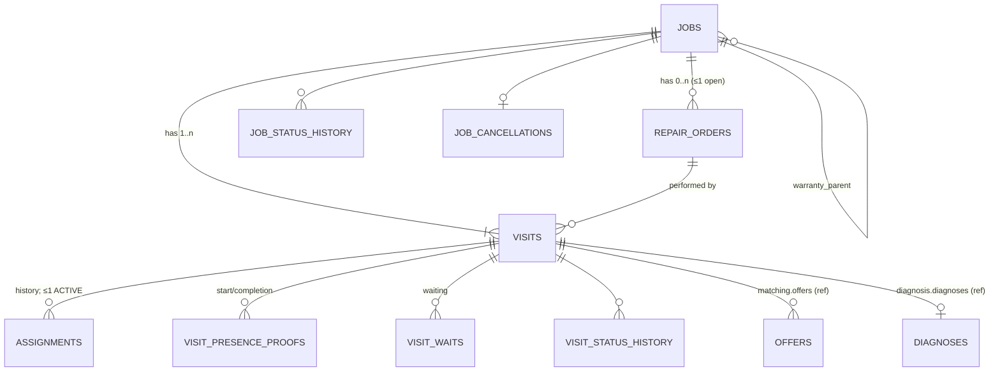
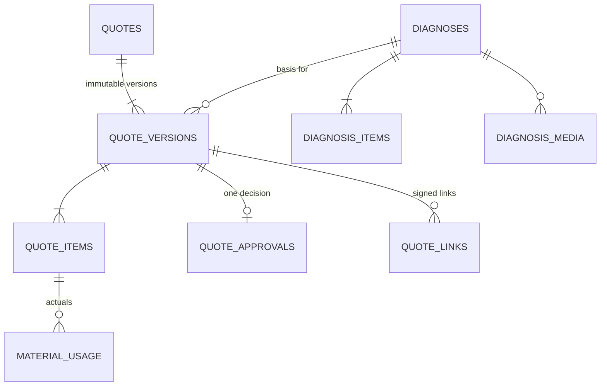
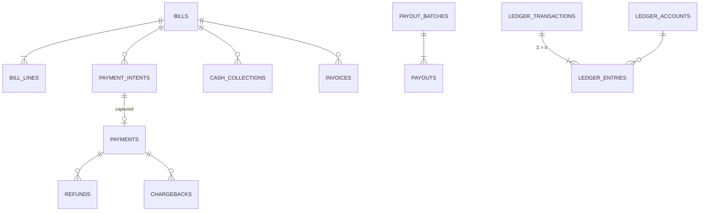

# Phase 1 · 03 — Database Design (PostgreSQL 17 + PostGIS)

> Status: **DRAFT for founder review** · Date: 2026-10-08
> The DDL below is a **design specification**, not a migration. Phase 2 turns it into reviewed, forward-only SQL migrations. Invariant references (INV-xx) point to [02-domain-model §8](02-domain-model.md#8-business-invariants).

---

## 1. Conventions

| Topic | Decision |
|---|---|
| **Primary keys** | `uuid`, **UUIDv7 generated in the application** (time-ordered → B-tree friendly; known before insert, which is needed for idempotency, outbox and logs). No DB default, so a missing ID fails loudly. PostgreSQL 18's native `uuidv7()` is not required. |
| **Human references** | `jobs.public_ref` = brand-neutral **`J-7K3P9QX`** style (Crockford Base32, 6 chars + 1 check char). `visits.visit_code` = 4-digit numeric, unique among a technician's active assignments (resolved in context, never used alone for authZ). |
| **Time** | `timestamptz` everywhere (stored UTC). Windows are `tstzrange` with `[)` bounds. Business dates are `date`, computed in `cities.timezone` (default `Asia/Kolkata`). `now()` is taken from the transaction. The app clock is injectable for tests. |
| **Money** | `bigint` **paise**, `CHECK (… >= 0)` unless the column is a signed adjustment. `currency char(3) NOT NULL DEFAULT 'INR'`. Quantities are `numeric(10,3)`. Rates are `int` basis points (`bps`). Never float. |
| **Status columns** | `text` + `CHECK (status IN (…))`. Transitions are enforced in application state machines, **and** a trigger rejects transitions not in the allowed-transition table for core aggregates (defense in depth; §9). |
| **Encrypted columns** | Suffix `_enc`, type `bytea`. Format: `v1 ‖ key_ref ‖ nonce ‖ ciphertext ‖ tag` (AES-256-GCM, envelope; per-subject DEK where the subject is a person). Never indexed. |
| **Blind indexes** | Suffix `_bidx`, `bytea` (HMAC-SHA256, pepper from Secrets Manager, truncated to 16 bytes). Used for equality lookup or dedupe only. |
| **Classification tags** | Every column carries a comment tag: `P` public · `I` internal · `C` confidential · `R` restricted. A schema lint fails CI if a new column lacks a tag. Legend in the DDL below: `-- C,enc`. |
| **Standard columns** | `created_at timestamptz NOT NULL DEFAULT now()`, `updated_at timestamptz NOT NULL DEFAULT now()` (trigger-maintained) on mutable tables. `version int NOT NULL DEFAULT 0` on mutable aggregates (optimistic locking). Actor columns as `(actor_type text, actor_id uuid)`. |
| **FKs** | Within a schema only. `ON DELETE RESTRICT` (default `NO ACTION`). Cross-schema references are plain `uuid` columns named `<thing>_id` with a comment `-- ref: schema.table` and a nightly orphan check. Exception: none in V1. |
| **Extensions** | `postgis`, `btree_gist`, `pg_trgm`, `pgcrypto` (digest only), `pg_partman`, `pgaudit`, `pg_stat_statements`. |

**Classification legend:** **P** may appear on public cards. **I** is operational and visible to parties in context. **C** is confidential: need-to-know, masked to admins by default. **R** is restricted: specific roles only, every read logged.

---

## 2. Schema overview (ER diagrams)

### 2.1 Fulfilment core: one job → many visits → many assignments



### 2.2 Quoting



### 2.3 Money



---

## 3. `geo` schema

#### `geo.cities`: operating cities
Class: P/I · Audit: admin changes → audit_logs · Retention: permanent
```sql
CREATE TABLE geo.cities (
  id               uuid PRIMARY KEY,
  code             text NOT NULL UNIQUE CHECK (code ~ '^[A-Z]{3,6}$'),   -- I
  names            jsonb NOT NULL,          -- P  {"en":"Nashik","hi":"नाशिक","mr":"नाशिक"}
  state_code       text NOT NULL,           -- I  (ISO 3166-2:IN)
  timezone         text NOT NULL DEFAULT 'Asia/Kolkata',
  supported_locales text[] NOT NULL CHECK (cardinality(supported_locales) >= 1),
  status           text NOT NULL CHECK (status IN ('PLANNED','PILOT','LIVE','PAUSED')),
  created_at timestamptz NOT NULL DEFAULT now(), updated_at timestamptz NOT NULL DEFAULT now(),
  version int NOT NULL DEFAULT 0
);
```

#### `geo.zones`: operational zones (polygons)
```sql
CREATE TABLE geo.zones (
  id        uuid PRIMARY KEY,
  city_id   uuid NOT NULL REFERENCES geo.cities(id),
  code      text NOT NULL,
  names     jsonb NOT NULL,                                  -- P
  boundary  geography(MultiPolygon, 4326) NOT NULL,          -- I
  status    text NOT NULL CHECK (status IN ('ACTIVE','INACTIVE')),
  created_at timestamptz NOT NULL DEFAULT now(), updated_at timestamptz NOT NULL DEFAULT now(),
  version int NOT NULL DEFAULT 0,
  UNIQUE (city_id, code)
);
CREATE INDEX zones_boundary_gix ON geo.zones USING gist (boundary);
```

#### `geo.localities`: the unit of location for basic-phone matching
```sql
CREATE TABLE geo.localities (
  id         uuid PRIMARY KEY,
  city_id    uuid NOT NULL REFERENCES geo.cities(id),
  zone_id    uuid NOT NULL REFERENCES geo.zones(id),
  code       text NOT NULL,
  names      jsonb NOT NULL,                          -- P  per locale, as spoken locally
  centroid   geography(Point, 4326) NOT NULL,         -- I
  pincode    text CHECK (pincode ~ '^[1-9][0-9]{5}$'),
  prompt_audio_ref text,                              -- I  pre-recorded name clip per locale (voice)
  status     text NOT NULL CHECK (status IN ('ACTIVE','INACTIVE')),
  created_at timestamptz NOT NULL DEFAULT now(), updated_at timestamptz NOT NULL DEFAULT now(),
  version int NOT NULL DEFAULT 0,
  UNIQUE (city_id, code)
);
CREATE INDEX localities_centroid_gix ON geo.localities USING gist (centroid);
CREATE INDEX localities_zone_ix ON geo.localities (zone_id) WHERE status = 'ACTIVE';

CREATE TABLE geo.locality_aliases (
  id uuid PRIMARY KEY, locality_id uuid NOT NULL REFERENCES geo.localities(id),
  alias text NOT NULL, script text NOT NULL, normalized text NOT NULL,
  UNIQUE (locality_id, normalized)
);
CREATE INDEX locality_aliases_trgm ON geo.locality_aliases USING gin (normalized gin_trgm_ops);

CREATE TABLE geo.locality_adjacency (
  locality_id uuid NOT NULL REFERENCES geo.localities(id),
  neighbor_id uuid NOT NULL REFERENCES geo.localities(id),
  travel_minutes_typical smallint NOT NULL CHECK (travel_minutes_typical BETWEEN 1 AND 240),
  source text NOT NULL CHECK (source IN ('COMPUTED','OPS_CURATED')),
  PRIMARY KEY (locality_id, neighbor_id),
  CHECK (locality_id <> neighbor_id)
);
```

---

## 4. `identity` schema

#### `identity.users`
Purpose: one row per natural person who logs in by phone (customer, technician, agent). Class: C · Encryption: phone enc + bidx · Retention: tombstone forever; PII erased on erasure · Audit: status changes, erasure
```sql
CREATE TABLE identity.users (
  id              uuid PRIMARY KEY,
  phone_enc       bytea,                  -- C,enc   NULL after erasure
  phone_bidx      bytea,                  -- C,bidx  NULL after erasure
  phone_masked    text,                   -- I       '+91 98•••••21'; NULL after erasure
  preferred_locale text NOT NULL,        -- set from the city's primary locale at registration; no hard-coded default (X-05)
  status          text NOT NULL CHECK (status IN ('ACTIVE','SUSPENDED','ERASED')),
  suspended_reason_code text,
  erased_at       timestamptz,
  created_at timestamptz NOT NULL DEFAULT now(), updated_at timestamptz NOT NULL DEFAULT now(),
  version int NOT NULL DEFAULT 0,
  CHECK ((status = 'ERASED') = (phone_enc IS NULL AND phone_bidx IS NULL AND erased_at IS NOT NULL))
);
CREATE UNIQUE INDEX users_phone_bidx_uq ON identity.users (phone_bidx) WHERE phone_bidx IS NOT NULL;
```

#### `identity.subject_keys`: per-person data key (crypto-shredding)
```sql
CREATE TABLE identity.subject_keys (
  user_id      uuid PRIMARY KEY REFERENCES identity.users(id),
  wrapped_dek  bytea,                     -- R  NULL = destroyed (erasure)
  kms_key_arn  text NOT NULL,
  created_at   timestamptz NOT NULL DEFAULT now(),
  destroyed_at timestamptz,
  CHECK ((wrapped_dek IS NULL) = (destroyed_at IS NOT NULL))
);
```

#### `identity.devices`, `identity.sessions`, `identity.refresh_tokens`
```sql
CREATE TABLE identity.devices (
  id uuid PRIMARY KEY, user_id uuid NOT NULL REFERENCES identity.users(id),
  platform text NOT NULL CHECK (platform IN ('ANDROID_APP','WEB')),
  app_version text, os_version text,
  push_token_enc bytea,                   -- C,enc
  integrity_verdict text CHECK (integrity_verdict IN ('MEETS_DEVICE','MEETS_BASIC','FAILED','UNKNOWN')),
  first_seen_at timestamptz NOT NULL DEFAULT now(), last_seen_at timestamptz NOT NULL DEFAULT now(),
  revoked_at timestamptz
);
CREATE INDEX devices_user_ix ON identity.devices (user_id) WHERE revoked_at IS NULL;

CREATE TABLE identity.sessions (
  id uuid PRIMARY KEY, user_id uuid NOT NULL REFERENCES identity.users(id),
  device_id uuid REFERENCES identity.devices(id),
  surface text NOT NULL CHECK (surface IN ('CUSTOMER_WEB','TECHNICIAN_APP','AGENT_WEB')),
  auth_methods text[] NOT NULL,           -- {'otp_sms'} / {'otp_sms','totp'}
  step_up_at timestamptz,
  idle_expires_at timestamptz NOT NULL, absolute_expires_at timestamptz NOT NULL,
  revoked_at timestamptz, revoke_reason text,
  created_at timestamptz NOT NULL DEFAULT now(), last_seen_at timestamptz NOT NULL DEFAULT now()
);
CREATE INDEX sessions_user_active_ix ON identity.sessions (user_id) WHERE revoked_at IS NULL;

CREATE TABLE identity.refresh_tokens (
  id uuid PRIMARY KEY, session_id uuid NOT NULL REFERENCES identity.sessions(id),
  family_id uuid NOT NULL,
  token_hash bytea NOT NULL UNIQUE,       -- R  SHA-256 of 256-bit random token
  issued_at timestamptz NOT NULL DEFAULT now(), expires_at timestamptz NOT NULL,
  used_at timestamptz, replaced_by_id uuid, revoked_at timestamptz
);
CREATE INDEX refresh_tokens_family_ix ON identity.refresh_tokens (family_id);
```
Retention: sessions/refresh tokens hard-deleted 30 days after expiry/revocation. Devices hard-deleted 180 days after last use.

#### `identity.otp_challenges`
Class: R (hash only) · Retention: **hard delete after 24 h** · Never logged
```sql
CREATE TABLE identity.otp_challenges (
  id uuid PRIMARY KEY,
  phone_bidx bytea NOT NULL,
  purpose text NOT NULL CHECK (purpose IN ('LOGIN','STEP_UP','QUOTE_LINK_APPROVAL','PHONE_CHANGE','CONSENT')),
  channel text NOT NULL CHECK (channel IN ('SMS','WHATSAPP','VOICE')),
  code_hmac bytea NOT NULL,               -- R  HMAC(pepper, challenge_id ‖ code)
  attempts smallint NOT NULL DEFAULT 0 CHECK (attempts BETWEEN 0 AND 10),
  max_attempts smallint NOT NULL DEFAULT 5,
  expires_at timestamptz NOT NULL, consumed_at timestamptz,
  ip_hash bytea, device_hash bytea,
  created_at timestamptz NOT NULL DEFAULT now()
);
CREATE INDEX otp_phone_recent_ix ON identity.otp_challenges (phone_bidx, created_at DESC);
```

#### `identity.ivr_credentials`
```sql
CREATE TABLE identity.ivr_credentials (
  user_id uuid PRIMARY KEY REFERENCES identity.users(id),
  pin_hash text NOT NULL,                 -- R  Argon2id PHC string
  failed_attempts smallint NOT NULL DEFAULT 0, locked_until timestamptz,
  last_changed_at timestamptz NOT NULL, set_via text NOT NULL CHECK (set_via IN ('IVR_SELF','AGENT_ASSISTED_VERIFIED','APP')),
  version int NOT NULL DEFAULT 0
);
```

---

## 5. `customers` schema

#### `customers.customer_profiles`
```sql
CREATE TABLE customers.customer_profiles (
  user_id uuid PRIMARY KEY,               -- ref: identity.users
  display_name_enc bytea,                 -- C,enc   optional first name for greetings
  preferred_locale text NOT NULL,
  preferred_language text CHECK (preferred_language IN ('te','en','other')),  -- I optional (Q-C). Purpose: communication, support, booking assistance, language-friction metrics. Never used for profiling or technician ranking
  marketing_opt_in boolean NOT NULL DEFAULT false,  -- mirrors consent; consent table is authoritative
  created_at timestamptz NOT NULL DEFAULT now(), updated_at timestamptz NOT NULL DEFAULT now(),
  version int NOT NULL DEFAULT 0
);
```

#### `customers.addresses`
Class: C · Encryption: all address text and exact point · Retention: soft delete; erased on account erasure · Audit: create/update/delete events (no values)
```sql
CREATE TABLE customers.addresses (
  id uuid PRIMARY KEY,
  customer_user_id uuid NOT NULL,         -- ref: identity.users
  city_id uuid NOT NULL, locality_id uuid NOT NULL,   -- I  ref: geo
  label text CHECK (char_length(label) <= 30),        -- I  "Home"
  line1_enc bytea NOT NULL,               -- C,enc  house/flat, building
  line2_enc bytea,                        -- C,enc
  landmark_enc bytea NOT NULL,            -- C,enc  mandatory
  access_notes_enc bytea,                 -- C,enc  "dog at home", gate code
  point_exact_enc bytea,                  -- C,enc  lat/lng as given
  point_coarse geography(Point,4326),     -- I      rounded to ~110 m, used for travel estimates only
  digipin_enc bytea,                      -- C,enc
  deleted_at timestamptz,
  created_at timestamptz NOT NULL DEFAULT now(), updated_at timestamptz NOT NULL DEFAULT now(),
  version int NOT NULL DEFAULT 0
);
CREATE INDEX addresses_customer_ix ON customers.addresses (customer_user_id) WHERE deleted_at IS NULL;
```

#### `customers.customer_sensitive_attributes`
Class: **R** · Purpose: segment statistics only (consent `segment_statistics`) · Retention: deleted on consent withdrawal or erasure
```sql
CREATE TABLE customers.customer_sensitive_attributes (
  user_id uuid PRIMARY KEY,
  gender_enc bytea NOT NULL,              -- R,enc  self-declared: woman/man/other/prefer_not
  consent_event_id uuid NOT NULL,         -- ref: compliance.consent_events
  created_at timestamptz NOT NULL DEFAULT now()
);
```
Readable only by the `trust` aggregation job via `customers.getSegmentForRating()`. No API or admin screen displays it individually.

---

## 6. `workforce` schema

#### `workforce.technician_profiles`
```sql
CREATE TABLE workforce.technician_profiles (
  user_id uuid PRIMARY KEY,               -- ref: identity.users
  legal_name_enc bytea NOT NULL,          -- C,enc
  display_name text NOT NULL CHECK (char_length(display_name) BETWEEN 2 AND 40),  -- P "Ramesh K."
  photo_file_id uuid,                     -- P (consented)  ref: files
  device_mode text NOT NULL CHECK (device_mode IN ('SMARTPHONE','BASIC_PHONE','AGENT_ASSISTED')),
  city_id uuid NOT NULL, home_locality_id uuid NOT NULL,
  languages text[] NOT NULL CHECK (cardinality(languages) >= 1),     -- P
  experience_years smallint CHECK (experience_years BETWEEN 0 AND 60),-- P (bucketed on display)
  birth_year smallint NOT NULL,           -- C  18+ check in app (computed against current year)
  onboarding_status text NOT NULL CHECK (onboarding_status IN ('DRAFT','DOCS_PENDING','IN_VERIFICATION','TRAINING','READY')),
  status text NOT NULL CHECK (status IN ('PROBATION','ACTIVE','PAUSED','SUSPENDED','OFFBOARDED')),
  capacity smallint NOT NULL DEFAULT 1 CHECK (capacity BETWEEN 1 AND 5),
  worker_attributes_enc bytea,            -- R,enc  self-declared gender (opt-in; future scoped services only)
  accepts_women_only_requests boolean NOT NULL DEFAULT false,  -- I (feature-flagged off in V1)
  ivr_locale text NOT NULL,
  preferred_offer_call_window int4range,  -- minutes of day, e.g. [480,1200)
  created_at timestamptz NOT NULL DEFAULT now(), updated_at timestamptz NOT NULL DEFAULT now(),
  version int NOT NULL DEFAULT 0
);
CREATE INDEX tech_city_status_ix ON workforce.technician_profiles (city_id, status);
```

#### `workforce.technician_skills`
```sql
CREATE TABLE workforce.technician_skills (
  id uuid PRIMARY KEY,
  technician_user_id uuid NOT NULL REFERENCES workforce.technician_profiles(user_id),
  service_type_id uuid NOT NULL,          -- ref: catalog.service_types
  specialization_id uuid,                 -- ref: catalog.specializations
  level text NOT NULL CHECK (level IN ('CLAIMED','ASSESSED','CERTIFIED')),
  can_diagnose boolean NOT NULL DEFAULT true,
  can_repair boolean NOT NULL DEFAULT true,
  verified_by_admin_id uuid, verified_at timestamptz, valid_until timestamptz,
  status text NOT NULL CHECK (status IN ('ACTIVE','REVOKED')),
  created_at timestamptz NOT NULL DEFAULT now(), updated_at timestamptz NOT NULL DEFAULT now(),
  CHECK (level = 'CLAIMED' OR (verified_by_admin_id IS NOT NULL AND verified_at IS NOT NULL))
);
CREATE UNIQUE INDEX tech_skill_uq ON workforce.technician_skills
  (technician_user_id, service_type_id, specialization_id) NULLS NOT DISTINCT WHERE status = 'ACTIVE';
CREATE INDEX tech_skill_lookup_ix ON workforce.technician_skills (service_type_id, specialization_id) WHERE status = 'ACTIVE';
```
`can_diagnose`/`can_repair` let diagnosis skill and repair skill differ (a senior AC diagnostician vs. a wiring specialist).

#### `workforce.technician_service_areas`
```sql
CREATE TABLE workforce.technician_service_areas (
  id uuid PRIMARY KEY,
  technician_user_id uuid NOT NULL REFERENCES workforce.technician_profiles(user_id),
  locality_id uuid NOT NULL,              -- ref: geo.localities
  priority text NOT NULL CHECK (priority IN ('PRIMARY','SECONDARY')),
  max_radius_km numeric(4,1) CHECK (max_radius_km BETWEEN 0.5 AND 50),  -- smartphone + consent only
  created_at timestamptz NOT NULL DEFAULT now(), removed_at timestamptz
);
CREATE UNIQUE INDEX tsa_uq ON workforce.technician_service_areas (technician_user_id, locality_id) WHERE removed_at IS NULL;
CREATE INDEX tsa_locality_ix ON workforce.technician_service_areas (locality_id) WHERE removed_at IS NULL;
```

#### `workforce.technician_weekly_availability` / `technician_availability_overrides`
```sql
CREATE TABLE workforce.technician_weekly_availability (
  id uuid PRIMARY KEY,
  technician_user_id uuid NOT NULL REFERENCES workforce.technician_profiles(user_id),
  weekday smallint NOT NULL CHECK (weekday BETWEEN 1 AND 7),     -- ISO
  minutes int4range NOT NULL CHECK (lower(minutes) >= 0 AND upper(minutes) <= 1440 AND NOT isempty(minutes)),
  effective_from date NOT NULL, effective_to date,
  EXCLUDE USING gist (technician_user_id WITH =, weekday WITH =, minutes WITH &&,
                      daterange(effective_from, effective_to) WITH &&)
);
CREATE TABLE workforce.technician_availability_overrides (
  id uuid PRIMARY KEY,
  technician_user_id uuid NOT NULL REFERENCES workforce.technician_profiles(user_id),
  period tstzrange NOT NULL,
  kind text NOT NULL CHECK (kind IN ('UNAVAILABLE','EXTRA_AVAILABLE')),
  reason_code text, created_via text NOT NULL CHECK (created_via IN ('APP','IVR','AGENT','OPS')),
  created_at timestamptz NOT NULL DEFAULT now()
);
CREATE INDEX tao_period_gix ON workforce.technician_availability_overrides USING gist (technician_user_id, period);
```

#### `workforce.technician_daily_checkins` (append-only)
```sql
CREATE TABLE workforce.technician_daily_checkins (
  id uuid PRIMARY KEY,
  technician_user_id uuid NOT NULL REFERENCES workforce.technician_profiles(user_id),
  service_date date NOT NULL,
  available boolean NOT NULL,
  locality_id uuid,                       -- must be one of the technician's registered areas (app check)
  channel text NOT NULL CHECK (channel IN ('APP','IVR','MISSED_CALL','AGENT','OPS')),
  call_session_id uuid,
  created_at timestamptz NOT NULL DEFAULT now(),
  CHECK (NOT available OR locality_id IS NOT NULL)
);
CREATE INDEX checkin_latest_ix ON workforce.technician_daily_checkins (technician_user_id, service_date, created_at DESC);
CREATE INDEX checkin_pool_ix ON workforce.technician_daily_checkins (service_date, locality_id) WHERE available;
```
Retention: 13 months (metrics), then aggregated.

#### `workforce.technician_presence`, `workforce.technician_location_shares`
```sql
CREATE TABLE workforce.technician_presence (
  technician_user_id uuid PRIMARY KEY REFERENCES workforce.technician_profiles(user_id),
  online boolean NOT NULL, changed_at timestamptz NOT NULL, channel text NOT NULL
);
CREATE TABLE workforce.technician_location_shares (     -- one-time, consented; NO continuous tracking
  id uuid PRIMARY KEY, technician_user_id uuid NOT NULL,
  visit_id uuid,                                         -- ref: jobs.visits
  purpose text NOT NULL CHECK (purpose IN ('ARRIVAL_SNAPSHOT','SHARE_ONCE_FOR_MATCHING')),
  point_enc bytea NOT NULL,               -- C,enc
  accuracy_m int, mock_location_flag boolean,
  consent_event_id uuid NOT NULL,
  captured_at timestamptz NOT NULL, expires_at timestamptz NOT NULL   -- ≤ 30 days
);
```

#### `workforce.payout_methods`
Class: **R** · Encryption: account/VPA/name enc + bidx · Audit: every change, every reveal · Retention: engagement + 8 years (financial evidence), PII minimised after offboarding
```sql
CREATE TABLE workforce.payout_methods (
  id uuid PRIMARY KEY,
  technician_user_id uuid NOT NULL REFERENCES workforce.technician_profiles(user_id),
  type text NOT NULL CHECK (type IN ('BANK_ACCOUNT','UPI_VPA')),
  account_number_enc bytea, account_bidx bytea, ifsc text CHECK (ifsc ~ '^[A-Z]{4}0[A-Z0-9]{6}$'),
  vpa_enc bytea, vpa_bidx bytea,
  holder_name_enc bytea NOT NULL,
  account_last4 text NOT NULL,            -- I display
  verification_status text NOT NULL CHECK (verification_status IN ('PENDING','VERIFIED','FAILED')),
  name_match_score smallint CHECK (name_match_score BETWEEN 0 AND 100),
  status text NOT NULL CHECK (status IN ('PENDING_COOLING_OFF','ACTIVE','REPLACED','DISABLED')),
  cooling_off_until timestamptz NOT NULL,
  created_via text NOT NULL CHECK (created_via IN ('APP_STEP_UP','AGENT_ASSISTED','OPS_VERIFIED')),
  created_by_actor_type text NOT NULL, created_by_actor_id uuid NOT NULL,
  approval_request_id uuid,               -- maker-checker when created via AGENT/OPS
  activated_at timestamptz,
  created_at timestamptz NOT NULL DEFAULT now(), updated_at timestamptz NOT NULL DEFAULT now(),
  version int NOT NULL DEFAULT 0,
  CHECK ((type = 'BANK_ACCOUNT' AND account_number_enc IS NOT NULL AND ifsc IS NOT NULL)
      OR (type = 'UPI_VPA' AND vpa_enc IS NOT NULL)),
  CHECK (status <> 'ACTIVE' OR (verification_status = 'VERIFIED' AND activated_at IS NOT NULL))
);
CREATE UNIQUE INDEX payout_active_uq ON workforce.payout_methods (technician_user_id) WHERE status = 'ACTIVE';
CREATE INDEX payout_dedupe_acct_ix ON workforce.payout_methods (account_bidx);  -- same account across technicians = fraud signal
```

#### `workforce.field_agents`, `workforce.agent_technician_links`
```sql
CREATE TABLE workforce.field_agents (
  user_id uuid PRIMARY KEY, agent_code text NOT NULL UNIQUE, city_id uuid NOT NULL,
  status text NOT NULL CHECK (status IN ('ACTIVE','SUSPENDED','TERMINATED')),
  contract_ref text, mfa_enrolled_at timestamptz,
  created_at timestamptz NOT NULL DEFAULT now(), version int NOT NULL DEFAULT 0
);
CREATE TABLE workforce.agent_technician_links (
  id uuid PRIMARY KEY,
  agent_user_id uuid NOT NULL REFERENCES workforce.field_agents(user_id),
  technician_user_id uuid NOT NULL REFERENCES workforce.technician_profiles(user_id),
  valid_from timestamptz NOT NULL, valid_to timestamptz,
  created_by_admin_id uuid NOT NULL
);
CREATE UNIQUE INDEX agent_link_active_uq ON workforce.agent_technician_links (technician_user_id) WHERE valid_to IS NULL;
```

`workforce.technician_metrics` is a projection (rebuildable): `technician_user_id PK, window text, offers_received, offers_accepted, offers_unreachable, assignments_completed, no_shows, late_cancels, on_time_arrivals, arrivals, upheld_complaints, rating_n, rating_sum, computed_at`.

---

## 7. `verification` schema

```sql
CREATE TABLE verification.documents (
  id uuid PRIMARY KEY,
  owner_user_id uuid NOT NULL,
  doc_type text NOT NULL CHECK (doc_type IN ('ID_PROOF','ADDRESS_PROOF','SKILL_CERTIFICATE','POLICE_CLEARANCE','PROFILE_PHOTO','OTHER')),
  file_id uuid NOT NULL,                  -- ref: files.file_objects (KYC bucket)
  doc_number_masked text,                 -- R  e.g. 'XXXX-XXXX-1234'; NEVER full Aadhaar (INV-27)
  doc_number_bidx bytea,                  -- R  dedupe for non-Aadhaar IDs only
  uploaded_by_actor_type text NOT NULL CHECK (uploaded_by_actor_type IN ('TECHNICIAN','FIELD_AGENT','ADMIN')),
  uploaded_by_actor_id uuid NOT NULL,
  status text NOT NULL CHECK (status IN ('UPLOADED','ACCEPTED','REJECTED','EXPIRED','PURGED')),
  rejection_reason_code text, expires_on date,
  file_purge_after timestamptz NOT NULL,  -- image deleted after decision + N days
  created_at timestamptz NOT NULL DEFAULT now(), updated_at timestamptz NOT NULL DEFAULT now()
);
CREATE INDEX docs_owner_ix ON verification.documents (owner_user_id);
CREATE INDEX docs_dedupe_ix ON verification.documents (doc_number_bidx) WHERE doc_number_bidx IS NOT NULL;

CREATE TABLE verification.verification_records (    -- append-only
  id uuid PRIMARY KEY,
  subject_user_id uuid NOT NULL,
  check_type text NOT NULL CHECK (check_type IN ('IDENTITY','ADDRESS','CRIMINAL_BACKGROUND','SKILL','BANK_ACCOUNT','FACE_MATCH','POLICE_CLEARANCE')),
  result text NOT NULL CHECK (result IN ('PASS','FAIL','INCONCLUSIVE','REVOKED')),
  result_summary text,                    -- R  minimised; no raw vendor report
  vendor text, vendor_ref text,           -- R
  consent_event_id uuid,                  -- required for BGV
  decided_by_admin_id uuid,               -- verification officer (never a field agent)
  decided_at timestamptz NOT NULL, valid_until timestamptz,
  supersedes_id uuid REFERENCES verification.verification_records(id),
  CHECK (check_type <> 'CRIMINAL_BACKGROUND' OR consent_event_id IS NOT NULL)
);
CREATE INDEX vr_subject_ix ON verification.verification_records (subject_user_id, check_type, decided_at DESC);

CREATE TABLE verification.verification_levels (     -- projection
  subject_user_id uuid PRIMARY KEY, level smallint NOT NULL CHECK (level BETWEEN 0 AND 4),
  badges text[] NOT NULL, computed_at timestamptz NOT NULL
);
```
Retention: document images purged after decision + 30 days (configurable). Records kept for engagement + 3 years. BGV summaries are Restricted.

---

## 8. `catalog` and `pricing` schemas (abridged)

```sql
CREATE TABLE catalog.service_types (
  id uuid PRIMARY KEY, category_id uuid NOT NULL REFERENCES catalog.service_categories(id),
  code text NOT NULL UNIQUE, names jsonb NOT NULL, icon_ref text,
  status text NOT NULL CHECK (status IN ('ACTIVE','HIDDEN','RETIRED'))
);
CREATE TABLE catalog.repair_items (
  id uuid PRIMARY KEY, service_type_id uuid NOT NULL REFERENCES catalog.service_types(id),
  code text NOT NULL UNIQUE,                         -- 'REP-AC-WIRING-INDOOR'
  keypad_code text CHECK (keypad_code ~ '^[0-9]{2,3}$'),
  names jsonb NOT NULL,
  required_service_type_id uuid NOT NULL, required_specialization_id uuid,
  warranty_policy_code text,
  status text NOT NULL CHECK (status IN ('ACTIVE','RETIRED')),
  UNIQUE (service_type_id, keypad_code)              -- IVR keypad codes are service-type-specific (ADR-020)
);
CREATE TABLE catalog.materials (
  id uuid PRIMARY KEY, code text NOT NULL UNIQUE, names jsonb NOT NULL,
  unit text NOT NULL CHECK (unit IN ('PIECE','METRE','LITRE','KG','SET')),
  status text NOT NULL CHECK (status IN ('ACTIVE','RETIRED'))
);
CREATE TABLE catalog.material_reference_prices (
  id uuid PRIMARY KEY, material_id uuid NOT NULL REFERENCES catalog.materials(id),
  city_id uuid NOT NULL, unit_price_paise bigint NOT NULL CHECK (unit_price_paise > 0),
  effective tstzrange NOT NULL, source text NOT NULL,
  EXCLUDE USING gist (material_id WITH =, city_id WITH =, effective WITH &&)
);
CREATE TABLE catalog.service_rules (                 -- effective-dated, maker-checker
  id uuid PRIMARY KEY, service_type_id uuid NOT NULL, city_id uuid,   -- NULL = default
  rules jsonb NOT NULL,     -- JSON-schema validated: same_visit_repair_allowed, min_verification_level,
                            -- max_visit_minutes, requires_after_photos, worker_attribute_requirement (null in V1),
                            -- diagnosis_skill_required, quote_expiry_hours,
                            -- enabled (city-scoped: is this service type bookable in this city; ADR-020) ...
  effective tstzrange NOT NULL, status text NOT NULL CHECK (status IN ('DRAFT','PENDING_APPROVAL','ACTIVE','RETIRED')),
  approval_request_id uuid,
  EXCLUDE USING gist (service_type_id WITH =, (coalesce(city_id,'00000000-0000-0000-0000-000000000000'::uuid)) WITH =, effective WITH &&) WHERE (status = 'ACTIVE')
);

CREATE TABLE pricing.rate_cards (
  id uuid PRIMARY KEY, city_id uuid NOT NULL, version_no int NOT NULL,
  status text NOT NULL CHECK (status IN ('DRAFT','PENDING_APPROVAL','APPROVED','ACTIVE','RETIRED')),
  effective tstzrange,                    -- set on approval
  created_by_admin_id uuid NOT NULL, approval_request_id uuid,
  created_at timestamptz NOT NULL DEFAULT now(),
  UNIQUE (city_id, version_no),
  EXCLUDE USING gist (city_id WITH =, effective WITH &&) WHERE (status IN ('APPROVED','ACTIVE'))
);
CREATE TABLE pricing.rate_card_items (
  id uuid PRIMARY KEY, rate_card_id uuid NOT NULL REFERENCES pricing.rate_cards(id),
  target_type text NOT NULL CHECK (target_type IN ('VISIT_FEE','REPAIR_ITEM')),
  service_type_id uuid, repair_item_id uuid,
  labour_paise bigint NOT NULL CHECK (labour_paise >= 0),
  min_paise bigint NOT NULL, max_paise bigint NOT NULL CHECK (min_paise <= labour_paise AND labour_paise <= max_paise),
  technician_share_bps int NOT NULL CHECK (technician_share_bps BETWEEN 0 AND 10000),
  UNIQUE NULLS NOT DISTINCT (rate_card_id, target_type, service_type_id, repair_item_id)
);
CREATE TABLE pricing.fee_rules (
  id uuid PRIMARY KEY, rate_card_id uuid NOT NULL REFERENCES pricing.rate_cards(id),
  fee_type text NOT NULL CHECK (fee_type IN ('PLATFORM_FEE','MATERIAL_MARKUP','CANCELLATION','WAITING','TRAVEL_COMPENSATION','NO_SHOW','DIAGNOSIS_PAYOUT')),
  params jsonb NOT NULL,                  -- schema-validated per fee_type (tiers, caps, grace minutes...)
  applies_to jsonb NOT NULL DEFAULT '{}'
);
CREATE TABLE pricing.tax_rules (          -- values require CA sign-off before ACTIVE
  id uuid PRIMARY KEY, code text NOT NULL, applies_to text NOT NULL,
  rate_bps int NOT NULL CHECK (rate_bps BETWEEN 0 AND 5000),
  liable_party text NOT NULL CHECK (liable_party IN ('PLATFORM','TECHNICIAN','NONE')),
  effective tstzrange NOT NULL, approval_request_id uuid NOT NULL
);
CREATE TABLE pricing.price_snapshots (    -- immutable (INV-21)
  id uuid PRIMARY KEY, rate_card_id uuid NOT NULL, rule_refs jsonb NOT NULL,
  inputs jsonb NOT NULL, outputs jsonb NOT NULL, engine_version text NOT NULL,
  content_hash bytea NOT NULL, created_at timestamptz NOT NULL DEFAULT now()
);
```


### 8.1 V1 catalog tree (seed example)

Revised 2026-10-08 ([ADR-020](15-architecture-decisions.md#adr-020-appliance--home-equipment-replaces-standalone-ac)). **No schema change:** `service_categories` → `service_types` → `specializations` → `repair_items` is unchanged. What a city offers is **data**: a service type is bookable in a city only when it is `ACTIVE`, its city-scoped `service_rules.rules.enabled = true`, the city's active rate card has items for it, and at least one technician holds the skill (an operational check, not a constraint).

| Category (`service_categories.code`) | Service type (`service_types.code`) | Example specializations (`specializations.code`) | Kurnool pilot status |
|---|---|---|---|
| `PLUMBING` | `PLUMBING_GENERAL` (taps, leaks, blockages, fittings), `PLUMBING_TANK_MOTOR` (overhead tank, pump connections) | `LEAKAGE`, `DRAINAGE_BLOCKAGE`, `FITTINGS`, `PUMP_CONNECTION` | Enabled (validation) |
| `ELECTRICAL` | `ELECTRICAL_GENERAL` (switches, sockets, wiring, MCB/DB, fans, lights) | `WIRING`, `DISTRIBUTION_BOARD`, `FAN_LIGHT_FITTING`, `EARTHING` | Enabled (validation) |
| `APPLIANCE_HOME_EQUIPMENT` | `REFRIGERATOR` | `COOLING`, `COMPRESSOR`, `THERMOSTAT`, `GAS_REFRIGERATION`, `ELECTRICAL` | **Enabled for validation** |
| | `RO_WATER_PURIFIER` | `FILTER`, `PUMP`, `MEMBRANE`, `ELECTRICAL`, `LEAKAGE` | **Enabled for validation** |
| | `WASHING_MACHINE` | `DRAINAGE`, `MOTOR`, `PCB`, `INLET`, `ELECTRICAL` | **Enabled for validation** |
| | `GEYSER` | `HEATING_ELEMENT`, `THERMOSTAT`, `LEAKAGE`, `ELECTRICAL` | **Enabled for validation** |
| | `AIR_COOLER` | `MOTOR_FAN`, `PUMP`, `ELECTRICAL`, `WATER_FLOW` | **Enabled for validation** |
| | `AC` | `COOLING`, `ELECTRICAL`, `GAS_REFRIGERATION`, `PCB`, `COMPRESSOR` | In catalog, **not a primary launch type** (enable per city by config) |
| | `INVERTER` | `BATTERY`, `PCB`, `WIRING` | In catalog, disabled |
| | `MIXER_GRINDER` | `MOTOR`, `JAR_COUPLER`, `ELECTRICAL` | In catalog, disabled |
| | `MICROWAVE` | `MAGNETRON`, `PCB`, `ELECTRICAL` | In catalog, disabled |
| | `TV` | `PANEL_BACKLIGHT`, `PCB`, `POWER_SUPPLY` | In catalog, disabled |

Rules:
- **There is no generic "appliance technician" skill.** `technician_skills` rows are per service type, with optional specialization, `can_diagnose`/`can_repair`, and a verification level. A refrigerator diagnostician without `GAS_REFRIGERATION` can't be assigned a gas-charging repair visit.
- The pilot set (Refrigerator, RO/Water Purifier, Washing Machine, Geyser, Air Cooler) is a **testable operating assumption**, not proven demand. Enabling, disabling or adding a service type is a maker-checker config change with **no code change**.
- Repair items and IVR keypad codes are **service-type-specific** (e.g., `21` under Refrigerator ≠ `21` under RO). The IVR resolves the service type from the visit, so technicians never enter a category.
- Example repair items: `REP-FRIDGE-THERMOSTAT-REPLACE`, `REP-FRIDGE-GAS-CHARGE`, `REP-RO-FILTER-SET-REPLACE`, `REP-RO-MEMBRANE-REPLACE`, `REP-WM-DRAIN-PUMP-REPLACE`, `REP-GEYSER-ELEMENT-REPLACE`, `REP-COOLER-PUMP-REPLACE`, `REP-AC-WIRING-INDOOR` (AC kept as a regression example).

---

## 9. `jobs` schema (fulfilment core)

#### `jobs.jobs`
Purpose: the customer's request · Class: I with C columns · Retention: active + 3 years, then anonymise (financial refs stay) · Audit: every transition → `job_status_history` + outbox
```sql
CREATE TABLE jobs.jobs (
  id uuid PRIMARY KEY,
  public_ref text NOT NULL UNIQUE CHECK (public_ref ~ '^J-[0-9A-HJKMNP-TV-Z]{7}$'),
  customer_user_id uuid NOT NULL,                 -- ref: identity.users
  city_id uuid NOT NULL, zone_id uuid NOT NULL, locality_id uuid NOT NULL,
  service_type_id uuid NOT NULL,
  symptom_codes text[] NOT NULL DEFAULT '{}',
  problem_text_enc bytea,                         -- C,enc  customer's own words
  problem_voice_file_id uuid, problem_photo_file_ids uuid[] NOT NULL DEFAULT '{}',
  address_id uuid NOT NULL,                       -- ref: customers.addresses
  address_snapshot_enc bytea NOT NULL,            -- C,enc  frozen at booking
  channel text NOT NULL CHECK (channel IN ('PWA','OPS_DESK','IVR','WHATSAPP')),
  payment_preference text NOT NULL CHECK (payment_preference IN ('ONLINE','CASH','EITHER')),   -- D-13 / X-24 soft signal
  onsite_adult text NOT NULL CHECK (onsite_adult IN ('SELF','ADULT_FAMILY','OTHER_ADULT')),    -- adult-present policy (X-34)
  onsite_contact_enc bytea,                       -- C,enc optional on-site adult contact when booking for someone else
  created_by_actor_type text NOT NULL, created_by_actor_id uuid NOT NULL,
  customer_verified boolean NOT NULL,             -- false when booked by ops before customer OTP
  client_request_id uuid NOT NULL,                -- idempotency at business level
  status text NOT NULL CHECK (status IN ('REQUESTED','IN_DIAGNOSIS','AWAITING_APPROVAL','REPAIR_PENDING',
                                          'REPAIR_IN_PROGRESS','AWAITING_PAYMENT','CLOSED','CANCELLED')),
  close_reason text CHECK (close_reason IN ('REPAIRED','NO_REPAIR_NEEDED','QUOTE_REJECTED','QUOTE_EXPIRED','WARRANTY_RESOLVED')),
  needs_attention boolean NOT NULL DEFAULT false, -- e.g. visit UNFULFILLED
  has_open_complaint boolean NOT NULL DEFAULT false,
  has_open_dispute boolean NOT NULL DEFAULT false,
  safety_hold boolean NOT NULL DEFAULT false,
  warranty_parent_job_id uuid REFERENCES jobs.jobs(id),
  warranty_claim_id uuid,                         -- ref: warranty.warranty_claims
  visit_fee_snapshot_id uuid NOT NULL,            -- ref: pricing.price_snapshots
  created_at timestamptz NOT NULL DEFAULT now(), updated_at timestamptz NOT NULL DEFAULT now(),
  closed_at timestamptz,
  version int NOT NULL DEFAULT 0,
  UNIQUE (customer_user_id, client_request_id),
  CHECK ((status = 'CLOSED') = (close_reason IS NOT NULL AND closed_at IS NOT NULL)),
  CHECK ((warranty_parent_job_id IS NULL) = (warranty_claim_id IS NULL))
);
CREATE INDEX jobs_customer_ix ON jobs.jobs (customer_user_id, created_at DESC);
CREATE INDEX jobs_board_ix ON jobs.jobs (city_id, status, created_at) WHERE status NOT IN ('CLOSED','CANCELLED');
CREATE INDEX jobs_dup_check_ix ON jobs.jobs (customer_user_id, address_id, service_type_id)
  WHERE status IN ('REQUESTED','IN_DIAGNOSIS','AWAITING_APPROVAL','REPAIR_PENDING','REPAIR_IN_PROGRESS');
```

#### `jobs.visits`: first-class physical trips
```sql
CREATE TABLE jobs.visits (
  id uuid PRIMARY KEY,
  job_id uuid NOT NULL REFERENCES jobs.jobs(id),
  city_id uuid NOT NULL, locality_id uuid NOT NULL,
  sequence_no smallint NOT NULL CHECK (sequence_no >= 1),
  purposes text[] NOT NULL CHECK (cardinality(purposes) BETWEEN 1 AND 2
                                  AND purposes <@ ARRAY['DIAGNOSIS','REPAIR','WARRANTY_INSPECTION']),
  repair_order_id uuid REFERENCES jobs.repair_orders(id),
  required_service_type_id uuid NOT NULL, required_specialization_id uuid,
  required_capability text NOT NULL CHECK (required_capability IN ('DIAGNOSE','REPAIR','DIAGNOSE_AND_REPAIR')),
  window tstzrange NOT NULL CHECK (NOT isempty(window)),
  urgency text NOT NULL CHECK (urgency IN ('ASAP','SCHEDULED')),
  status text NOT NULL CHECK (status IN ('PLANNED','MATCHING','ASSIGNED','EN_ROUTE','ON_SITE','IN_PROGRESS',
                                          'COMPLETED','CANCELLED','UNFULFILLED','CUSTOMER_NO_SHOW','ABORTED')),
  start_code_hash bytea NOT NULL,                 -- R  HMAC; plaintext shown only to customer
  start_code_attempts smallint NOT NULL DEFAULT 0,
  completion_code_hash bytea,                     -- R  issued for REPAIR purpose
  completion_code_attempts smallint NOT NULL DEFAULT 0,
  visit_code text NOT NULL CHECK (visit_code ~ '^[0-9]{4}$'),  -- IVR selection aid
  departed_at timestamptz, arrived_at timestamptz, work_started_at timestamptz, completed_at timestamptz,
  terminal_reason_code text,
  disclosure_opens_at timestamptz, disclosure_closes_at timestamptz,
  created_at timestamptz NOT NULL DEFAULT now(), updated_at timestamptz NOT NULL DEFAULT now(),
  version int NOT NULL DEFAULT 0,
  UNIQUE (job_id, sequence_no),
  CHECK (('REPAIR' = ANY(purposes)) = (repair_order_id IS NOT NULL)),
  CHECK (('REPAIR' = ANY(purposes)) = (completion_code_hash IS NOT NULL)),
  CHECK (status NOT IN ('ON_SITE','IN_PROGRESS','COMPLETED') OR arrived_at IS NOT NULL),
  CHECK (status <> 'COMPLETED' OR completed_at IS NOT NULL)
);
CREATE INDEX visits_job_ix ON jobs.visits (job_id);
CREATE INDEX visits_ops_ix ON jobs.visits (city_id, status, lower(window)) WHERE status NOT IN ('COMPLETED','CANCELLED','CUSTOMER_NO_SHOW','ABORTED');
CREATE INDEX visits_repair_order_ix ON jobs.visits (repair_order_id) WHERE repair_order_id IS NOT NULL;
```
Same-visit repair = `purposes = {DIAGNOSIS,REPAIR}`, with `repair_order_id` set and a completion code issued when the repair order is attached (an atomic update with checks).

#### `jobs.assignments`
```sql
CREATE TABLE jobs.assignments (
  id uuid PRIMARY KEY,
  visit_id uuid NOT NULL REFERENCES jobs.visits(id),
  technician_user_id uuid NOT NULL,               -- ref: workforce.technician_profiles
  offer_id uuid,                                  -- ref: matching.offers (NULL for manual)
  assigned_via text NOT NULL CHECK (assigned_via IN ('CASCADE_OFFER','DIRECT_OFFER','MANUAL_OPS')),
  assigned_by_actor_type text NOT NULL, assigned_by_actor_id uuid NOT NULL,
  manual_reason_code text,
  status text NOT NULL CHECK (status IN ('ACTIVE','COMPLETED','RELEASED','NO_SHOW','REVOKED')),
  release_reason_code text, released_by_actor_type text, released_at timestamptz,
  created_at timestamptz NOT NULL DEFAULT now(), ended_at timestamptz,
  CHECK (assigned_via <> 'MANUAL_OPS' OR manual_reason_code IS NOT NULL),
  CHECK ((status = 'ACTIVE') = (ended_at IS NULL))
);
CREATE UNIQUE INDEX assignment_active_uq ON jobs.assignments (visit_id) WHERE status = 'ACTIVE';   -- INV-01
CREATE INDEX assignment_tech_ix ON jobs.assignments (technician_user_id, status, created_at DESC);
```

#### `jobs.repair_orders`
```sql
CREATE TABLE jobs.repair_orders (
  id uuid PRIMARY KEY,
  job_id uuid NOT NULL REFERENCES jobs.jobs(id),
  quote_id uuid NOT NULL, quote_version_id uuid NOT NULL,        -- ref: diagnosis.*  (current approved)
  required_service_type_id uuid NOT NULL, required_specialization_id uuid,
  performer_preference text NOT NULL CHECK (performer_preference IN ('SAME_VISIT','SAME_TECHNICIAN','RECOMMENDED_SPECIALIST')),
  preferred_technician_user_id uuid,
  allow_fallback boolean NOT NULL,
  preferred_window tstzrange,
  materials_required jsonb NOT NULL,              -- snapshot of material lines from the approved version
  materials_supplied_by text NOT NULL CHECK (materials_supplied_by IN ('TECHNICIAN','CUSTOMER','MIXED','NONE')),
  materials_confirmed_at timestamptz,             -- technician confirmed carrying materials
  status text NOT NULL CHECK (status IN ('AWAITING_SCHEDULE','SCHEDULED','IN_PROGRESS','CHANGE_PENDING','BLOCKED','COMPLETED','CANCELLED')),
  blocked_reason_code text,
  created_at timestamptz NOT NULL DEFAULT now(), updated_at timestamptz NOT NULL DEFAULT now(),
  completed_at timestamptz, version int NOT NULL DEFAULT 0,
  CHECK (performer_preference <> 'SAME_TECHNICIAN' OR preferred_technician_user_id IS NOT NULL),
  CHECK (status <> 'BLOCKED' OR blocked_reason_code IS NOT NULL)
);
CREATE UNIQUE INDEX repair_order_open_uq ON jobs.repair_orders (job_id) WHERE status NOT IN ('COMPLETED','CANCELLED');
```

#### Histories & proofs (append-only, partitioned monthly)
```sql
CREATE TABLE jobs.job_status_history (
  id uuid NOT NULL, job_id uuid NOT NULL, from_status text, to_status text NOT NULL,
  actor_type text NOT NULL CHECK (actor_type IN ('CUSTOMER','TECHNICIAN','FIELD_AGENT','ADMIN','SYSTEM')),
  actor_id uuid, channel text NOT NULL, reason_code text, correlation_id uuid NOT NULL,
  created_at timestamptz NOT NULL DEFAULT now(),
  PRIMARY KEY (id, created_at)
) PARTITION BY RANGE (created_at);
CREATE INDEX jsh_job_ix ON jobs.job_status_history (job_id, created_at);
-- jobs.visit_status_history and jobs.repair_order_status_history: identical shape keyed by visit_id / repair_order_id

CREATE TABLE jobs.visit_presence_proofs (
  id uuid PRIMARY KEY, visit_id uuid NOT NULL REFERENCES jobs.visits(id),
  kind text NOT NULL CHECK (kind IN ('START_CODE','COMPLETION_CODE','OPS_OVERRIDE_ARRIVAL','OPS_OVERRIDE_COMPLETION',
                                     'LOCATION_SNAPSHOT','CALL_EVIDENCE','CUSTOMER_IDENTITY_CONFIRMED')),
  channel text NOT NULL CHECK (channel IN ('APP','IVR','OPS','CUSTOMER_APP')),
  actor_type text NOT NULL, actor_id uuid,
  call_session_id uuid, location_share_id uuid, approval_request_id uuid, reason_code text,
  created_at timestamptz NOT NULL DEFAULT now(),
  CHECK (kind NOT LIKE 'OPS_OVERRIDE%' OR (approval_request_id IS NOT NULL AND reason_code IS NOT NULL))
);

CREATE TABLE jobs.visit_waits (
  id uuid PRIMARY KEY, visit_id uuid NOT NULL REFERENCES jobs.visits(id),
  started_at timestamptz NOT NULL, ended_at timestamptz,
  start_evidence text NOT NULL CHECK (start_evidence IN ('CALL_ATTEMPTS','LOCATION_SNAPSHOT','OPS_CONFIRMED','CUSTOMER_ACK')),
  outcome text CHECK (outcome IN ('CUSTOMER_ARRIVED','CUSTOMER_NO_SHOW','CANCELLED')),
  billable_minutes int CHECK (billable_minutes >= 0),
  fee_paise bigint CHECK (fee_paise >= 0)
);
CREATE UNIQUE INDEX visit_wait_open_uq ON jobs.visit_waits (visit_id) WHERE ended_at IS NULL;

CREATE TABLE jobs.job_cancellations (
  job_id uuid PRIMARY KEY REFERENCES jobs.jobs(id),
  visit_id uuid, cancelled_by_actor_type text NOT NULL, cancelled_by_actor_id uuid,
  reason_code text NOT NULL, stage text NOT NULL,
  customer_fee_paise bigint NOT NULL DEFAULT 0 CHECK (customer_fee_paise >= 0),
  technician_compensation_paise bigint NOT NULL DEFAULT 0 CHECK (technician_compensation_paise >= 0),
  price_snapshot_id uuid NOT NULL,
  created_at timestamptz NOT NULL DEFAULT now()
);
```

---

## 10. `matching` schema

```sql
CREATE TABLE matching.match_runs (
  id uuid PRIMARY KEY, visit_id uuid NOT NULL, city_id uuid NOT NULL,
  config_version_id uuid NOT NULL, trigger text NOT NULL CHECK (trigger IN ('NEW_VISIT','RETRY','REMATCH_AFTER_RELEASE','OPS_MANUAL','NEW_CHECKINS')),
  started_at timestamptz NOT NULL DEFAULT now(), ended_at timestamptz,
  outcome text CHECK (outcome IN ('ASSIGNED','EXHAUSTED','CANCELLED','SUPERSEDED'))
);
CREATE INDEX match_runs_visit_ix ON matching.match_runs (visit_id, started_at DESC);

CREATE TABLE matching.match_candidates (            -- explainability; 180-day retention, then aggregated
  match_run_id uuid NOT NULL REFERENCES matching.match_runs(id),
  technician_user_id uuid NOT NULL,
  eligible boolean NOT NULL, exclusion_reasons text[] NOT NULL DEFAULT '{}',
  score numeric(6,4), score_breakdown jsonb, rank smallint,
  PRIMARY KEY (match_run_id, technician_user_id)
);

CREATE TABLE matching.offers (
  id uuid PRIMARY KEY,
  visit_id uuid NOT NULL, technician_user_id uuid NOT NULL,
  match_run_id uuid REFERENCES matching.match_runs(id),
  kind text NOT NULL CHECK (kind IN ('CASCADE','DIRECT','WAVE')),
  wave_no smallint NOT NULL DEFAULT 1,
  channel_plan text NOT NULL CHECK (channel_plan IN ('PUSH','IVR','PUSH_THEN_IVR')),
  earnings_estimate_paise bigint NOT NULL CHECK (earnings_estimate_paise >= 0),
  earnings_range jsonb,
  sent_at timestamptz NOT NULL, expires_at timestamptz NOT NULL CHECK (expires_at > sent_at),
  held_until timestamptz,                         -- G-2: hold while an offer call is in progress (call end + 30 s, hard cap 6 min)
  status text NOT NULL CHECK (status IN ('PENDING','INTERESTED','ACCEPTED','DECLINED','EXPIRED','UNREACHABLE','WITHDRAWN')),  -- INTERESTED: wave offers awaiting rank selection (X-07)
  responded_at timestamptz, response_channel text CHECK (response_channel IN ('APP','IVR','OPS_ON_BEHALF')),
  decline_reason_code text, delivery_attempts smallint NOT NULL DEFAULT 0,
  created_at timestamptz NOT NULL DEFAULT now(), version int NOT NULL DEFAULT 0
);
CREATE UNIQUE INDEX offer_pending_uq ON matching.offers (visit_id, technician_user_id) WHERE status = 'PENDING';
CREATE UNIQUE INDEX offer_accepted_uq ON matching.offers (visit_id) WHERE status = 'ACCEPTED' AND kind <> 'WAVE';
CREATE INDEX offer_tech_pending_ix ON matching.offers (technician_user_id) WHERE status = 'PENDING';
-- G-3: 'one pending offer per technician' applies only to offers whose windows overlap (ASAP offers: one at a time).
-- Enforced in the application under a per-technician advisory lock; non-overlapping scheduled/direct offers may coexist.
CREATE INDEX offer_expiry_ix ON matching.offers (expires_at) WHERE status = 'PENDING';

CREATE TABLE matching.matching_configs (             -- versioned weights/windows (maker-checker)
  id uuid PRIMARY KEY, city_id uuid NOT NULL, version_no int NOT NULL, params jsonb NOT NULL,
  status text NOT NULL CHECK (status IN ('DRAFT','PENDING_APPROVAL','ACTIVE','RETIRED')),
  approval_request_id uuid, activated_at timestamptz, UNIQUE (city_id, version_no)
);
CREATE UNIQUE INDEX matching_config_active_uq ON matching.matching_configs (city_id) WHERE status = 'ACTIVE';

CREATE TABLE matching.fairness_ledger (               -- opportunity accounting per technician per day
  technician_user_id uuid NOT NULL, service_date date NOT NULL, zone_id uuid NOT NULL,
  eligible_minutes int NOT NULL DEFAULT 0, offers_received int NOT NULL DEFAULT 0,
  offers_by_channel jsonb NOT NULL DEFAULT '{}', earnings_offered_paise bigint NOT NULL DEFAULT 0,
  PRIMARY KEY (technician_user_id, service_date, zone_id)
);
```

---

## 11. `diagnosis` schema

```sql
CREATE TABLE diagnosis.diagnoses (
  id uuid PRIMARY KEY,
  job_id uuid NOT NULL, visit_id uuid NOT NULL,           -- ref: jobs
  technician_user_id uuid NOT NULL,
  captured_by_actor_type text NOT NULL CHECK (captured_by_actor_type IN ('TECHNICIAN','OPS_AGENT')),
  captured_by_actor_id uuid NOT NULL,
  kind text NOT NULL CHECK (kind IN ('INITIAL','ADDITIONAL_FINDING','WARRANTY_ASSESSMENT')),
  problem_code text NOT NULL,                             -- catalog problem taxonomy
  observed_chips text[] NOT NULL DEFAULT '{}',
  observed_notes_enc bytea,                               -- C,enc
  severity text NOT NULL CHECK (severity IN ('MINOR','MODERATE','MAJOR','SAFETY_HAZARD')),
  safety_advice_code text,
  required_repair_service_type_id uuid, required_repair_specialization_id uuid,
  no_repair_needed boolean NOT NULL DEFAULT false,
  same_visit_feasible boolean NOT NULL,
  material_available_now boolean NOT NULL,
  warranty_assessment text CHECK (warranty_assessment IN ('COVERED','NOT_COVERED','PARTIAL')),
  status text NOT NULL CHECK (status IN ('DRAFT','SUBMITTED','SUPERSEDED','VOIDED')),
  supersedes_id uuid REFERENCES diagnosis.diagnoses(id),
  submitted_at timestamptz, voided_reason_code text, voided_by_admin_id uuid,
  created_at timestamptz NOT NULL DEFAULT now(), updated_at timestamptz NOT NULL DEFAULT now(),
  version int NOT NULL DEFAULT 0,
  CHECK (severity <> 'SAFETY_HAZARD' OR safety_advice_code IS NOT NULL),
  CHECK (no_repair_needed OR required_repair_service_type_id IS NOT NULL OR status = 'DRAFT'),
  CHECK (kind <> 'WARRANTY_ASSESSMENT' OR warranty_assessment IS NOT NULL OR status = 'DRAFT')
);
CREATE INDEX diag_job_ix ON diagnosis.diagnoses (job_id);
-- Trigger: once status = 'SUBMITTED', all columns except status/voided_* are immutable (INV-05 analogue)

CREATE TABLE diagnosis.diagnosis_items (
  id uuid PRIMARY KEY, diagnosis_id uuid NOT NULL REFERENCES diagnosis.diagnoses(id),
  line_type text NOT NULL CHECK (line_type IN ('REPAIR_ITEM','MATERIAL','CUSTOM_LABOUR')),
  repair_item_id uuid, material_id uuid,
  qty numeric(10,3) NOT NULL CHECK (qty > 0),
  proposed_unit_price_paise bigint CHECK (proposed_unit_price_paise >= 0),
  reason_code text, notes text CHECK (char_length(notes) <= 500),
  CHECK ((line_type = 'REPAIR_ITEM') = (repair_item_id IS NOT NULL)),
  CHECK ((line_type = 'MATERIAL') = (material_id IS NOT NULL)),
  CHECK (line_type <> 'CUSTOM_LABOUR' OR reason_code IS NOT NULL)
);

CREATE TABLE diagnosis.diagnosis_media (
  id uuid PRIMARY KEY, diagnosis_id uuid NOT NULL REFERENCES diagnosis.diagnoses(id),
  file_id uuid NOT NULL, kind text NOT NULL CHECK (kind IN ('PHOTO_BEFORE','PHOTO_AFTER','VOICE_NOTE')),
  captured_in_app boolean NOT NULL, perceptual_hash bytea, captured_at timestamptz NOT NULL
);

CREATE TABLE diagnosis.quotes (
  id uuid PRIMARY KEY, job_id uuid NOT NULL UNIQUE,
  latest_version_no smallint NOT NULL DEFAULT 0,
  approved_version_id uuid,                               -- convenience pointer (maintained in-tx)
  created_at timestamptz NOT NULL DEFAULT now(), version int NOT NULL DEFAULT 0
);

CREATE TABLE diagnosis.quote_versions (
  id uuid PRIMARY KEY,
  quote_id uuid NOT NULL REFERENCES diagnosis.quotes(id),
  version_no smallint NOT NULL CHECK (version_no >= 1),
  diagnosis_ids uuid[] NOT NULL CHECK (cardinality(diagnosis_ids) >= 1),
  created_by_actor_type text NOT NULL, created_by_actor_id uuid NOT NULL,
  price_snapshot_id uuid NOT NULL,                        -- ref: pricing.price_snapshots
  currency char(3) NOT NULL DEFAULT 'INR',
  items_total_paise bigint NOT NULL CHECK (items_total_paise >= 0),   -- Σ VISIT_FEE+LABOUR+MATERIAL+PLATFORM_FEE lines (DISCOUNT/TAX lines are mirrored below)
  discount_paise bigint NOT NULL DEFAULT 0 CHECK (discount_paise >= 0),
  visit_fee_credit_paise bigint NOT NULL DEFAULT 0 CHECK (visit_fee_credit_paise >= 0),
  tax_paise bigint NOT NULL DEFAULT 0 CHECK (tax_paise >= 0),
  total_payable_paise bigint NOT NULL CHECK (total_payable_paise >= 0),
  technician_earnings_paise bigint NOT NULL CHECK (technician_earnings_paise >= 0),
  content_hash bytea NOT NULL,                            -- SHA-256 over canonical JSON of items + totals + locale text keys
  status text NOT NULL CHECK (status IN ('DRAFT','PRESENTED','APPROVED','REJECTED','EXPIRED','WITHDRAWN','SUPERSEDED')),
  presented_at timestamptz, expires_at timestamptz, decided_at timestamptz,
  supersedes_version_id uuid REFERENCES diagnosis.quote_versions(id),
  created_at timestamptz NOT NULL DEFAULT now(),
  UNIQUE (quote_id, version_no),
  CHECK (total_payable_paise = items_total_paise - discount_paise - visit_fee_credit_paise + tax_paise),
  CHECK (status = 'DRAFT' OR presented_at IS NOT NULL)
);
CREATE UNIQUE INDEX qv_one_presented_uq ON diagnosis.quote_versions (quote_id) WHERE status = 'PRESENTED';
CREATE UNIQUE INDEX qv_one_approved_uq  ON diagnosis.quote_versions (quote_id) WHERE status = 'APPROVED';   -- INV-07
-- Trigger: after status leaves DRAFT, only status/decided_at may change, and only along allowed transitions (INV-05)

CREATE TABLE diagnosis.quote_items (
  id uuid PRIMARY KEY,
  quote_version_id uuid NOT NULL REFERENCES diagnosis.quote_versions(id),
  line_no smallint NOT NULL,
  item_type text NOT NULL CHECK (item_type IN ('VISIT_FEE','VISIT_FEE_CREDIT','LABOUR','MATERIAL','PLATFORM_FEE','DISCOUNT','TAX')),  -- G-8: credit types are subtracted; amounts stay ≥ 0
  repair_item_id uuid, material_id uuid,
  label_key text NOT NULL, label_params jsonb NOT NULL DEFAULT '{}',
  qty numeric(10,3) NOT NULL CHECK (qty > 0),
  unit_price_paise bigint NOT NULL CHECK (unit_price_paise >= 0),
  amount_paise bigint NOT NULL CHECK (amount_paise >= 0),
  reference_unit_price_paise bigint, deviation_bps int, deviation_reason_code text,
  tax_rate_bps int NOT NULL DEFAULT 0, technician_share_paise bigint NOT NULL DEFAULT 0,
  UNIQUE (quote_version_id, line_no),
  CHECK (amount_paise = round(qty * unit_price_paise)),
  CHECK (deviation_bps IS NULL OR abs(deviation_bps) <= 2000 OR deviation_reason_code IS NOT NULL)
);
-- No UPDATE/DELETE grant on quote_items for any runtime role; inserts only while parent version is DRAFT (trigger).

CREATE TABLE diagnosis.quote_approvals (                  -- append-only; one decision per version
  id uuid PRIMARY KEY,
  quote_version_id uuid NOT NULL UNIQUE REFERENCES diagnosis.quote_versions(id),
  decision text NOT NULL CHECK (decision IN ('APPROVED','REJECTED')),
  content_hash bytea NOT NULL,                            -- must equal version.content_hash (trigger)
  channel text NOT NULL CHECK (channel IN ('APP_SESSION','SIGNED_LINK_OTP','IVR_CALL','OPS_RECORDED_CALL')),
  customer_user_id uuid NOT NULL,
  session_id uuid, device_id uuid, otp_challenge_id uuid, call_session_id uuid,
  ops_recorder_admin_id uuid, ops_verifier_admin_id uuid, diagnosis_capturer_admin_id uuid,   -- G-9
  repair_preference text CHECK (repair_preference IN ('SAME_VISIT','SAME_TECHNICIAN','RECOMMENDED_SPECIALIST')),
  preferred_technician_user_id uuid, allow_fallback boolean, preferred_window tstzrange,
  rejection_reason_code text,
  decided_at timestamptz NOT NULL DEFAULT now(),
  CHECK (channel <> 'APP_SESSION'      OR session_id IS NOT NULL),
  CHECK (channel <> 'SIGNED_LINK_OTP'  OR otp_challenge_id IS NOT NULL),
  CHECK (channel <> 'IVR_CALL'         OR call_session_id IS NOT NULL),
  CHECK (channel <> 'OPS_RECORDED_CALL' OR (call_session_id IS NOT NULL AND ops_recorder_admin_id IS NOT NULL
                                            AND ops_verifier_admin_id IS NOT NULL AND ops_recorder_admin_id <> ops_verifier_admin_id)),
  CHECK (diagnosis_capturer_admin_id IS NULL OR (diagnosis_capturer_admin_id IS DISTINCT FROM ops_recorder_admin_id
                                                 AND diagnosis_capturer_admin_id IS DISTINCT FROM ops_verifier_admin_id)),   -- G-9 separation of duties
  CHECK (decision <> 'APPROVED' OR repair_preference IS NOT NULL OR rejection_reason_code IS NULL)
);

CREATE TABLE diagnosis.quote_links (
  id uuid PRIMARY KEY, quote_version_id uuid NOT NULL REFERENCES diagnosis.quote_versions(id),
  token_hash bytea NOT NULL UNIQUE, expires_at timestamptz NOT NULL, used_at timestamptz,
  created_at timestamptz NOT NULL DEFAULT now()
);

CREATE TABLE diagnosis.material_usage (
  id uuid PRIMARY KEY,
  repair_order_id uuid NOT NULL, visit_id uuid NOT NULL,
  quote_item_id uuid NOT NULL REFERENCES diagnosis.quote_items(id),
  material_id uuid NOT NULL,
  qty_quoted numeric(10,3) NOT NULL, qty_used numeric(10,3) NOT NULL CHECK (qty_used >= 0),
  actual_unit_cost_paise bigint CHECK (actual_unit_cost_paise >= 0),
  receipt_file_id uuid,
  recorded_by_actor_type text NOT NULL, recorded_by_actor_id uuid NOT NULL,
  recorded_at timestamptz NOT NULL DEFAULT now(),
  CHECK (qty_used <= qty_quoted),                        -- more material ⇒ new quote version
  UNIQUE (quote_item_id, visit_id)
);
```

---

## 12. Database roles, grants and RLS

### 12.1 Roles

| Role | Used by | Grants |
|---|---|---|
| `migrator` | CI migration task only | DDL on all schemas. No login outside pipeline. |
| `app_api` | `api` | DML on schemas needed by public APIs. INSERT on `pricing.price_snapshots` (X-10). **No** access to `backoffice` or `ledger` (of any kind), `payments.provider_events`, or `voice` internals. Otherwise SELECT only on `pricing`/`catalog`. |
| `app_admin` | `admin-api` | Broader DML through module code. **No** DELETE anywhere. **No ledger writes** (refund/payout postings are done by the worker, G-5). |
| `app_webhook` | `webhook` | INSERT on `payments.provider_events`, `voice.call_events_raw`, `comms.delivery_receipts_raw`; INSERT on `platform.job_queue`. Nothing else. |
| `app_voice` | `voice` | DML on `voice.*`. SELECT/UPDATE on the specific jobs/matching/workforce/identity tables used by IVR commands. **No** ledger access. INSERT only on `payments.cash_collections` (X-11). |
| `app_worker` | `worker`, `scheduler` | Broadest DML (event handlers). **The only role with INSERT on `ledger.*`** (G-5/SR-18). Still **no UPDATE/DELETE** on append-only tables. The media-decoder scanner runs as a separate minimal task, not with this role (SR-09). |
| `ops_readonly` | Humans via JIT bastion | SELECT on **masked views** only (`*_ops_v`). RLS city scope. |
| `analytics_etl` | CDC/ETL from the replica | SELECT on pseudonymised views only. |
| `break_glass` | Sealed; 2-person activation | Superuser-equivalent. Every session pgaudit-logged and alerted. |

**Why per-process-role grants and not per-module roles:** one connection pool per process can't practically switch DB roles per module call. Module isolation is enforced by code-level checks (lint + query-tag fitness test, 01 §4.1). DB roles enforce **blast-radius limits per exposed process**: a compromised `api` task cannot write the ledger or read admin tables, and a compromised `webhook` task can only insert raw events. ([ADR-019](15-architecture-decisions.md#adr-019-per-process-role-database-grants))

### 12.2 Append-only enforcement
For `*_status_history`, `visit_presence_proofs`, `quote_approvals`, `verification_records`, `ledger.entries`, `ledger.transactions`, `compliance.audit_logs`, `compliance.consent_events`, `compliance.disclosure_events`, `trust.safety_incident_events`, `voice.ivr_interactions`:
`REVOKE UPDATE, DELETE, TRUNCATE ON … FROM PUBLIC, app_*;` plus a `BEFORE UPDATE OR DELETE` trigger that raises an exception (protects against future grant mistakes). Retention purges run as a dedicated `retention_executor` role, are partition-based (`DETACH`/`DROP` of expired partitions) and are logged.

### 12.3 Row-level security
- **Not** used for the application runtime roles in V1. Object-level authorization lives in the policy layer, tested by the authorization matrix. RLS with session variables adds complexity and failure modes (pool leakage of `SET` state) for little extra protection given per-role grants.
- **Used** for human/analytics roles: `ops_readonly` and `analytics_etl` have RLS policies restricting rows to permitted `city_id`s, and **deny-all** on Restricted tables (`customer_sensitive_attributes`, `payout_methods`, `safety_incidents`, `verification_records`).
- Revisit when adding a second app (e.g., partner portal) or multi-tenant B2B.

---

## 13. Remaining schemas (payments, ledger, warranty, trust, voice, comms, files, compliance, backoffice, platform)

The money tables are specified in full in [09-payments-ledger.md §5](09-payments-ledger.md#5-schema). File tables are in [10-files-and-data.md](10-files-and-data.md). The rest are below.

```sql
-- warranty
CREATE TABLE warranty.warranty_policies (
  id uuid PRIMARY KEY, code text NOT NULL, version_no int NOT NULL,
  scope_type text NOT NULL CHECK (scope_type IN ('SERVICE_TYPE','REPAIR_ITEM')), scope_id uuid NOT NULL,
  city_id uuid, duration_days smallint NOT NULL CHECK (duration_days BETWEEN 0 AND 365),
  revisit_fee_waived boolean NOT NULL DEFAULT true,
  cost_bearer text NOT NULL CHECK (cost_bearer IN ('ORIGINAL_TECHNICIAN','PLATFORM','SPLIT')),
  cost_split_bps int CHECK (cost_split_bps BETWEEN 0 AND 10000),
  exclusions jsonb NOT NULL DEFAULT '[]',
  status text NOT NULL CHECK (status IN ('DRAFT','PENDING_APPROVAL','ACTIVE','RETIRED')),
  effective tstzrange NOT NULL, approval_request_id uuid,
  UNIQUE (code, version_no)
);
CREATE TABLE warranty.warranty_coverages (       -- immutable snapshot (INV-22)
  id uuid PRIMARY KEY, job_id uuid NOT NULL UNIQUE, repair_order_id uuid NOT NULL,
  customer_user_id uuid NOT NULL, policy_id uuid NOT NULL, policy_snapshot jsonb NOT NULL,
  covered_repair_item_ids uuid[] NOT NULL, original_technician_user_ids uuid[] NOT NULL,
  starts_at timestamptz NOT NULL, ends_at timestamptz NOT NULL CHECK (ends_at >= starts_at),
  status text NOT NULL CHECK (status IN ('ACTIVE','EXPIRED','VOIDED')), voided_reason_code text
);
CREATE INDEX coverage_customer_ix ON warranty.warranty_coverages (customer_user_id, ends_at DESC);
CREATE TABLE warranty.warranty_claims (
  id uuid PRIMARY KEY, coverage_id uuid NOT NULL REFERENCES warranty.warranty_coverages(id),
  original_job_id uuid NOT NULL, warranty_job_id uuid, customer_user_id uuid NOT NULL,
  description_enc bytea, media_file_ids uuid[] NOT NULL DEFAULT '{}',
  status text NOT NULL CHECK (status IN ('SUBMITTED','AUTO_ELIGIBLE','NEEDS_REVIEW','INELIGIBLE','INSPECTION_SCHEDULED',
                                          'COVERED','NOT_COVERED','PARTIALLY_COVERED','DISPUTED','CLOSED')),
  decision_reason_code text, decided_by_actor_type text, decided_by_actor_id uuid,
  submitted_at timestamptz NOT NULL DEFAULT now(), decided_at timestamptz, version int NOT NULL DEFAULT 0
);
CREATE UNIQUE INDEX claim_open_uq ON warranty.warranty_claims (coverage_id) WHERE status NOT IN ('INELIGIBLE','CLOSED','NOT_COVERED');

-- trust
CREATE TABLE trust.ratings (
  id uuid PRIMARY KEY, job_id uuid NOT NULL, rater_user_id uuid NOT NULL, ratee_user_id uuid NOT NULL,
  direction text NOT NULL CHECK (direction IN ('CUSTOMER_TO_TECHNICIAN','TECHNICIAN_TO_CUSTOMER')),
  stars smallint NOT NULL CHECK (stars BETWEEN 1 AND 5), tags text[] NOT NULL DEFAULT '{}',
  comment_enc bytea,                               -- C,enc ops-only in V1
  excluded_from_aggregates boolean NOT NULL DEFAULT false, exclusion_reason_code text,
  created_at timestamptz NOT NULL DEFAULT now(), editable_until timestamptz NOT NULL, locked_at timestamptz,
  UNIQUE (job_id, rater_user_id, ratee_user_id, direction)           -- INV-16
);
CREATE INDEX ratings_ratee_ix ON trust.ratings (ratee_user_id, direction, created_at DESC);
CREATE TABLE trust.rating_aggregates (             -- published values only (threshold + batch)
  technician_user_id uuid NOT NULL, segment text NOT NULL CHECK (segment IN ('ALL','WOMEN_CUSTOMERS')),
  n_ratings int NOT NULL, n_distinct_raters int NOT NULL, mean_rounded numeric(2,1),
  bayes_score numeric(4,3), publishable boolean NOT NULL, computed_at timestamptz NOT NULL, published_at timestamptz,
  PRIMARY KEY (technician_user_id, segment)
);
CREATE TABLE trust.complaints (
  id uuid PRIMARY KEY, job_id uuid, visit_id uuid,
  raised_by_user_id uuid NOT NULL, raised_by_role text NOT NULL CHECK (raised_by_role IN ('CUSTOMER','TECHNICIAN','OPS')),
  against_user_id uuid,
  category text NOT NULL CHECK (category IN ('PRICE','QUALITY','CONDUCT','NO_SHOW','PAYMENT','PRIVACY','SAFETY','FRAUD','OTHER')),
  severity text NOT NULL CHECK (severity IN ('P1','P2','P3','P4')),
  description_enc bytea, media_file_ids uuid[] NOT NULL DEFAULT '{}',
  status text NOT NULL CHECK (status IN ('OPEN','TRIAGED','INVESTIGATING','AWAITING_PARTY','RESOLVED','CLOSED','ESCALATED_TO_DISPUTE')),
  outcome_code text, assignee_admin_id uuid, sla_due_at timestamptz NOT NULL,
  created_at timestamptz NOT NULL DEFAULT now(), updated_at timestamptz NOT NULL DEFAULT now(), version int NOT NULL DEFAULT 0
);
CREATE INDEX complaints_queue_ix ON trust.complaints (status, severity, sla_due_at) WHERE status NOT IN ('RESOLVED','CLOSED');
CREATE TABLE trust.disputes (
  id uuid PRIMARY KEY, complaint_id uuid REFERENCES trust.complaints(id), job_id uuid NOT NULL,
  type text NOT NULL CHECK (type IN ('PRICE','QUALITY','CASH_MISMATCH','WARRANTY','CANCELLATION','NO_SHOW','CONDUCT','CHARGEBACK')),
  status text NOT NULL CHECK (status IN ('OPEN','EVIDENCE_GATHERING','UNDER_REVIEW','DECIDED','APPEALED','APPEAL_DECIDED','CLOSED')),
  decision_code text, decided_by_admin_id uuid, decided_at timestamptz,
  financial_actions jsonb NOT NULL DEFAULT '[]',   -- references to refunds/ledger txns created via payments facade
  appeal_of_dispute_id uuid REFERENCES trust.disputes(id),   -- appeal reviewer ≠ original reviewer: enforced by policy layer + test (cross-row)
  created_at timestamptz NOT NULL DEFAULT now(), version int NOT NULL DEFAULT 0
);
CREATE TABLE trust.investigation_notes (            -- append-only, Restricted
  id uuid PRIMARY KEY, subject_type text NOT NULL CHECK (subject_type IN ('COMPLAINT','DISPUTE','SAFETY_INCIDENT','FRAUD_CASE')),
  subject_id uuid NOT NULL, author_admin_id uuid NOT NULL, note_enc bytea NOT NULL,
  visibility text NOT NULL CHECK (visibility IN ('INTERNAL','SAFETY_ONLY')), created_at timestamptz NOT NULL DEFAULT now()
);
CREATE TABLE trust.sanctions (
  id uuid PRIMARY KEY, subject_user_id uuid NOT NULL, subject_role text NOT NULL CHECK (subject_role IN ('TECHNICIAN','CUSTOMER','FIELD_AGENT')),
  type text NOT NULL CHECK (type IN ('WARNING','COACHING','TEMP_SUSPENSION','DEACTIVATION','BLOCK_FROM_CUSTOMER')),
  reason_code text NOT NULL, linked_dispute_id uuid, linked_incident_id uuid,
  proposed_by_admin_id uuid NOT NULL, approved_by_admin_id uuid,
  period tstzrange, status text NOT NULL CHECK (status IN ('PROPOSED','ACTIVE','LIFTED','OVERTURNED')),
  appeal_status text CHECK (appeal_status IN ('NONE','PENDING','UPHELD','OVERTURNED')),
  CHECK (type IN ('WARNING','COACHING') OR approved_by_admin_id IS NOT NULL OR status = 'PROPOSED'),
  CHECK (approved_by_admin_id IS NULL OR approved_by_admin_id <> proposed_by_admin_id)
);
CREATE TABLE trust.safety_incidents (               -- Restricted
  id uuid PRIMARY KEY, job_id uuid, visit_id uuid,
  raised_by_user_id uuid, raised_by_role text NOT NULL CHECK (raised_by_role IN ('CUSTOMER','TECHNICIAN','OPS','SYSTEM')),
  channel text NOT NULL CHECK (channel IN ('APP_SOS','PWA_SOS','IVR_SOS','MISSED_CALL_SOS','SUPPORT_CALL','OPS')),
  severity text NOT NULL CHECK (severity IN ('P1','P2','P3')),
  status text NOT NULL CHECK (status IN ('OPEN','ACKNOWLEDGED','IN_PROGRESS','ESCALATED_EXTERNAL','RESOLVED','CLOSED')),
  location_snapshot_enc bytea, external_ref_enc bytea, -- e.g. police complaint number
  acknowledged_by_admin_id uuid, acknowledged_at timestamptz,
  created_at timestamptz NOT NULL DEFAULT now(), closed_at timestamptz, version int NOT NULL DEFAULT 0
);
CREATE INDEX safety_open_ix ON trust.safety_incidents (status, severity, created_at) WHERE status NOT IN ('RESOLVED','CLOSED');
CREATE TABLE trust.blocks (
  blocker_user_id uuid NOT NULL, blocked_user_id uuid NOT NULL, reason_code text NOT NULL,
  created_by_actor_type text NOT NULL, created_at timestamptz NOT NULL DEFAULT now(), lifted_at timestamptz,
  PRIMARY KEY (blocker_user_id, blocked_user_id), CHECK (blocker_user_id <> blocked_user_id)
);

-- voice (see 08-voice-ivr.md for semantics)
CREATE TABLE voice.call_sessions (
  id uuid PRIMARY KEY, provider text NOT NULL, provider_call_id text NOT NULL,
  direction text NOT NULL CHECK (direction IN ('OUTBOUND','INBOUND','BRIDGE')),
  purpose text NOT NULL CHECK (purpose IN ('OFFER','TECH_HOTLINE','DAILY_CHECKIN','QUOTE_APPROVAL','CASH_CONFIRMATION',
                                           'MASKED_BRIDGE','SOS','CUSTOMER_LINE','OPS_CALLBACK','VOICE_OTP')),
  flow_version_id uuid, user_id uuid, counterparty_user_id uuid,
  from_bidx bytea, to_bidx bytea,                        -- C,bidx  never plaintext numbers
  job_id uuid, visit_id uuid, offer_id uuid, quote_version_id uuid,
  status text NOT NULL CHECK (status IN ('INITIATED','RINGING','IN_PROGRESS','COMPLETED','NO_ANSWER','BUSY','FAILED','CANCELLED')),
  attempt_no smallint NOT NULL DEFAULT 1, started_at timestamptz, answered_at timestamptz, ended_at timestamptz,
  duration_s int, cost_paise bigint, recording_file_id uuid, recording_consent_event_id uuid,
  created_at timestamptz NOT NULL DEFAULT now(),
  UNIQUE (provider, provider_call_id),
  CHECK (recording_file_id IS NULL OR recording_consent_event_id IS NOT NULL OR purpose = 'SOS')
);
CREATE TABLE voice.ivr_interactions (                     -- append-only, partitioned monthly, 1-year retention
  id uuid NOT NULL, call_session_id uuid NOT NULL, flow_node text NOT NULL, prompt_id text,
  input_type text NOT NULL CHECK (input_type IN ('DTMF','SPEECH','TIMEOUT','NONE','HANGUP')),
  input_value text,                                       -- '***' for PIN/OTP/codes (never stored)
  asr_confidence numeric(4,3), outcome text NOT NULL, created_at timestamptz NOT NULL DEFAULT now(),
  PRIMARY KEY (id, created_at)
) PARTITION BY RANGE (created_at);
CREATE TABLE voice.masked_bindings (
  id uuid PRIMARY KEY, visit_id uuid NOT NULL, virtual_number_ref text NOT NULL,
  party_a_user_id uuid NOT NULL, party_b_user_id uuid NOT NULL,
  valid tstzrange NOT NULL, revoked_at timestamptz, provider text NOT NULL
);

-- comms
CREATE TABLE comms.notifications (                        -- partitioned monthly, 180-day retention
  id uuid NOT NULL, recipient_user_id uuid NOT NULL, template_key text NOT NULL, template_version int NOT NULL,
  locale text NOT NULL, channel_plan text[] NOT NULL, purpose text NOT NULL CHECK (purpose IN ('TRANSACTIONAL','SAFETY','OTP','PROMOTIONAL')),
  vars_ref jsonb NOT NULL,                                -- IDs only; rendered at send time
  status text NOT NULL CHECK (status IN ('QUEUED','SENT','DELIVERED','FAILED','SUPPRESSED','READ')),
  dedupe_key text NOT NULL, created_at timestamptz NOT NULL DEFAULT now(),
  PRIMARY KEY (id, created_at), UNIQUE (dedupe_key, created_at)
) PARTITION BY RANGE (created_at);

-- compliance
CREATE TABLE compliance.consent_events (                  -- append-only (consent records)
  id uuid PRIMARY KEY, user_id uuid NOT NULL,
  purpose text NOT NULL CHECK (purpose IN ('SERVICE_DELIVERY','CALL_RECORDING','LOCATION_ONCE','MARKETING','SEGMENT_STATISTICS',
                                           'BACKGROUND_VERIFICATION','WORKER_ATTRIBUTES','BENEFITS_REFERRAL')),
  action text NOT NULL CHECK (action IN ('GRANTED','WITHDRAWN')),
  notice_id uuid NOT NULL, notice_version text NOT NULL, locale text NOT NULL,
  channel text NOT NULL CHECK (channel IN ('PWA','APP','IVR','AGENT_ASSISTED','OPS_CALL')),
  evidence jsonb NOT NULL,                                -- {otp_challenge_id | session_id | call_session_id}
  created_at timestamptz NOT NULL DEFAULT now()
);
CREATE INDEX consent_user_purpose_ix ON compliance.consent_events (user_id, purpose, created_at DESC);
CREATE TABLE compliance.disclosure_events (               -- who accessed exact address/contact, when
  id uuid NOT NULL, visit_id uuid NOT NULL, viewer_type text NOT NULL, viewer_id uuid NOT NULL,
  data_kind text NOT NULL CHECK (data_kind IN ('EXACT_ADDRESS','MASKED_CALL','PROBLEM_MEDIA','ACCESS_NOTES')),
  channel text NOT NULL, call_session_id uuid, created_at timestamptz NOT NULL DEFAULT now(),
  PRIMARY KEY (id, created_at)
) PARTITION BY RANGE (created_at);
CREATE TABLE compliance.audit_logs (                      -- append-only, hash-chained, partitioned monthly
  id uuid NOT NULL, occurred_at timestamptz NOT NULL DEFAULT now(),
  actor_type text NOT NULL, actor_id uuid, actor_session_id uuid,
  action text NOT NULL, resource_type text NOT NULL, resource_id uuid,
  city_id uuid, outcome text NOT NULL CHECK (outcome IN ('SUCCESS','DENIED','FAILED')),
  reason_code text, change_summary jsonb,                 -- field names + redacted diffs, never PII values
  request_id uuid, ip_hash bytea, ua_hash bytea,
  chain_partition text NOT NULL, prev_hash bytea NOT NULL, row_hash bytea NOT NULL,
  PRIMARY KEY (id, occurred_at)
) PARTITION BY RANGE (occurred_at);
CREATE INDEX audit_resource_ix ON compliance.audit_logs (resource_type, resource_id, occurred_at);
CREATE INDEX audit_actor_ix ON compliance.audit_logs (actor_type, actor_id, occurred_at);
CREATE TABLE compliance.data_rights_requests (
  id uuid PRIMARY KEY, user_id uuid NOT NULL,
  type text NOT NULL CHECK (type IN ('ACCESS','CORRECTION','ERASURE','GRIEVANCE','NOMINATION','CONSENT_WITHDRAWAL')),
  status text NOT NULL CHECK (status IN ('RECEIVED','VERIFIED','BLOCKED','IN_PROGRESS','COMPLETED','REJECTED')),
  blockers jsonb NOT NULL DEFAULT '[]', due_at timestamptz NOT NULL, executed_actions jsonb NOT NULL DEFAULT '[]',
  created_at timestamptz NOT NULL DEFAULT now(), completed_at timestamptz
);

-- backoffice
CREATE TABLE backoffice.approval_requests (
  id uuid PRIMARY KEY, action_type text NOT NULL, resource_type text NOT NULL, resource_id uuid,
  payload jsonb NOT NULL, payload_hash bytea NOT NULL, risk_level text NOT NULL CHECK (risk_level IN ('MEDIUM','HIGH','CRITICAL')),
  requested_by_admin_id uuid NOT NULL, requested_at timestamptz NOT NULL DEFAULT now(),
  required_approver_permission text NOT NULL,
  decided_by_admin_id uuid, decided_at timestamptz,
  status text NOT NULL CHECK (status IN ('PENDING','APPROVED','REJECTED','EXPIRED','EXECUTED','CANCELLED')),
  expires_at timestamptz NOT NULL,
  CHECK (decided_by_admin_id IS NULL OR decided_by_admin_id <> requested_by_admin_id)     -- INV-19
);

-- platform
CREATE TABLE platform.idempotency_keys (
  actor_key text NOT NULL,                -- 'user:<uuid>' | 'admin:<uuid>' | 'anon:<device-hash>'
  idem_key uuid NOT NULL, endpoint text NOT NULL, request_hash bytea NOT NULL,
  status text NOT NULL CHECK (status IN ('IN_FLIGHT','COMPLETED')),
  response_status smallint, response_body bytea,          -- encrypted if it contains C data
  created_at timestamptz NOT NULL DEFAULT now(), expires_at timestamptz NOT NULL,
  PRIMARY KEY (actor_key, idem_key)
);
CREATE INDEX idem_expiry_ix ON platform.idempotency_keys (expires_at);
CREATE TABLE platform.outbox (
  id uuid PRIMARY KEY,                    -- = event_id (UUIDv7)
  event_type text NOT NULL, schema_version smallint NOT NULL,
  aggregate_type text NOT NULL, aggregate_id uuid NOT NULL, aggregate_version int NOT NULL,
  payload jsonb NOT NULL,                 -- IDs/enums/amounts only (no PII), size ≤ 16 KB
  correlation_id uuid NOT NULL, causation_id uuid, city_id uuid,
  occurred_at timestamptz NOT NULL DEFAULT now(), published_at timestamptz
);
CREATE INDEX outbox_unpublished_ix ON platform.outbox (occurred_at) WHERE published_at IS NULL;
CREATE TABLE platform.processed_events (
  consumer text NOT NULL, event_id uuid NOT NULL, processed_at timestamptz NOT NULL DEFAULT now(),
  PRIMARY KEY (consumer, event_id)
);
CREATE TABLE platform.dead_letters (
  id uuid PRIMARY KEY, consumer text NOT NULL, event_id uuid, job_name text NOT NULL,
  last_error text NOT NULL, attempts int NOT NULL, payload_ref jsonb NOT NULL,
  created_at timestamptz NOT NULL DEFAULT now(), replayed_at timestamptz, replayed_by_admin_id uuid
);
```

---

## 14. Cross-cutting database policies

### 14.1 UUID strategy
UUIDv7 everywhere (application-generated via a vetted library; monotonic within the process). It isn't secret: knowing an ID grants nothing (object-level authZ always applies). It is time-ordered, which keeps B-tree insert locality and makes partitions/indices efficient. Public/IVR codes are separate, short and unambiguous.

### 14.2 Timestamps & time zones
All instants are `timestamptz`. Windows are `tstzrange '[)'`. Service-date logic uses the city timezone. Offer expiries and disclosure windows are computed server-side only. Client timestamps (offline replays) are stored as `client_reported_at` alongside the server `created_at`, and **never** used for authorization or ordering decisions.

### 14.3 Soft deletion
Only `customers.addresses` (and catalog/geo via `status`) use soft delete. Users are **erased** (PII nulled plus subject key destroyed), not soft-deleted. Business records are never deleted inside retention. Corrections are new rows.

### 14.4 Immutable records
Price snapshots, quote versions (after DRAFT), quote items, quote approvals, invoices, ledger transactions/entries, histories, presence proofs, verification records, consent events, audit logs, coverages. Enforcement: grants plus triggers plus tests (INV-05, INV-10, INV-11).

### 14.5 Optimistic locking
Mutable aggregates have `version`. Updates use `WHERE id = $1 AND version = $2` → 0 rows → `409 CONFLICT_STALE` → client refetches. Hot invariants use pessimistic locks instead: `SELECT … FOR UPDATE` on visit (assignment), quote (approval), payment (refund), and `pg_advisory_xact_lock(hashtext('tech:'||id))` for technician capacity (INV-03).

### 14.6 Transaction boundaries
One command = one transaction containing: the aggregate change, history row, outbox event(s), audit row and idempotency record. Lock ordering is fixed to avoid deadlocks: **job → visit → assignment → repair_order**, and **quote → version**, and **bill → payment → refund**. Long external calls never happen inside a DB transaction (call the provider, then record the result in a new transaction keyed by an idempotency key).

### 14.7 Migration strategy
Forward-only SQL files reviewed in PR. **Expand → migrate code → backfill (batched worker job) → contract** across releases. `SET lock_timeout = '3s'; SET statement_timeout = '60s'` in every migration. `CREATE INDEX CONCURRENTLY`. `NOT VALID` constraints then `VALIDATE`. The `squawk` linter runs in CI. Every migration is tested against a production-sized anonymised-shape dataset in staging. A rollback is a new forward migration. Enum/status additions are expand-only (add allowed value, deploy, then use).

### 14.8 Partitioning
Monthly range partitions (pg_partman, 3 months pre-created) for: `job_status_history`, `visit_status_history`, `repair_order_status_history`, `audit_logs`, `ivr_interactions`, `notifications`, `delivery_attempts`, `disclosure_events`, `provider_events`. Retention = detach + archive to S3 (Parquet, encrypted) + drop. **Archives contain only pseudonymous IDs and non-PII columns. PII columns are dropped before archiving** (G-7/SR-07). Ledger tables are **not** partitioned in V1 (small, and they need global constraints). `created_at` is designed in, so yearly partitioning is possible later.

### 14.9 Retention summary (legal confirmation required ⚖️)

| Data | Retention | Mechanism |
|---|---|---|
| OTP challenges | 24 h | hard delete |
| Sessions, refresh tokens | expiry + 30 d | hard delete |
| Idempotency keys | 24 h (72 h for payment endpoints) | hard delete |
| Location shares | ≤ 30 d | hard delete |
| Disclosure events | 1 y | partition drop |
| IVR interactions, call sessions metadata | 1 y ⚖️ (DPDP Rules log retention) | partition drop |
| Call recordings | 90 d default; held while linked case open | S3 lifecycle + legal hold |
| Notifications | 180 d | partition drop |
| Jobs/visits/quotes/diagnoses | close + 3 y, then anonymise | retention job |
| Bills, payments, invoices, ledger, payouts | 8 y after FY end ⚖️ | archive (pseudonymised) |
| Audit logs | 1 y hot + archive to 8 y (WORM) ⚖️ | partition detach → S3 Object Lock |
| Safety incidents | 8 y ⚖️ | restricted archive |
| KYC images | decision + 30 d | S3 lifecycle |
| Verification records | engagement + 3 y | anonymise |
| Match candidates | 180 d, then aggregates | partition/delete |
