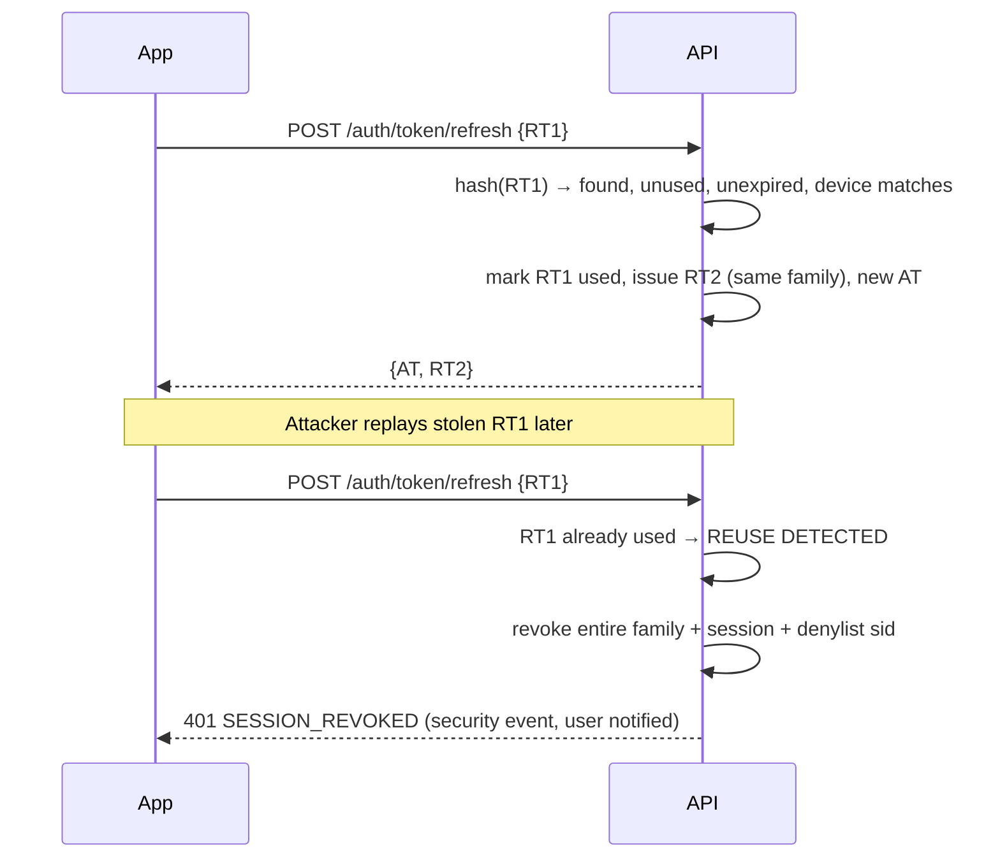

# Phase 1 · 05 — Authentication & Authorization

> Status: **DRAFT for founder review** · Date: 2026-10-08
> Security objective (not "unhackable"): **minimise attack probability and blast radius, prevent privilege escalation, detect compromise, revoke quickly, recover safely, preserve evidence.** We assume credentials, devices, accounts, employees and vendors **will** sometimes be compromised.

---

## 1. Identity realms

| Realm | Who | Identity store | Primary factor | Second factor | Session form |
|---|---|---|---|---|---|
| **Public** | Customers, technicians (app), field agents | `identity.users` (phone-based) | Phone OTP | Agents: TOTP/passkey (mandatory). Technicians: device binding + optional app lock. Customers: step-up OTP for sensitive actions | App: short JWT + rotating refresh. Web: server-side session via BFF cookie |
| **Voice** | Basic-phone technicians (and customers on approval calls) | Same users. Caller-ID → user. | "We called you" / caller ID | **IVR PIN** for sensitive actions. Customer **visit codes** for presence | Per-call session (`call_sessions`), no token |
| **Admin** | Employees | Company IdP (Google Workspace/Entra) → `backoffice.admin_users` | SSO | **Phishing-resistant MFA (passkey/FIDO2), enforced at the IdP and re-verified for step-up** | Admin session behind the zero-trust proxy |
| **Machine** | Process roles, CI, providers | AWS IAM, provider secrets | IAM role / HMAC signatures | — | Short-lived credentials |

The realms never share credentials or session stores. **An admin is never a `users` row**, and nobody can grant a public-realm account admin capabilities.

---

## 2. Authentication by actor

### 2.1 Customer (PWA)
- Login: phone → OTP (SMS default; WhatsApp/voice alternatives) → session.
- **BFF session:** the browser holds only an `__Host-sid` cookie (`HttpOnly; Secure; SameSite=Lax; Path=/`). The session lives server-side (Postgres with a Valkey cache). Idle timeout 30 days rolling, absolute 90 days (config). CSRF is protected by SameSite plus a synchronizer token on mutating requests plus an Origin check.
- Step-up (fresh OTP within 10 min) for: phone change, account deletion, data export, high-value quote approval (above threshold), adding a refund bank account.
- Ops-created bookings: the customer gets an OTP-protected link. The job stays `customer_verified=false` until the OTP succeeds.

### 2.2 Technician (Android app)
- Login: phone → OTP (SMS Retriever auto-read) → **device registration** (Play Integrity verdict recorded) → access JWT (10 min) + refresh token (opaque, 30-day sliding, 90-day absolute, device-bound).
- **Device binding:** a refresh token is valid only with the device ID it was issued to. A new device login triggers notifications to the old device and SMS. A **payout hold** (72 h, config) applies only when the new device coincides with a payout-method change or a FAILED integrity verdict. The technician always sees the reason, the held amount and the release time (X-32).
- Optional **app lock** (4-digit app PIN or biometric) protects against shared-phone misuse. The app PIN is local only (Keystore-backed) and never sent to the server.
- Offline: queued actions carry the access token used at queue time. On replay, an expired token is refreshed first. The server re-authorises each action **at replay time** (an assignment revoked meanwhile means rejection).

### 2.3 Basic-phone technician (IVR)
| Action class | Required proof |
|---|---|
| Hear an offer (L0 data), accept/decline | We placed the call to the registered number + "Are you {first name}? press 1" |
| Daily check-in, presence | Inbound caller ID matches the registered number (or our outbound call) |
| Hear exact address (L2), connect to customer, depart/arrive/complete, earnings | **IVR PIN** (4 digits, per call session; re-asked after 10 min) |
| Arrival / completion state change | PIN **+ customer's start/completion code** |
| SOS | Nothing. Any caller to the SOS line creates a P1 (abuse handled after) |
| Change payout method, phone, PIN | **Not available on IVR.** PIN reset only via an outbound verification call + agent/ops check |

PIN rules: 4 digits. Trivial PINs (0000, 1234, a repeated digit, birth year) are rejected at setting time. Argon2id. **3 wrong per call → call ends politely; 5 wrong per 24 h → locked**, ops alert and callback. A PIN is never spoken back and never stored in `ivr_interactions` (`***`).

**Caller-ID spoofing** is assumed possible. Caller ID alone only unlocks low-risk actions.

### 2.4 Field agent
Phone OTP + a mandatory second factor (passkey preferred. TOTP accepted only for agents without assist mode), enrolled in person by ops. **Assist mode requires a passkey step-up per grant (SR-03).** Web sessions use the BFF cookie model, with no bearer tokens in the browser (SR-02). Session 12 h absolute, 30 min idle. Every action is scoped to linked technicians (§5) and recorded as `actor=agent, on_behalf_of=technician`.

### 2.5 Admin (support, dispatch, verification, safety, finance, city manager, auditor, security admin, super-admin)
- Access path: zero-trust proxy (identity-aware, device-posture check: managed device, disk encryption, OS patch level) → admin SPA → `admin-api`.
- **SSO with phishing-resistant MFA** (passkeys/FIDO2 hardware keys). SMS/TOTP are **not** allowed for admins.
- The `admin-api` validates the proxy's signed assertion (JWT from the proxy, audience-bound) **and** its own admin session. Session: 10 h absolute, 30 min idle. **Re-authentication (WebAuthn assertion) for high-risk actions** (approvals, reveals in bulk, grants, payouts, break-glass).
- Concurrent sessions: 1 per admin by default (a new login ends the old one; config).
- Joiner/mover/leaver: grants come from HR-approved requests. IdP deprovisioning revokes access within minutes (proxy) and the nightly sync suspends `admin_users`. **Quarterly access recertification** by the security admin plus a city manager.

### 2.6 Service-to-service
- Process roles use IAM task roles (no static keys). DB auth via IAM tokens or Secrets Manager-rotated passwords per role.
- `webhook → voice` uses mTLS within the VPC plus a signed short-lived internal token carrying the provider call ID.
- CI/CD uses GitHub OIDC → AWS role per environment with least privilege. Production deploy requires the protected environment's reviewers.

---

## 3. Sessions & tokens

### 3.1 Access token (app)
- JWT, **ES256**. Signing key in KMS (asymmetric CMK). `kid` rotation every 90 days with overlap. JWKS cached in-process.
- Claims: `iss` (config, brand-neutral `https://auth.<domain>`), `aud` (`tech-app`. Field-agent web uses BFF cookie sessions, not JWTs: X-14/SR-02), `sub` (user id), `sid`, `dev`, `iat`, `exp` (10 min), `amr` (`otp`, `otp+totp`), `scp` (coarse surface). **No roles beyond the surface, no PII.**
- Validation: `alg` pinned to ES256. `iss`/`aud`/`exp`/`nbf` checked. Clock skew ±60 s. Session not revoked (Valkey denylist check, with DB fallback).
- Permissions are **always** resolved server-side per request from current DB state (cached ≤ 30 s, invalidated on `UserSuspended`/`TechnicianStatusChanged`/`AdminGrantChanged`).

### 3.2 Refresh token rotation

- Grace: if the same RT is presented twice within 10 s **from the same device** (network retry), return the same RT2 (idempotent) instead of revoking.
- RTs are stored only as SHA-256 hashes. Plain RTs are never logged.

### 3.3 Revocation
| Trigger | Effect | Latency |
|---|---|---|
| Logout / session delete | Session revoked, RT family revoked, `sid` denylisted | immediate |
| User suspended | All sessions revoked. IVR access blocked. ACTIVE assignments revoked → re-match | ≤ 5 s |
| Refresh reuse | Family + session revoked. Security event | immediate |
| Admin offboarded | IdP disable (proxy blocks) + admin sessions revoked + grants expired | minutes |
| Device reported lost (via support) | Device revoked → all sessions on that device | immediate |
| Key compromise suspected | Rotate signing key, invalidate all access tokens (refresh required), force re-login for affected realm | ≤ 15 min (runbook) |

---

## 4. OTP handling
Per Phase 0 §10.3, with these specifics:
- Generation: 6-digit CSPRNG. Storage: `HMAC(pepper, challengeId‖code)`. Verify in constant time.
- Expiry 5 min. 5 attempts per challenge. Resend cooldown 30 s, cap 5/h, 10/day per phone. Per-IP/device caps. **Global breaker**: if OTP sends exceed the forecast by 3σ or the conversion rate drops below threshold → challenge-gate all OTP sends (bot check) and alert.
- Only **+91 mobile** ranges. Number-type check (no landlines/premium) through provider lookup where available.
- Message template (DLT-registered, brand placeholder): `{code} is your {brand.short} login code. Do not share it with anyone, including {brand.short} staff. @{domain} #{code}`.
- OTPs **never** appear in logs, traces, analytics, error reports or support tooling. The SMS provider's console logging is masked where configurable. Test environments use a fixed-code test-number allowlist (non-production only, enforced by config + a startup assertion).

---

## 5. Authorization model

### 5.1 Layers
1. **Edge:** WAF, rate limits, admin network boundary.
2. **Authentication:** realm-appropriate verification.
3. **Capability (RBAC):** does the actor's role grant the permission (e.g., `quote.approve`, `payments.refund.request`)?
4. **Scope (ABAC):** is the resource in the actor's scope (city/zone for admins; linked technicians for agents)?
5. **Relationship / object-level:** is the actor in the right relationship with **this** object (owner, assignee, offer recipient, party to a dispute)?
6. **State:** is the action allowed in the object's current state (state machine guard)?
7. **Field-level / disclosure:** which fields may be returned now (DTO + disclosure level)?

All checks are implemented in a **policy module per bounded context** as pure functions `can(actor, action, resource, context) → Allow | Deny(reason)`, called by application services, **not** controllers. This keeps checks consistent across REST, IVR and admin entry points. Deny reasons are logged internally. Clients get 404 (object-level) or 403 (capability).

### 5.2 Relationship rules (object-level, the core BOLA defence)

| Resource | Customer | Technician | Field agent | Admin |
|---|---|---|---|---|
| Job | `job.customer_user_id = actor` | assignee of any of its visits (limited DTO) | via linked technician's visit, L1 only | scope(city) + permission |
| Visit | job owner | `ACTIVE assignment.technician = actor` (L1/L2), or recently ended (L3) | linked technician's assignment, L1 only, **no L2** unless ops grants "assist mode" for that visit (time-boxed, logged) | scope + permission |
| Offer | — | `offer.technician = actor ∧ PENDING` | linked technician, view only, accept on behalf **disabled in V1** | dispatch |
| Address | owner | only via visit disclosure window (snapshot, not the address-book row) | — | `pii.reveal.address` with reason |
| Quote version | job owner (view, approve, reject) | creator/assignee (view only) | — | view; recorded-approval with maker-checker |
| Bill/payment | job owner | own cash collections only | — | finance/support per permission |
| Earnings/ledger | — | own accounts only | linked: summary only | finance |
| Payout method | — | own (masked) | — | finance (reveal with reason) |
| Ratings | own submitted | own aggregates. Individual given/received after blind window | — | trust permissions |
| Complaint/dispute | if raiser/party (no internal notes) | if raiser/party | — | assigned investigator + scope |
| Safety incident | own raised (status only) | own raised | — | safety roles only |
| Documents/KYC | — | own (metadata) | uploaded by them, **only until submission** | verification role |

**Implementation rules:**
- Repository methods for user-facing reads **require the actor** and add the relationship predicate in SQL (`AND customer_user_id = $actor`). No "load then check" for list endpoints.
- Unknown and unauthorized objects both return **404**.
- IDs from the client are never trusted to identify the actor (e.g., `technicianRef` in rating requests is resolved through the job's assignments, not looked up globally).

### 5.3 Admin RBAC

Permissions are **defined in code** (an enumerated, versioned list, so they can't be invented through the UI). Roles are compositions of permissions stored in DB, and changing a role definition requires maker-checker. Grants = (admin, role, scope: `global | city:<id>[]`, expires_at?, granted_by, approved_by).

| Role | Key permissions | Scope |
|---|---|---|
| **Support L1** | `jobs.read`, `support.book`, `support.callback`, `complaints.create/update`, `notifications.resend`, `pii.reveal.phone` (reason), `support.capture_diagnosis` | city |
| **Support L2** | L1 + `payments.refund.request` (≤ threshold auto, above → approval), `goodwill.issue` (≤ cap), `disputes.investigate`, `support.record_approval` (maker; needs second ops as checker), `pii.reveal.address` | city |
| **Dispatch** | `dispatch.view_board`, `dispatch.assign`, `dispatch.reschedule`, `dispatch.override_presence` (maker), `technicians.availability.edit_on_behalf` | city |
| **Verification officer** | `verification.read_documents`, `verification.decide`, `technicians.onboarding.update`, `skills.verify` | city |
| **Safety officer** | `safety.read`, `safety.ack`, `safety.hold`, `trust.sanction.propose`, `trust.suspend_pending_investigation` (≤ 72 h, no approval), `pii.reveal.*` for incident subjects, `recordings.read` (incident-linked) | region |
| **Finance** | `payments.read`, `payments.refund.approve`, `finance.payout.prepare`, `finance.payout.approve` (not own batch), `finance.payout_method.reveal`, `finance.writeoff` (maker), `reconciliation.*` | global |
| **City manager** | approvals for: `pricing.approve`, `zones.approve`, `trust.sanction.approve`, `service_rules.approve`, `presence_override.approve`. Read analytics. | city |
| **Pricing admin** | `pricing.edit` (maker), `catalog.edit`, `service_rules.edit` | city |
| **Auditor** | `audit.read`, `config.read`, read-only on all queues, **no PII reveal** | global |
| **Security admin** | `security.grant` (maker), `security.grant.approve` (not own), `security.sessions.revoke`, `security.access_review` | global |
| **Super-admin** | Break-glass only (§9). No standing assignment | — |

### 5.4 Maker-checker actions (INV-19)
Pricing/fee/commission/tax changes · service rules · warranty policies · matching config · zone boundaries · refunds above threshold · write-offs · payout batch execution · payout-method activation when created by agent/ops · presence overrides · recorded-call approvals · sanctions (suspension > 72 h, deactivation) · admin role grants and role definitions · bulk exports · feature flags marked `critical`. The checker must hold the `*.approve` permission, have scope over the resource, **be a different person**, and re-authenticate with WebAuthn. Approvals expire (24 h default). The executed payload must hash-match the approved payload.

---

## 6. Privilege-escalation protections

| Vector | Protection |
|---|---|
| Self-granting roles | `security.grant` is maker-checker. Checker ≠ maker. Neither can be the grantee. All grants are audited and alerted to the security channel. |
| Editing role definitions to add permissions | Role-definition changes are maker-checker + security admin. Permissions can't be created at runtime. |
| Customer → technician escalation | The technician profile is created only through onboarding with verification-officer approval. The app surface is gated by an active technician profile. |
| Agent → technician impersonation | Agents never receive technician tokens. Actions are recorded `on_behalf_of`. Agents can't accept offers, see L2 data (except time-boxed assist mode granted by ops), or verify. |
| Agent → admin | Separate realm. Impossible by design. |
| Token tampering | ES256, pinned alg, audience-bound. Server-side permission resolution. |
| Mass assignment of `status`, `price`, `technicianId`, `role` | Strict DTOs. Server-owned fields aren't in request schemas. |
| Cross-city admin access | Scope predicate in every admin query. Tests per role and city. |
| JIT elevation abuse | Elevation is time-boxed (≤ 4 h), reason required, approved, auto-expires, alerted. |
| Approval replay | An approval is bound to a payload hash and a single execution (`EXECUTED` state). |
| Webhook as a privilege path | Webhooks only insert raw events. Processing re-fetches provider state. No webhook can call admin functions. |
| SQL-level | Per-process DB roles. No runtime DDL. Append-only grants. |

---

## 7. Account recovery

| Situation | Process | Safeguards |
|---|---|---|
| Customer lost their phone/number | New number = new account. Optional **history transfer** through support: OTP on the new number + verify ≥ 2 facts (a past job reference, address locality, last amount paid) + 72 h waiting period + notification to the old number | No address/history visible until transfer completes. Warranty coverages move with the transfer. |
| Customer number reassigned by the telco to someone else (common in India) | Inactivity > 12 months + a new OTP login from an unfamiliar device → **soft-gate**: show no saved addresses/history until the user confirms one past fact, or starts fresh | Protects previous owner's data |
| Technician lost phone (same number, new SIM) | OTP works. New device triggers a payout hold + ops review | SIM-swap control |
| Technician changed number | **Agent-assisted + verification officer**: ID document re-check + face match (vendor, consent) + call to the old number (if reachable) + 7-day payout hold + notification on all channels | High-risk: payouts |
| Technician forgot IVR PIN | Request via agent or IVR "forgot PIN" → **outbound** call to the registered number → set the new PIN in that call after answering 2 profile questions (home locality, a recent job's area) → ops alert if it fails | PIN never set by an agent |
| Field agent lost the second factor | Ops in person / video verification + re-enrolment. All sessions revoked | — |
| Admin lost the security key | Backup key (each admin enrols 2). Otherwise IdP admin recovery with manager approval | Logged |

---

## 8. Suspension & deactivation

- **Who:** safety officer (pending-investigation suspension ≤ 72 h, immediate), otherwise maker-checker (`trust.sanction.propose` + `approve`).
- **Effects:** sessions revoked. IVR access limited to SOS and support. No new offers. Active assignments revoked and re-matched (customers informed neutrally). **Earned payouts are not confiscated.** Payouts may be held only when a fraud investigation is open, and only for the disputed amount.
- **Notice:** the technician is told the reason category and appeal path in their language (SMS + IVR/agent call).
- **Appeal:** to a different reviewer. SLA 7 days. Outcome logged.
- Customers: suspension for abuse/fraud/safety. Same notice/appeal principles.

---

## 9. Emergency (break-glass) access

- Two sealed break-glass identities (hardware keys stored separately with the CTO and an independent founder). Their activation needs **both** people (2-person rule: one holds the key, the other the PIN, or a split secret).
- Grants `super_admin` (application) and/or the `break_glass` DB role (via an SSM session with recording).
- Use triggers: immediate page to all founders + security channel, mandatory incident ticket, every action audited (pgaudit + app audit), auto-expiry after 4 h, and post-use review within 48 h with credential rotation.
- Use cases: IdP outage during a safety incident, data corruption recovery, compromise containment.

---

## 10. Audit logging for auth/authz

Logged to `compliance.audit_logs` (and a security event stream): login success/failure (phone bidx, never the phone), OTP send/verify outcome (never the code), refresh reuse, new device, step-up, session revocation, IVR PIN failures/lockouts, permission denials (rate-sampled for public APIs, always for admin), every admin action, PII reveals, grant changes, approvals, break-glass usage, suspension/reinstatement, payout-method events.

---

## 11. Authorization matrix (V1)

Legend: ✅ allowed · **O** own/relationship-scoped only · **S** city/zone-scoped · **M** maker (needs approval) · **C** checker (approver) · **R** reason + audited reveal · **L** limited fields · ❌ denied. Basic-phone technicians (**TEC-IVR**) have the same rights as the app (**TEC-APP**) through IVR, except where noted.

| Capability | CUS | TEC-APP | TEC-IVR | AGT | SUP-L1 | SUP-L2 | DISP | VER | SAF | FIN | CM | PRC | AUD | SEC | SUPER (BG) |
|---|---|---|---|---|---|---|---|---|---|---|---|---|---|---|---|
| Create booking | O | ❌ | ❌ | ❌ | S | S | ❌ | ❌ | ❌ | ❌ | ❌ | ❌ | ❌ | ❌ | ✅ |
| View job | O | O,L | O,L | O,L (linked) | S,L | S | S | ❌ | S | S,L | S | ❌ | S,L | ❌ | ✅ |
| Cancel job | O | ❌ | ❌ | ❌ | S | S | S | ❌ | S | ❌ | S | ❌ | ❌ | ❌ | ✅ |
| See exact address | O | O (L2 window) | O (PIN, L2) | ❌ (assist mode only) | R | R | R | ❌ | R | ❌ | R | ❌ | ❌ | ❌ | ✅ |
| See customer phone | O (own) | ❌ (masked call) | ❌ (bridge) | ❌ | R | R | R | ❌ | R | ❌ | ❌ | ❌ | ❌ | ❌ | ✅ |
| Accept/decline offer | ❌ | O | O | ❌ | ❌ | ❌ | ❌ | ❌ | ❌ | ❌ | ❌ | ❌ | ❌ | ❌ | ❌ |
| Manual assignment | ❌ | ❌ | ❌ | ❌ | ❌ | ❌ | S | ❌ | ❌ | ❌ | S | ❌ | ❌ | ❌ | ✅ |
| Depart/arrive (with code) | ❌ | O | O (PIN) | ❌ | ❌ | ❌ | ❌ | ❌ | ❌ | ❌ | ❌ | ❌ | ❌ | ❌ | ❌ |
| Presence override | ❌ | ❌ | ❌ | ❌ | ❌ | ❌ | S,M | ❌ | ❌ | ❌ | C | ❌ | ❌ | ❌ | ✅ |
| Create/submit diagnosis | ❌ | O | via ops | ❌ | S (capture, bridged call) | S | ❌ | ❌ | ❌ | ❌ | ❌ | ❌ | ❌ | ❌ | ❌ |
| Approve/reject quote | O (own channel) | ❌ | ❌ | ❌ | ❌ | S,M (recorded call) | ❌ | ❌ | ❌ | ❌ | ❌ | ❌ | ❌ | ❌ | ❌ |
| Edit approved quote | ❌ | ❌ | ❌ | ❌ | ❌ | ❌ | ❌ | ❌ | ❌ | ❌ | ❌ | ❌ | ❌ | ❌ | ❌ (never) |
| Complete repair (code) | ❌ | O | O (PIN) | ❌ | ❌ | ❌ | ❌ | ❌ | ❌ | ❌ | ❌ | ❌ | ❌ | ❌ | ❌ |
| Record cash | ❌ | O | O (PIN) | ❌ | ❌ | ❌ | ❌ | ❌ | ❌ | ❌ | ❌ | ❌ | ❌ | ❌ | ❌ |
| Pay bill | O | ❌ | ❌ | ❌ | ❌ (send link) | ❌ | ❌ | ❌ | ❌ | ❌ | ❌ | ❌ | ❌ | ❌ | ❌ |
| Request refund | via complaint | ❌ | ❌ | ❌ | ❌ | S (≤thr) / M | ❌ | ❌ | ❌ | M | ❌ | ❌ | ❌ | ❌ | ❌ |
| Approve refund > threshold | ❌ | ❌ | ❌ | ❌ | ❌ | ❌ | ❌ | ❌ | ❌ | C | ❌ | ❌ | ❌ | ❌ | ✅ |
| Prepare payout batch | ❌ | ❌ | ❌ | ❌ | ❌ | ❌ | ❌ | ❌ | ❌ | M | ❌ | ❌ | ❌ | ❌ | ❌ |
| Approve payout batch | ❌ | ❌ | ❌ | ❌ | ❌ | ❌ | ❌ | ❌ | ❌ | C (not own) | ❌ | ❌ | ❌ | ❌ | ❌ |
| Add payout method | ❌ | O (step-up) | ❌ | M (assisted) | ❌ | ❌ | ❌ | ❌ | ❌ | C | ❌ | ❌ | ❌ | ❌ | ❌ |
| Reveal payout details | ❌ | O (masked) | ❌ | ❌ | ❌ | ❌ | ❌ | ❌ | ❌ | R | ❌ | ❌ | ❌ | ❌ | ✅ |
| Upload KYC docs | ❌ | O | via agent | O (linked, pre-submit) | ❌ | ❌ | ❌ | ✅ S | ❌ | ❌ | ❌ | ❌ | ❌ | ❌ | ❌ |
| Verification decision | ❌ | ❌ | ❌ | ❌ | ❌ | ❌ | ❌ | S | ❌ | ❌ | ❌ | ❌ | ❌ | ❌ | ❌ |
| Edit skills/areas | ❌ | request | request | M (linked) | ❌ | ❌ | S | S,C | ❌ | ❌ | ❌ | ❌ | ❌ | ❌ | ❌ |
| Rate | O | O | via IVR (V1.1) | ❌ | ❌ | ❌ | ❌ | ❌ | ❌ | ❌ | ❌ | ❌ | ❌ | ❌ | ❌ |
| Raise complaint | O | O | via IVR/agent | on behalf (linked) | S | S | ❌ | ❌ | S | ❌ | ❌ | ❌ | ❌ | ❌ | ❌ |
| Decide dispute | ❌ | ❌ | ❌ | ❌ | ❌ | S | ❌ | ❌ | S (conduct) | S (payment) | S (appeal) | ❌ | ❌ | ❌ | ❌ |
| Propose sanction | ❌ | ❌ | ❌ | ❌ | ❌ | S | ❌ | ❌ | S | ❌ | ❌ | ❌ | ❌ | ❌ | ❌ |
| Approve suspension/deactivation | ❌ | ❌ | ❌ | ❌ | ❌ | ❌ | ❌ | ❌ | ≤72 h interim | ❌ | C | ❌ | ❌ | ❌ | ❌ |
| SOS raise | O | O | O (any caller) | O | ✅ | ✅ | ✅ | ✅ | ✅ | ✅ | ✅ | ✅ | ✅ | ✅ | ✅ |
| SOS handle | ❌ | ❌ | ❌ | ❌ | ack/escalate | ack/escalate | ❌ | ❌ | ✅ | ❌ | ✅ | ❌ | ❌ | ❌ | ✅ |
| Listen to recordings | ❌ | ❌ | ❌ | ❌ | ❌ | R (complaint-linked) | ❌ | ❌ | R | ❌ | ❌ | ❌ | ❌ | ❌ | ✅ |
| Edit pricing/rules | ❌ | ❌ | ❌ | ❌ | ❌ | ❌ | ❌ | ❌ | ❌ | ❌ | C | M | ❌ | ❌ | ❌ |
| Edit matching config | ❌ | ❌ | ❌ | ❌ | ❌ | ❌ | M | ❌ | ❌ | ❌ | C | ❌ | ❌ | ❌ | ❌ |
| Read audit logs | ❌ | ❌ | ❌ | ❌ | ❌ | ❌ | ❌ | ❌ | ❌ | ❌ | S (own city ops) | ❌ | ✅ | ✅ | ✅ |
| Grant roles | ❌ | ❌ | ❌ | ❌ | ❌ | ❌ | ❌ | ❌ | ❌ | ❌ | ❌ | ❌ | ❌ | M / C (not own) | ✅ |
| Revoke sessions | own | own | ❌ | own | ❌ | ❌ | ❌ | ❌ | ❌ | ❌ | ❌ | ❌ | ❌ | ✅ | ✅ |
| Export data (bulk) | own DSR | own DSR | via agent | ❌ | ❌ | ❌ | ❌ | ❌ | ❌ | M (pseudonymised) | C | ❌ | ✅ (audit only) | ❌ | ✅ |

**Revoke sessions (founder decision 2026-10-09, ADR-024 R12):** only the security admin (and break-glass) may revoke another user's sessions. This row previously gave SUP-L2 "user (reason)" and SAF "user". It was narrowed deliberately for Gate 3 because users carry no city or region, so a city- or region-scoped revocation couldn't be enforced. Broader scoped revocation can be revisited once the product defines city / region semantics for users.

Every cell becomes an automated test case ([13 §4](13-testing-strategy.md#4-authorization-matrix-tests)): allowed cells must succeed with in-scope objects, and every ❌ (and every out-of-scope object for O/S cells) must return 403/404.
