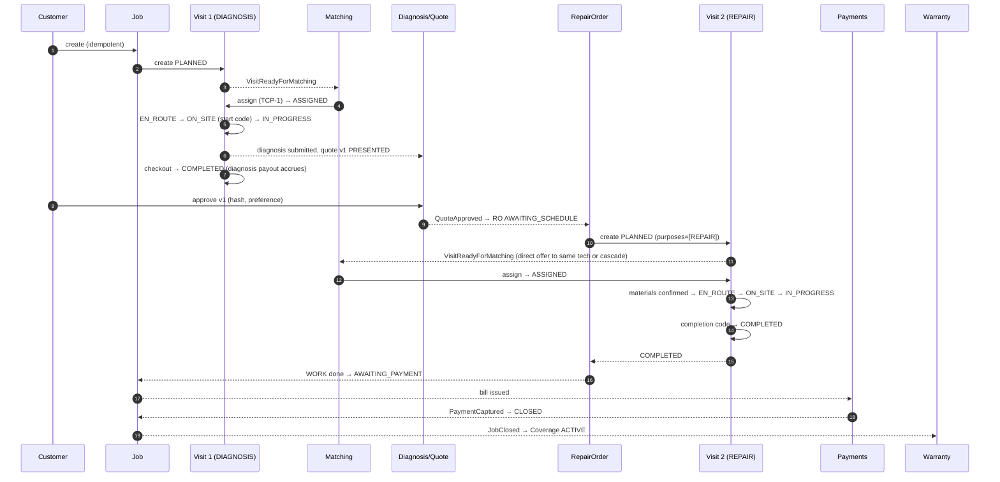
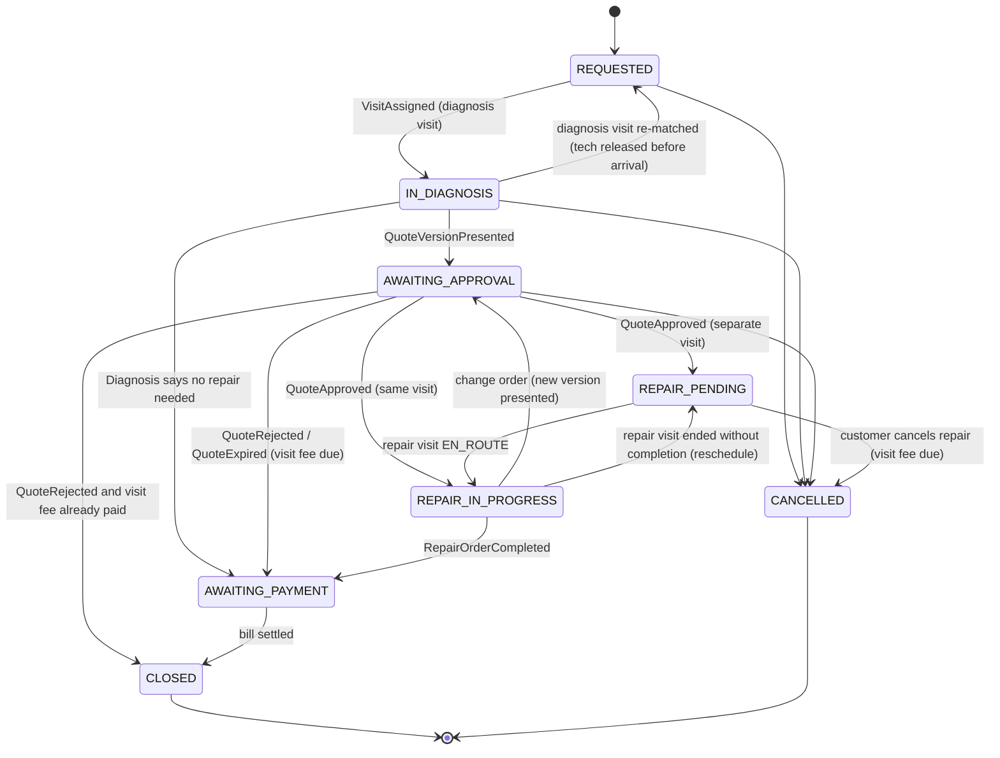
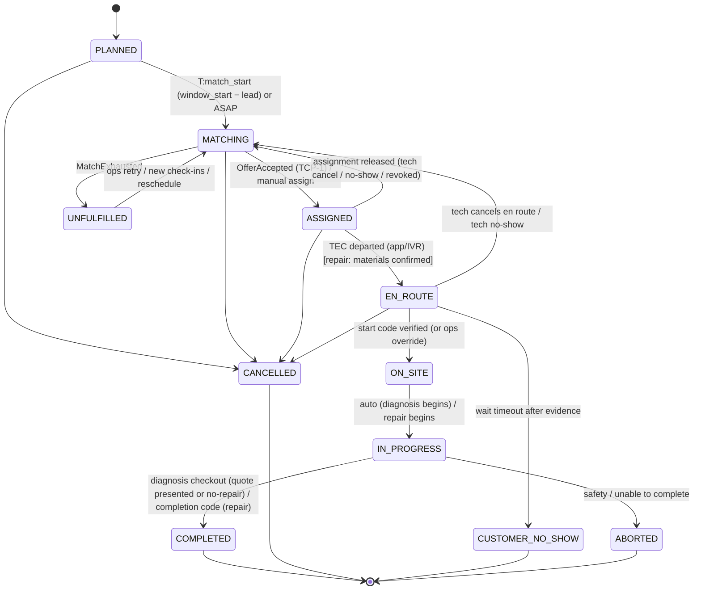
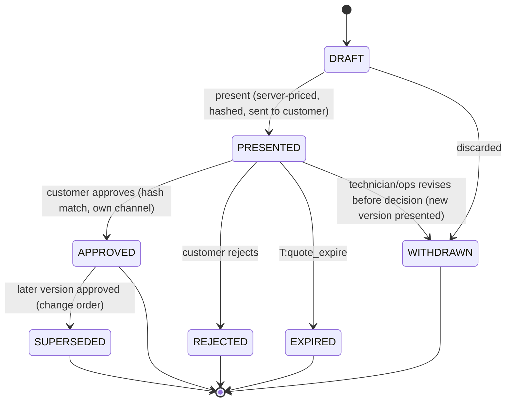
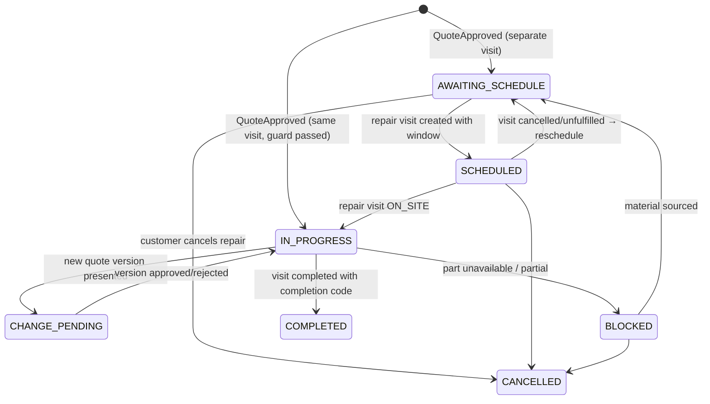
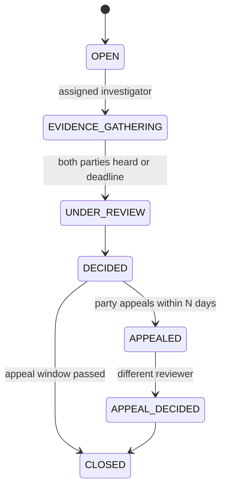
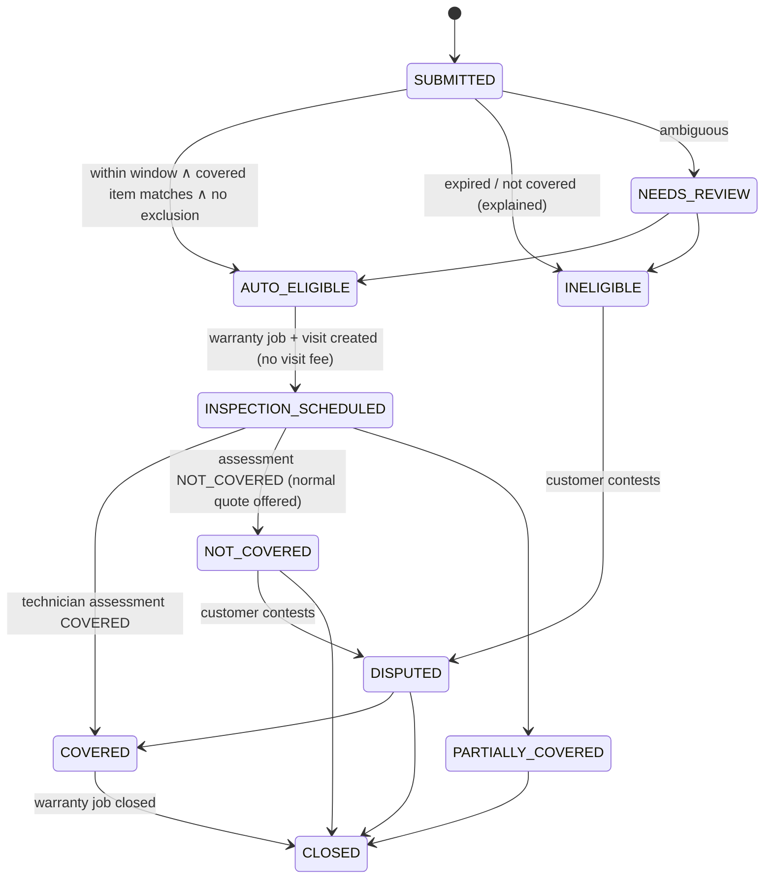

# Phase 1 · 06 — Job Workflows & State Machines

> Status: **DRAFT for founder review** · Date: 2026-10-08
> All state machines are **persisted** (status columns + append-only history). Timeouts are **durable timers + a 1-minute sweeper** ([01 §5.2](01-architecture.md#52-durable-timers--sweepers-no-in-memory-timers)), never in-memory. Every transition writes: history row, outbox event, audit row (for human actors), in one transaction.

**Actor abbreviations:** CUS customer · TEC technician (app or IVR) · AGT field agent (on behalf of TEC, limited) · OPS support/dispatch · SAF safety officer · FIN finance · SYS system (event handler/timer).

**Timer naming:** `T:<name>(<id>)`, implemented as a queue job with `job_key = <name>:<id>`.

---

## 1. Overview: how the machines interact

---

## 2. Job state machine

| State | Meaning | Who/what transitions out | Allowed next | Forbidden (examples) | Timeout | Recovery | Audit/event |
|---|---|---|---|---|---|---|---|
| REQUESTED | Created. Diagnosis visit PLANNED/MATCHING | SYS (visit events), CUS/OPS (cancel) | IN_DIAGNOSIS, CANCELLED | → AWAITING_APPROVAL (no diagnosis), → CLOSED | none at job level (visit handles matching SLA) | Visit UNFULFILLED → `needs_attention=true`. Ops re-matches or reschedules | `JobRequested` |
| IN_DIAGNOSIS | Diagnosis visit assigned..in progress | SYS on diagnosis/quote events | AWAITING_APPROVAL, AWAITING_PAYMENT, REQUESTED, CANCELLED | → REPAIR_* without approval | none | Visit failures handled at visit level | `JobStatusChanged` |
| AWAITING_APPROVAL | A quote version is PRESENTED | SYS on quote decisions. CUS cancel | REPAIR_PENDING, REPAIR_IN_PROGRESS, AWAITING_PAYMENT, CLOSED, CANCELLED | → CLOSED(REPAIRED) | `T:quote_expire(version)` at `expires_at` (config, e.g., 48 h) with reminders at 2 h, 24 h | Expiry → QuoteExpired → visit fee due. The customer can re-request a fresh quote (new version) within N days without a new visit fee if price inputs unchanged (configurable) | `JobStatusChanged` |
| REPAIR_PENDING | Approved; repair order awaiting scheduling/assignment/material | SYS (RO/visit events), CUS cancel | REPAIR_IN_PROGRESS, CANCELLED | → AWAITING_PAYMENT (no repair) | `T:repair_unscheduled(ro)` 24 h → ops queue | Ops schedules manually. Customer contacted | — |
| REPAIR_IN_PROGRESS | A repair visit is EN_ROUTE..IN_PROGRESS | SYS | AWAITING_APPROVAL (change order), REPAIR_PENDING, AWAITING_PAYMENT | → CANCELLED by customer once ON_SITE (must go via dispute/ops) | Visit-level timers | — | — |
| AWAITING_PAYMENT | Work done or no-repair; a bill is OPEN | SYS on `BillSettled` | CLOSED | → any work state | `T:payment_reminder(bill)` at 1 h, 24 h, 72 h → ops collection queue at 7 d | Payment link resend. Cash dispute path | `BillIssued` |
| CLOSED | Final | — | (none) | any | — | Warranty creates a **new job** with `warranty_parent_job_id` | `JobClosed` |
| CANCELLED | Final | — | (none) | any | — | Customer can rebook (new job) | `JobCancelled` |

**Job close guard (INV-25):** no open repair order, all bills settled or written-off-with-approval, no safety hold.

---

## 3. Visit state machine (first-class; applies to DIAGNOSIS, REPAIR, WARRANTY_INSPECTION and combined purposes)

| State | Who can transition | Allowed next | Forbidden | Timeout | Recovery path | Audit / event |
|---|---|---|---|---|---|---|
| **PLANNED** | SYS (timer), CUS/OPS (reschedule, cancel) | MATCHING, CANCELLED | → ASSIGNED without offer/manual | `T:match_start(visit)` at `window_start − lead` (ASAP: immediate) | Sweeper picks up missed timers | `VisitCreated` |
| **MATCHING** | SYS (matching), OPS (manual assign with reason, a high-risk action logged) | ASSIGNED, UNFULFILLED, CANCELLED | → EN_ROUTE | Cascade timers per offer. `T:match_sla(visit)` (e.g., ASAP 30 min) → UNFULFILLED | Ops manual assign. Widen radius (config). Offer reschedule to customer | `VisitReadyForMatching`, `MatchRunStarted` |
| **UNFULFILLED** | OPS, SYS (new check-in triggers rematch), CUS (reschedule/cancel) | MATCHING, CANCELLED | → ASSIGNED directly (must go through MATCHING or manual assign) | `T:unfulfilled_escalate` 15 min → city manager alert | Customer informed with options (another slot, callback) | `VisitUnfulfilled` |
| **ASSIGNED** | TEC (depart, release), CUS/OPS (cancel, reschedule), SYS (no-show timer) | EN_ROUTE, MATCHING (release), CANCELLED | → ON_SITE without EN_ROUTE (app auto-inserts depart if a start code is entered; IVR menu does the same, recorded as `implicit_departure`, which counts only as evidence level E0 for compensation: X-35) | `T:departure_due(visit)` at `window_start − typical_travel − grace` → reminder (push/IVR). `T:tech_no_show(visit)` at `window_start + no_show_grace` → assignment NO_SHOW → MATCHING (priority) | Re-match with urgency weight. Customer notified. Goodwill per policy | `VisitAssigned`, `AssignmentReleased` |
| **EN_ROUTE** | TEC (arrive via start code, start wait, cancel w/ reason), OPS (override arrival on customer confirmation), SYS | ON_SITE, MATCHING, CUSTOMER_NO_SHOW, CANCELLED | → COMPLETED | `T:tech_no_show` still applies until arrival. Wait flow: technician taps "I'm at the door, customer not responding" → `visit_waits` started (needs ≥ 2 masked-call attempts logged, or a location snapshot, or ops confirmation) → `T:customer_no_show(visit)` after `wait_grace` (config, e.g., 20 min) | Customer-arrives-late: wait ends, waiting fee computed. Customer no-show → CUSTOMER_NO_SHOW with compensation | `TechnicianDeparted`, `CustomerWaitStarted` |
| **ON_SITE** | SYS (auto to IN_PROGRESS) | IN_PROGRESS | — | immediate | — | `TechnicianArrived` |
| **IN_PROGRESS** | TEC (submit diagnosis, checkout, complete with code), OPS (completion override), SAF/TEC (abort) | COMPLETED, ABORTED | → CANCELLED (customer can't cancel mid-work. Disputes go through complaints) | `T:visit_overrun(visit)` at `arrived_at + max_visit_minutes` (service rules) → ops check-in call to the technician (also a safety check) | Ops call. Abort with reason if needed | — |
| **COMPLETED** | — | (terminal) | any | — | Corrections via dispute | `VisitCompleted` (carries purposes) |
| **CANCELLED** | — | terminal | — | — | Fees/compensation via cancellation policy | `VisitCancelled` |
| **CUSTOMER_NO_SHOW** | — | terminal | — | — | Customer may dispute (evidence: waits, call attempts) | `VisitNoShow` |
| **ABORTED** | — | terminal | — | — | Safety incident linked if applicable. New visit may be created by ops | `VisitAborted` |

**Completion rules by purpose:**
- **DIAGNOSIS only:** IN_PROGRESS → COMPLETED when (a) a diagnosis is SUBMITTED **and** (b) either a quote version is PRESENTED or the diagnosis is `no_repair_needed`, **and** (c) the technician checks out ("Leaving"). Customer acknowledgement isn't required (the customer's decision is on the quote). If the technician forgets to check out, `T:visit_overrun` triggers an ops call, and SYS auto-checkout happens 30 min after quote presentation with flag `auto_checkout`.
- **REPAIR (or DIAGNOSIS+REPAIR):** completion requires a **verified completion code** (INV-15), or an ops override with customer confirmation by call (maker-checker). The repair order must not be in CHANGE_PENDING.
- **Partial repair** (part unavailable mid-way): technician ends the visit with outcome `PARTIAL` → visit COMPLETED with `terminal_reason=PARTIAL_WORK`, repair order → BLOCKED or AWAITING_SCHEDULE, and a new repair visit is created. Billing waits until the repair order completes or is cancelled.

**Start code / completion code:**
- 4 digits, generated per visit (CSPRNG), shown **only** to the customer (PWA, WhatsApp/SMS to the customer's number, or read out on the customer approval IVR). Stored as HMAC.
- 5 attempts per code → locked → ops alert. The technician may ask ops for an override (call to the customer's registered number, recorded, second ops approval).
- Codes are visit-specific: visit 2 has new codes.

**Same-visit repair attach (from `QuoteApproved` with SAME_VISIT):** guard = visit IN_PROGRESS ∧ service rule allows ∧ the assigned technician holds a `can_repair` skill for the required type ∧ diagnosis `material_available_now` ∧ the approval is ≤ `same_visit_max_wait` after presentation (config, e.g., 45 min). Effect: `purposes += REPAIR`, `repair_order_id` set, completion code issued and sent to the customer, RO → IN_PROGRESS. If the guard fails → RO falls back to AWAITING_SCHEDULE and the customer is told why ("Technician doesn't have the part now. We'll schedule a repair visit.").

---

## 4. Assignment state machine

| State | Transition by | Next | Notes |
|---|---|---|---|
| ACTIVE | created by TCP-1 or manual assign | COMPLETED (visit COMPLETED/CUSTOMER_NO_SHOW), RELEASED (TEC cancel before arrival; OPS reassign), NO_SHOW (SYS timer), REVOKED (SAF/OPS: safety or eligibility change, e.g., verification revoked) | Exactly ≤1 ACTIVE per visit (INV-01). Every exit records reason + actor. |
| COMPLETED / RELEASED / NO_SHOW / REVOKED | — | terminal | Reliability metrics use reason codes. RELEASED with reason `SAFETY_CONCERN` or `CUSTOMER_REQUESTED` doesn't count against the technician. |

Technician release rules: free release until `window_start − free_release_lead` (config). After that, release is allowed with a reason (counted as a late cancellation, but forgiven if ≤ N per 30 days). **Never blocked**: a technician is never forced to go.

---

## 5. Offer state machine (owned by matching; detail in [07](07-matching.md))

`PENDING → ACCEPTED | DECLINED | EXPIRED | UNREACHABLE | WITHDRAWN`

| From | To | By | Guard |
|---|---|---|---|
| PENDING | ACCEPTED | TEC (app/IVR), via TCP-1 | now < expires_at (+ 5 s grace for IVR latency), visit MATCHING, INV-02/03 hold |
| PENDING | DECLINED | TEC | — |
| PENDING | EXPIRED | SYS `T:offer_expire(offer)` | push channel: no response in window |
| PENDING | UNREACHABLE | SYS (IVR no-answer/busy after attempts, or wrong person) | does not count as decline |
| PENDING | WITHDRAWN | SYS (another wave candidate accepted; visit cancelled; tech became ineligible) | — |

---

## 6. Diagnosis state machine

| State | By | Next | Rules |
|---|---|---|---|
| DRAFT | TEC (app) / OPS agent (for basic-phone technician, with the technician on a bridged call) | SUBMITTED, (deleted if never submitted, retained 7 d) | Editable. Autosaved offline. Requires visit IN_PROGRESS and the actor assigned (or ops on a bridged call recorded in `call_sessions`). |
| SUBMITTED | — | SUPERSEDED (a correcting diagnosis submitted before any quote decision), VOIDED (OPS with reason; e.g., wrong job) | **Immutable** (trigger). |
| SUPERSEDED / VOIDED | — | terminal | Kept for evidence. |

Additional findings during repair → a **new** diagnosis (`kind=ADDITIONAL_FINDING`). It doesn't supersede.

---

## 7. Quote (version) state machine

| Rule | Detail |
|---|---|
| Creation | Only the server prices a version (`pricing.priceQuote`). The client sends **diagnosis item references and quantities**, never prices. A custom labour line must be within the rate-card min/max (else it needs ops approval before presentation). |
| Presentation | Computes `content_hash`, freezes items (INV-05), sends notification(s) to the customer: push/WhatsApp/SMS link, plus optional approval IVR call. Only one PRESENTED version per quote (partial unique). Presenting v(n+1) **withdraws** v(n) if it's still PRESENTED. |
| Approval | Customer only, via own channel (INV-08). The request carries `content_hash`. A mismatch returns `409 QUOTE_CHANGED` and the customer is shown the latest version. Captures repair preference. |
| Change order | v(n+1) presented while v(n) APPROVED: the repair order → CHANGE_PENDING and work on **new** items is paused. On approval: v(n) → SUPERSEDED, and the RO points to v(n+1). On rejection: v(n) remains in force. |
| Price decrease | Also needs a new version, but can be **auto-approved** only if strictly ≤ the approved total and item-wise ≤ (e.g., less material used). The customer is notified; no customer action is needed (configurable). Increases always need approval. |
| Forbidden | Editing a PRESENTED/APPROVED version. Approving an old version. Approval by anyone other than the customer. The invoice exceeding the approved total + policy fees (INV-09). |
| Audit | `QuoteVersionPresented`, `QuoteApproved`, `QuoteRejected`, `QuoteExpired`, `QuoteVersionSuperseded`. The approval row is the legal evidence. |

---

## 8. Repair order state machine

| State | By | Timeout | Recovery |
|---|---|---|---|
| AWAITING_SCHEDULE | SYS (from approval), CUS (choose slot), OPS | `T:repair_unscheduled` 24 h → ops calls customer | Ops schedules |
| SCHEDULED | SYS | Visit-level timers. `T:material_confirm(visit)` at departure-due: if materials aren't confirmed → reminder → ops call | Reschedule with customer consent |
| IN_PROGRESS | SYS | Visit overrun timer | — |
| CHANGE_PENDING | SYS | Quote expiry timer (shorter, e.g., 60 min, while the technician is on site, configurable) | On expiry: continue v(n) scope or end visit as PARTIAL |
| BLOCKED | TEC/OPS with reason | `T:blocked_followup` 48 h | Ops sourcing / cancel with refund of any prepaid material |
| COMPLETED / CANCELLED | — | — | Cancel after approval: visit fee due. Any material bought specifically and carried is handled per policy (config: `material_restocking_compensation`) |

---

## 9. Payment (bill) state machine (detail in [09](09-payments-ledger.md))

**Bill:** `OPEN → PARTIALLY_PAID → PAID` | `OPEN → VOID` (superseded by recomputation before any payment) | `OPEN → WRITTEN_OFF` (FIN maker-checker).

**Payment intent:** `CREATED → PENDING → SUCCEEDED | FAILED | EXPIRED | CANCELLED`. Only a **webhook or server-side status fetch** moves an intent to SUCCEEDED. Timeout `T:intent_expire` (e.g., 30 min). A reconciliation sweep fetches status for PENDING older than 10 min.

**Cash collection:** `RECORDED(PENDING) → CONFIRMED | DENIED | TIMEOUT`. `T:cash_confirm_timeout` (24 h) → TIMEOUT → treated as confirmed only if the customer was reachable and silent (config, default **no**: an ops call is made instead). DENIED → dispute (INV-24).

**Refund:** `REQUESTED → (PENDING_APPROVAL → APPROVED) → SUBMITTED → SUCCEEDED | FAILED`. FAILED → retry or alternative (bank payout) with FIN approval.

**Chargeback:** `OPEN → EVIDENCE_SUBMITTED → WON | LOST`, or `ACCEPTED`.

**Payout:** `PENDING → APPROVED → SUBMITTED → PAID | FAILED`, with `PAID → REVERSED` (bank returned).

---

## 10. Cancellation & no-show matrix (all amounts from policy config; legal review of consumer-fairness ⚖️)

| Situation | Initiator | Job/visit effect | Customer charge | Technician gets | Metrics |
|---|---|---|---|---|---|
| Before any assignment | CUS | Job CANCELLED | none | — | — |
| Assigned, before `free_cancel_lead` | CUS | Visit/Job CANCELLED | none | — | — |
| Assigned, after `free_cancel_lead`, technician not departed | CUS | CANCELLED | late-cancel fee (may be 0) | share of fee (config) | — |
| Technician EN_ROUTE | CUS | CANCELLED | cancellation fee tier | **travel compensation** | — |
| Technician waiting at door → customer no-show | SYS after wait evidence | CUSTOMER_NO_SHOW | no-show fee | compensation | customer flag (private) |
| Customer late (wait then arrives) | — | continues | waiting fee beyond grace (cap) | waiting fee share | — |
| After quote presented, customer rejects | CUS | AWAITING_PAYMENT → CLOSED | visit fee | diagnosis payout (INV-23) | — |
| After approval, before repair visit departure | CUS | RO CANCELLED, job → AWAITING_PAYMENT | visit fee (+ material restocking if applicable) | diagnosis payout already accrued | — |
| Technician releases before departure | TEC | Visit → MATCHING (priority) | none | none | late-release counted if inside lead (forgivable) |
| Technician no-show | SYS | Assignment NO_SHOW → MATCHING | none + goodwill option | none | no-show event → review (not auto-sanction) |
| Technician aborts for safety | TEC/SAF | Visit ABORTED. Safety incident opened | none (pending review) | visit payout protected pending review | **not** counted |
| Ops cancels (service issue) | OPS | CANCELLED | none | compensation if travelled | — |

---

## 11. Dispute workflow

- Opened automatically for: cash mismatch/denial, completion disputed by the customer, chargeback, warranty decision contested, no-show contested. Opened manually from complaints.
- **Both parties are notified and heard** (app, IVR callback or agent). Evidence is auto-assembled (timeline, quote versions + hashes, approval proof, presence proofs, call metadata, photos).
- Outcomes call facades: `payments.requestRefund` (maker-checker above threshold), `payments.postAdjustment` (compensating ledger entries), `trust.proposeSanction` (needs approval for suspension/deactivation), `warranty.decideClaim`.
- Timeouts: `T:dispute_sla(dispute)` by type (e.g., cash 72 h, quality 7 d) → escalation to city manager.
- Technician metrics change **only** on DECIDED-upheld outcomes.

---

## 12. Warranty state machines

**Coverage:** `ACTIVE → EXPIRED` (`T:coverage_expire` at `ends_at`) | `ACTIVE → VOIDED` (ops with reason, e.g., third-party tampering established in a dispute).

**Claim:**

- A warranty job's visit has purpose `WARRANTY_INSPECTION`. It's offered first to the original technician(s) if eligible (config), and to another qualified technician otherwise. **A different technician from the original is preferred when the claim alleges poor workmanship** (config). This avoids conflict of interest.
- Covered repairs create a quote version priced at ₹0 to the customer, with a cost-bearer ledger posting per policy (technician deduction / platform expense / split). **A technician deduction only happens after a DECIDED dispute or the technician's acceptance**, never automatically.
- Timeouts: SUBMITTED → auto-check is immediate. NEEDS_REVIEW SLA 24 h. INSPECTION_SCHEDULED follows visit timers.

---

## 13. Booking, ops-assisted and edge flows (summary)

| Flow | Notes |
|---|---|
| Booking idempotency | `client_request_id` (unique per customer) + `Idempotency-Key`. Soft duplicate check → `409 POSSIBLE_DUPLICATE` unless `confirm_separate=true`. |
| Ops-assisted booking | Job `customer_verified=false`. Customer must verify via OTP link before the **exact address is disclosed** to any technician (L2). Matching may proceed so the slot isn't lost, but L2 waits for verification, or ops confirms by call to the registered number (logged). |
| Reschedule | CUS/OPS on PLANNED/MATCHING/ASSIGNED. If ASSIGNED, the technician must re-confirm (push/IVR). If no confirmation within window → release + rematch. |
| Customer unreachable for approval | Reminders → IVR call → ops call → expiry. |
| Technician phone dies mid-visit | Visit stays IN_PROGRESS. The technician can complete via any phone through ops (identity verification: PIN + customer completion code) or via IVR from another phone (PIN + code). |
| Process restart | All states persisted. Timers in the queue. Sweeper resyncs within ~1 min. In-flight IVR calls continue (state in Valkey + DB per step; see 08). |
