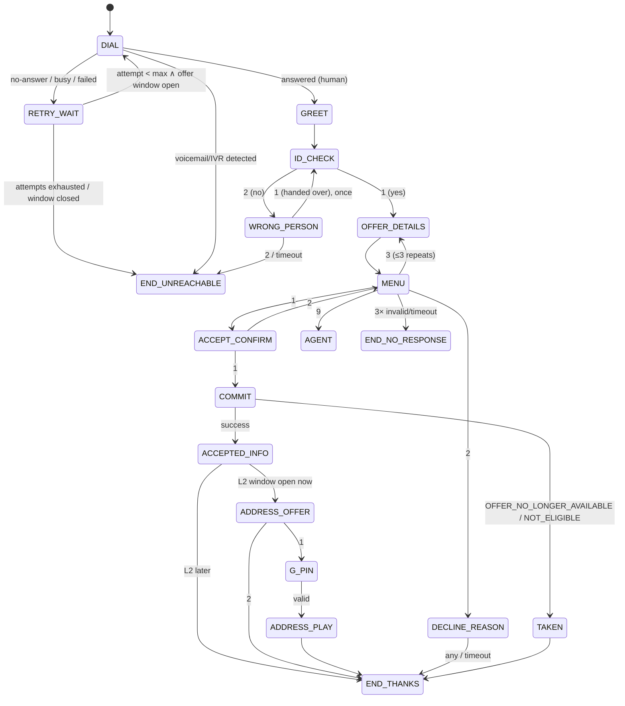
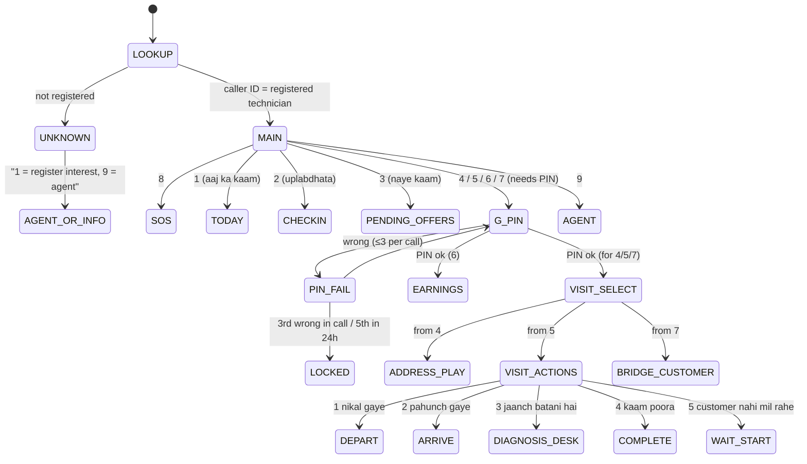

# Phase 1 · 08 — Voice / IVR System

> Status: **DRAFT for founder review** · Date: 2026-10-08
> Principle: **a basic-phone technician is a first-class user.** DTMF is the reliable baseline. Speech is assistive. Critical actions are always confirmed with a keypress. Sensitive data is spoken only after a PIN and only within the disclosure window. **No customer address is ever sent by SMS.**

---

## 1. Components

| Component | Responsibility |
|---|---|
| `TelephonyPort` adapters (primary, secondary) | Place outbound calls, receive inbound, play audio/TTS, gather DTMF/speech, bridge calls (masked), record (when allowed), missed-call numbers, status callbacks. Normalise provider events into `CallEvent`. |
| **Flow engine** (`voice` role) | Executes versioned **flow definitions** (state machines as data). Each node: `play` / `gather` / `confirm` / `command` / `bridge` / `branch` / `hangup`. Persists every step to `ivr_interactions`. Live state is kept in Valkey (`call:<id>`, TTL 1 h) and is reconstructible from the DB. |
| **Prompt catalog** | Prompt IDs → audio per locale. **Fixed sentences are pre-recorded by native speakers.** Dynamic parts (numbers, amounts, times) are concatenated recorded number clips (preferred) or TTS. Locality names are pre-recorded per locality (`geo.localities.prompt_audio_ref`) with TTS fallback. The **brand name is a separate clip** (`brand.voice_clip_id`), so rebranding only re-records one clip per locale. |
| `SpeechPort` | ASR (yes/no, digits, short closed vocabularies) and TTS fallback. Confidence returned. |
| Command bridge | Calls module facades (`matching.acceptOffer`, `jobs.verifyArrival`, …) with `channel=IVR`, actor = technician, `call_session_id` as evidence. |

**Latency budget:** provider → webhook → voice → response **< 800 ms p95**. Commands in IVR paths are pre-indexed and do no external calls. Anything slow (e.g., earnings aggregation) is precomputed or served from a cache refreshed on events.

---

## 2. Global IVR conventions

- **Language:** the technician's `ivr_locale`. Inbound unknown callers get a language menu. **Every greeting offers a one-key language switch** (keys configurable per locale, e.g., Telugu/English), and the hotline has a "change language" option that updates `ivr_locale` (X-31). No switching mid-flow after the greeting.
- **Keys:** `1` yes/accept · `2` no/decline · `3` repeat · `9` agent · `*` back/main menu · `8` SOS from any main menu.
- **Gather timeout:** 7 s (configurable per locale/user; agents can raise it for elderly technicians, e.g., 10 s).
- **Invalid/timeout handling:** 1st → "I didn't hear that" + repeat (shorter prompt). 2nd → simplified prompt. 3rd → agent transfer (business hours) or a callback promise, then end.
- **Confirmation:** every state-changing action (accept, depart, arrive, complete, cash, availability change) requires an explicit **DTMF confirmation step** unless the action itself was a code entry (start/completion code, which is its own confirmation).
- **PIN gate (`G_PIN`):** required before L2 data and job state actions (05 §2.3). Valid for 10 min within the call.
- **Nothing sensitive in the first 5 seconds:** the greeting never includes job details before the identity check (`Are you {firstName}?`).
- **Every node** writes `ivr_interactions` (node, prompt, input type, masked value, ASR confidence, outcome).

---

## 3. Flow F1: outbound job offer (`ivr.offer.v1`)

| Node | Prompt (Hindi example; all via prompt IDs) | Input | Notes |
|---|---|---|---|
| DIAL | — | — | Caller ID: the brand's registered number (consistent so technicians recognise it; saved in their phone by the agent at onboarding). |
| GREET | "Namaste. {brand} se call hai." | — | 2 s |
| ID_CHECK | "Kya main {firstName} ji se baat kar raha hoon? Haan ke liye 1, nahi ke liye 2." | DTMF / speech yes-no | Protects against a family member hearing offer details. Offer data is only L0, but this also keeps the IVR respectful. |
| WRONG_PERSON | "Kripya phone {firstName} ji ko dein aur 1 dabayein. Baad mein call karne ke liye 2." | DTMF | — |
| OFFER_DETAILS | "Aapke liye ek **{service}** ka **{purpose: jaanch / repair}** kaam hai. Jagah: **{locality}** (**{distance band}**). Samay: **{day} {window}**. Is visit ki aapki kamaai: **{amount} rupaye**{, repair hone par alag se}." | — | **L0 only.** No customer name, no address, no phone. |
| MENU | "Kaam lene ke liye 1. Mana karne ke liye 2. Dobara sunne ke liye 3. Madad ke liye 9." | DTMF (speech "haan/nahi" accepted only as a hint → goes to the confirm step) | — |
| ACCEPT_CONFIRM | "Aapne kaam lene ka chuna hai. Pakka karne ke liye 1. Wapas jaane ke liye 2." | DTMF only | Prevents accidental accepts. Always on (D-03). The earlier per-technician relaxation was removed (X-27). |
| COMMIT | (hold tone ≤ 1.5 s) | — | `matching.acceptOffer(offerId, techId, IVR, callSessionId)` (TCP-1). Idempotent by `(offerId, callSessionId)`. |
| ACCEPTED_INFO | "Badhai ho, kaam aapka hai. Kaam number **{visitCode}**. Kaam se pehle humein call karke pata sun sakte hain. SMS bhi bheja gaya hai." | — | SMS per §9 (no address). |
| ADDRESS_OFFER | "Pata abhi sunne ke liye 1 dabayein." | DTMF | Only if the L2 window is open (ASAP visits). |
| G_PIN | "Apna 4 ank ka PIN dabayein." | DTMF ×4 | See §6. |
| ADDRESS_PLAY | Address read in segments: house/building, street, landmark, locality. "Dobara sunne ke liye 3. Customer se baat karne ke liye 4." | DTMF | `disclosure_events` row. `4` → masked bridge (F6). |
| DECLINE_REASON | "Kaaran batayein (optional): 1 vyast, 2 door, 3 yeh kaam nahi aata, 4 kuch aur." | DTMF / timeout | Optional. No penalty. |
| TAKEN | "Maaf kijiye, yeh kaam ab uplabdh nahi hai. Agla kaam jaldi milega." | — | — |
| END_UNREACHABLE | — | — | Offer → UNREACHABLE (**not a decline**). |

**Call drop handling:** dropped *before* COMMIT → the offer stays PENDING until expiry. The technician can call the hotline (F2 → "3 Naye kaam") to hear and accept it. Dropped *after* COMMIT → the assignment stands, and the confirmation SMS is sent anyway. The technician can call back for details.

---

## 4. Flow F2: technician hotline, inbound toll-free (`ivr.tech_hotline.v1`)

**Main menu (no PIN):** "1 Aaj ka kaam · 2 Aaj kaam karenge ya nahi · 3 Naye kaam · 4 Pata sunna · 5 Kaam ki sthiti badalna · 6 Kamaai · 7 Customer se baat · 8 Khatra/SOS · 9 Agent".

| Node | Behaviour |
|---|---|
| TODAY (no PIN) | L1-safe summary: "Aaj aapke 2 kaam hain. Pehla: fridge jaanch, Civil Lines, 4 se 6 baje…" (`{service}` is the service-type name from the catalog prompt set) No address or customer name. |
| CHECKIN | → F3 inline. |
| PENDING_OFFERS | Plays pending offers addressed to this technician (L0) → the same MENU/ACCEPT_CONFIRM/COMMIT nodes as F1 (shared sub-flow). |
| VISIT_SELECT | 0 active visits → "Abhi koi kaam nahi". 1 → "Aapka kaam: {service}, {locality}, {time}. Sahi hai to 1". >1 → list up to 3 ("pehle ke liye 1…"), else "Kaam number dabayein" (4-digit `visit_code`). |
| ADDRESS_PLAY | Only if the L2 window is open. Otherwise: "Pata {time} se uplabdh hoga." Logged. |
| DEPART | "Aap kaam ke liye nikal rahe hain? Pakka karne ke liye 1." Repair visit: first "Kya aapke paas yeh saamaan hai: {materials}? Haan 1, nahi 2" → 2 → ops alert + "Agent aapko call karega." |
| ARRIVE | "Customer se 4 ank ka code lekar dabayein." → `jobs.verifyArrival`. Wrong: "Code galat hai, {n} koshish baaki" → locked after 5 → "Agent aapko turant call karega" (ops override flow). |
| WAIT_START | "Kya aapne customer ko call kiya? Customer se baat ke liye 1 (bridge). Agar 2 baar call kar chuke hain, intezaar shuru karne ke liye 2." The system checks the masked-call attempts. |
| DIAGNOSIS_DESK | Bridges to the ops diagnosis desk with a context screen (visit, technician, catalog) on the agent console. If no agent within 60 s: "Agent {n} minute mein call karenge. Customer ke paas rukiye." → callback task with an SLA alert. The agent enters a diagnosis with `captured_by=OPS_AGENT` using **the repair catalog of the visit's service type** (refrigerator items for a refrigerator visit, and so on). V1.1 keypad repair codes are likewise **service-type-specific** (`UNIQUE (service_type_id, keypad_code)`). The IVR takes the service type from the visit, so the technician never selects a category. The quote goes to the **customer's** phone. The technician hears "Customer ko {amount} ka quote bheja gaya hai." when it is presented, and gets an outbound call when the customer decides. |
| COMPLETE | Diagnosis-only visit: "Jaanch poori, nikal rahe hain? 1" → checkout (guarded). Repair visit: "Customer ka completion code dabayein" → verify → "Saamaan poora laga? 1 haan, 2 kuch bacha" (2 → agent for material usage entry) → payment step: "Customer ko **{amount}** dena hai. Customer ne nakad diya to 1, online denge to 2." → 1 → "Aapne {amount} nakad liya, sahi hai to 1" → cash recorded (fixed amount = amount due; a different amount → agent). |
| EARNINGS | "Is hafte aapki kamaai {x} rupaye. Agla bhugtan {date} ko {y} rupaye. Nakad kaam ka commission baaki: {z} rupaye." |
| BRIDGE_CUSTOMER | Masked bridge (F6) to the customer, only within the L2 window. Logged as a disclosure. |
| SOS | → F5 immediately (no PIN). |
| LOCKED | "Suraksha ke liye PIN band kiya gaya hai. Agent aapko call karega." Ops task + security event. SOS is still available. |

---

## 5. Flow F3: daily check-in (`ivr.checkin.v1`)

Triggers: (a) outbound at the technician's chosen time (opt-in), (b) **missed call** to the check-in number (we call back within 60 s, so the technician pays nothing), (c) hotline option 2.

| Node | Prompt | Transitions |
|---|---|---|
| ASK | "Kya aap aaj kaam ke liye uplabdh hain? Haan 1, nahi 2." | 1 → AREA · 2 → RECORD_UNAVAILABLE |
| AREA | "Aapka kshetra **{primary locality}**. Sahi hai to 1. Doosra kshetra chunne ke liye 2." | 1 → HOURS · 2 → AREA_LIST |
| AREA_LIST | Registered secondary localities, max 5 ("Civil Lines ke liye 1, Sadar ke liye 2…") | choice → HOURS |
| HOURS | "Aap kab tak kaam karenge? Shaam 6 baje tak ke liye 1, raat 8 tak 2, apne niyamit samay ke liye 3." | → CONFIRM |
| CONFIRM | "Aaj {locality} mein {hours} tak. Pakka karne ke liye 1." | 1 → RECORD (`technician_daily_checkins`, channel IVR/MISSED_CALL) |

No free-text location is ever required. Only pre-registered areas are offered. Changing registered areas goes through an agent.

---

## 6. PIN handling

- 4 digits, set at onboarding **by the technician on an IVR call** (an agent may explain but never hears or enters it). Weak PINs rejected.
- Input value stored as `***`. Verify via `identity.verifyIvrPin` (Argon2id; result cached for the call session for 10 min).
- 3 failures per call → end the call politely. 5 failures per rolling 24 h → lock, ops callback, security event. SOS remains available.
- Reset: §7 of [05](05-auth-authorization.md#7-account-recovery).

---

## 7. Flow F4: customer calls (approval & cash confirmation)

**F4a: quote approval (`ivr.quote_approval.v1`, outbound to the customer's registered number)**
1. GREET + ID_CHECK ("Kya main {customer first name or 'ghar ke maalik'} se baat kar raha hoon?").
2. SUMMARY: "Aapke **{service}** ki jaanch hui. Samasya: **{problem label}**. Kaam: **{items summary}**. Kul rakam **{total} rupaye**, jismein jaanch fees adjust ho gayi hai. Warranty **{days} din**."
3. MENU: "Manzoor karne ke liye 1. Mana karne ke liye 2. Dobara 3. Agent se baat 9."
4. On 1: if `total > ivr_approval_limit` (config, e.g., ₹2,000) → "Is rakam ke liye aapke phone par link bheja gaya hai. Wahan se manzoor karein." (signed link + OTP). Else → CONFIRM: "Aap **{total} rupaye** manzoor kar rahe hain. Pakka karne ke liye 1."
5. Then REPAIR_OPTION: "Isi technician se karwana hai to 1. Kisi aur visheshagya se 2." (+ "Abhi isi visit mein" if same-visit is available) → SLOT: "Kal subah 1, kal shaam 2, link se samay chunne ke liye 3."
6. Recorded as a `quote_approvals` row with `channel=IVR_CALL`, `call_session_id`, and the content hash of the version read out.

**F4b: cash confirmation:** "Kya aapne technician ko **{amount} rupaye** nakad diye? Haan 1, nahi 2." → 2 → dispute + ops call.

---

## 8. Flow F5: SOS (`ivr.sos.v1`)

- **Numbers:** a dedicated SOS number (printed on technician ID cards/stickers) plus hotline option 8. A missed call to the SOS number → immediate callback.
- Flow: **no menus, no PIN.** First sentence: "Agar turant khatra hai, phone kaat kar **112** dial karein." Then: "Hum aapko suraksha team se jod rahe hain" → bridge to the safety desk (ring group). In parallel: `trust.raiseSos(channel=IVR_SOS, caller user if known, active visit if any)` → P1 incident + pager.
- No answer at the desk within 30 s → escalate through the phone tree (on-call safety lead → city manager → founders). The caller hears a reassurance message every 15 s, and the call is never dropped by us.
- **Provider-level fallback:** if our webhook fails or times out, the provider's static fallback routes the SOS number directly to the safety desk mobile ring group (configured at the provider, tested monthly).
- Recording: SOS calls are recorded **⚖️ subject to legal confirmation** of the basis (vital interest/safety). The announcement is "Yeh call suraksha ke liye record ho rahi hai."

---

## 9. Flow F6: masked bridge (customer ↔ technician)

- `voice.createMaskedBinding(visit, techUser, customerUser, window = L2 window)`. The virtual number connects only when called **from one of the two registered numbers** within the window. Otherwise: "Yeh number abhi sakriya nahi hai."
- For basic-phone technicians, the bridge is reached through the hotline (option 7) after the PIN, so **no virtual number has to be stored in SMS**. App technicians tap "Call customer".
- Calls are **not recorded** by default. Metadata is logged (time, duration, initiator) as dispute evidence (e.g., "technician called twice before marking no-show").

---

## 10. SMS to basic-phone technicians (content policy)

| Event | SMS content (template, DLT-registered) | Never included |
|---|---|---|
| Offer accepted | "{brand}: Kaam {visitCode} pakka. {service}, {locality}, {date} {window}. Pata sunne ke liye call karein {hotline}." | address, landmark, customer name/phone, customer number |
| Visit reminder | "{brand}: Kaam {visitCode} aaj {window}, {locality}. Pata: {hotline} par call karein." | same |
| Quote decided | "{brand}: Kaam {visitCode}: customer ne manzoor kiya. Rakam {amount}." | items detail |
| Payout | "{brand}: ₹{net} aapke khate ••{last4} mein bheje gaye. Vivaran: {hotline}." | full account |
| Payout method changed | "{brand}: Aapka bhugtan khata badla gaya. Agar aapne nahi badla to turant {hotline} par 9 dabayein." | — |

---

## 11. Fallback paths

| Situation | Handling |
|---|---|
| **No answer** | Retry once after 60 s (config) within the offer window. Then UNREACHABLE → next candidate. No penalty. Repeated unreachability (≥ 5 in 7 days) → agent check-in call ("Is your phone working? Do you want to pause?"). |
| **Busy** | Same as no answer, but retry after 90 s. |
| **Call drop mid-flow** | State persisted per node. Pre-commit: offer remains open, technician can call back. Post-commit: outcome stands, SMS confirmation. During PIN/code entry: no partial state. During the diagnosis bridge: agent console keeps the draft, agent calls back. |
| **Wrong input** | Re-prompt (short) → simplified prompt → agent/callback (§2). |
| **Repeated wrong PIN** | 3 per call → end. 5 per 24 h → lock + ops callback + security event. |
| **Repeated wrong customer code** | 5 attempts → code locked → ops calls the customer's registered number to confirm presence → presence override (maker-checker). |
| **Poor speech recognition** | Confidence < threshold (config, e.g., 0.80) → "Kripya button dabayein." Speech is disabled for the rest of the call after 2 low-confidence results. Speech never commits without DTMF confirmation. |
| **Wrong person answers** | ID_CHECK → hand over or end (UNREACHABLE). |
| **Voicemail / network message detected** | Treated as no answer. |
| **Primary provider outage** | Breaker opens → outbound via the secondary provider (pre-registered caller ID, which technicians are told about during onboarding). Inbound numbers have provider-level forwarding to the secondary. SOS has a static fallback to desk mobiles. |
| **Both providers down** | Basic-phone offers paused (parity alert). Ops desk dispatches manually by phone using the console (no new tooling needed: assignment via `manual-assign`, actions recorded by ops on the technician's behalf with a reason). |
| **Our backend down, provider up** | Provider fallback flows: hotline → "Seva abhi uplabdh nahi hai, kripya {ops mobile} par call karein". SOS → direct to desk mobiles. |
| **Technician calls from a different phone** | Caller ID unknown → UNKNOWN menu. An agent can verify (PIN + profile questions) and act on their behalf, logged. |

---

## 12. Call recording policy (⚖️ legal confirmation required)

| Call type | Recorded? | Announcement | Retention | Access |
|---|---|---|---|---|
| Outbound offer / check-in / hotline IVR (machine only) | **No** (DTMF logs suffice) | — | — | — |
| Diagnosis desk bridge (technician ↔ ops agent) | **Yes, if the technician consented** (`CALL_RECORDING`). Otherwise ops writes a structured note | "Yeh call gunvatta ke liye record ho sakti hai" | 90 days, or until the linked dispute closes | Support L2 (complaint-linked), safety |
| Customer approval IVR (F4a) | **No audio.** The DTMF decision + content hash + call metadata are the evidence | — | — | — |
| Ops-recorded approval (OPS_RECORDED_CALL channel) | **Yes, mandatory** (it's the evidence) | Announced. The customer can refuse → use the link instead | Job retention | Support L2, dispute investigators |
| Support calls (customer/technician) | Yes with announcement and opt-out (routed to a non-recorded agent) | Announced | 90 days | Support L2, QA sample (masked) |
| SOS | Yes (⚖️ basis to confirm) | Announced | 8 years if an incident is opened, else 90 days | Safety only |
| Masked customer↔technician calls | **No** | — | Metadata 1 year | Dispute investigators |

Recordings are stored in the recordings bucket (separate KMS key), linked to a `call_session`, never sent to AI providers without consent and redaction, and are covered by deletion requests (except under a legal hold).

---

## 13. Minimising sensitive data spoken or stored

- Spoken before the PIN: L0/L1 only (service, locality, time, earnings, job code).
- Never spoken: customer surname, phone numbers, OTPs (except the voice-OTP flow to the owner), bank details (only the last 4 digits), other technicians' info.
- Address segments are spoken only after the PIN within the L2 window, each playback logged.
- `ivr_interactions.input_value` masks PINs, codes and OTPs. Speech transcripts for yes/no aren't stored (only the interpreted value + confidence).
- Provider-side: disable provider transcript storage. Recordings off except as in §12. The provider DPA covers deletion.

---

## 14. Compliance notes (⚖️ to confirm)

- **TRAI TCCCPR** (as amended): register as a principal entity on DLT. Register SMS headers and templates. Confirm the numbering-series requirements for **service/transactional voice calls** (e.g., 160-series) with the telephony provider. Technician offer calls are service calls to registered partners who opted in.
- Toll-free inbound for technicians, so they never pay to use the platform.
- Use of **brand-neutral or company-name** DLT headers until the brand is final ([ADR-016](15-architecture-decisions.md#adr-016-configurable-brand-identity)).

---

## 15. Cost controls & testing hooks

- Per-call cost recorded. Budget per city per day with alerting. Flows are designed for ≤ 60 s typical offer calls.
- Push first for app technicians. Combine scheduled offers into the technician's preferred call window. Check-ins via free missed calls.
- **Telephony simulator** (test env): replays provider webhook sequences with scripted DTMF/speech/timeouts/drops. Each flow definition has a test suite covering every node and edge (see [13 §8](13-testing-strategy.md#8-telephony--ivr-tests)).
- **Field usability gate:** before launch, ≥ 15 basic-phone technicians in the pilot city complete scripted tasks (accept, check-in, hear address, arrive, complete, SOS) with ≥ 90% task success unaided.
