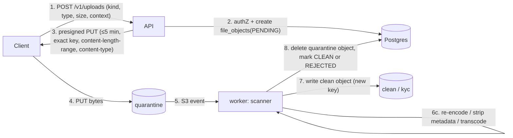

# Phase 1 · 10 — Files & Sensitive Data Handling

> Status: **DRAFT for founder review** · Date: 2026-10-08
> No public buckets. No file is ever served without an authorization check. Every sensitive data element has a purpose, access policy, retention and deletion strategy (§5).

---

## 1. Storage layout

| Bucket (ap-south-1) | Contents | KMS key | Who can read (IAM) | Public access |
|---|---|---|---|---|
| `<env>-files-quarantine` | All uploads before scanning | `files-general` | `worker` (scanner) only | **Blocked** (account-level Block Public Access + bucket policy deny) |
| `<env>-files-clean` | Problem photos, diagnosis photos, after photos, receipts, complaint media, voice notes | `files-general` | `worker` (signing role) | Blocked |
| `<env>-files-kyc` | ID/address proofs, certificates, police clearance, profile photos pre-approval | `files-kyc` (separate CMK; decrypt limited to the verification signing role) | `worker-kyc` role only | Blocked |
| `<env>-recordings` | Consented call recordings (fetched from the telephony provider, then deleted there) | `recordings` | `worker-recordings` role | Blocked |
| `<env>-documents` | Generated invoices, credit notes, DSR exports, evidence packs | `files-general` | `worker` | Blocked |
| `<env>-audit-archive` | Audit/partition archives, anchors (Object Lock **compliance mode**) | `audit` | security/audit roles | Blocked |

All buckets: SSE-KMS (bucket keys), versioning on, TLS-only policy (`aws:SecureTransport`), access logging to the log-archive account, Object Ownership = BucketOwnerEnforced, lifecycle rules per prefix, and VPC-endpoint-only access for writes from the app (presigned client uploads are the exception and are restricted by signature conditions).

---

## 2. Upload pipeline



| Step | Control |
|---|---|
| Slot creation | Allowed only for kinds permitted to the actor **and** context (e.g., `DIAGNOSIS_PHOTO` only by the active assignee of an IN_PROGRESS visit). Per-user quotas. The declared type must be in the kind's allowlist. |
| Presigned PUT | Single object key `quarantine/<fileId>`, `Content-Type` fixed, `content-length-range` = declared size ± 0. Expires in 5 min. Key is unguessable (UUIDv7 + random suffix). |
| Validation | **Magic-byte sniffing** must match the declared and allowed type. Dimension and duration limits. Reject polyglots, SVG (never accepted), HTML, archives, executables. PDFs: parse with a hardened library, reject JavaScript/embedded files/encryption. |
| Malware scan | GuardDuty Malware Protection for S3 (managed) or ClamAV in an isolated task (no network egress). EICAR is tested in CI. |
| Re-encoding | Images: decode → re-encode to WebP/JPEG (quality 75–85), max 1600 px long edge, **strip all EXIF/XMP/IPTC (GPS especially)**, generate thumbnail 320 px. Audio: transcode to Opus 16 kHz mono, max 60 s (voice notes), strip metadata. PDFs (documents): rasterise KYC PDFs to images (removes active content) unless original-required by the vendor. |
| Perceptual hash | For diagnosis/after photos: pHash stored for duplicate-reuse detection across jobs (fraud F15). |
| Finalisation | `file_objects.status = CLEAN`, `clean_key`, sha256, final size. Owner module notified (`FileReady`). Quarantine object deleted. |
| Rejection | `REJECTED` + reason. Object deleted. Repeated rejections per user → fraud signal. |

---

## 3. Download / access

- `GET` on a resource returns **signed URLs (GET, ≤ 5 min, single object, `response-content-disposition`)** only after the owning module's policy approves (`files.getDownloadUrl(fileId, actor)` asks the owner module via its policy hook).
- CloudFront signed URLs (with origin access control) for images in the PWA/app to benefit from caching. Cache TTL ≤ URL TTL. No caching of KYC or recordings.
- KYC documents: viewable only in the admin verification UI (inline viewer, **download disabled**, watermark with admin ID + timestamp). Every view is logged to `audit_logs` (`kyc.document_viewed`).
- Recordings: streamed via the admin UI only for permitted roles with a linked case. Every play is logged.

---

## 4. File kinds

| Kind | Uploader | Allowed types | Max size | Processing | Bucket | Access | Retention | Deletion |
|---|---|---|---|---|---|---|---|---|
| `PROBLEM_PHOTO` | Customer | JPEG, PNG, WebP, HEIC | 8 MB in, ≤ 400 KB out | re-encode, strip EXIF | clean | customer; assigned technician during L2; ops | job close + 1 y (or dispute end) | lifecycle + erasure |
| `PROBLEM_VOICE` | Customer | AAC, Opus, AMR, WebM | 2 MB / 60 s | transcode, strip | clean | customer; technician L2; ops; AI transcription (redacted, flagged) | job close + 90 d | lifecycle + erasure |
| `DIAGNOSIS_PHOTO` / `AFTER_PHOTO` | Technician (in-app camera only) / ops | JPEG, WebP | 8 MB | re-encode, strip, pHash | clean | customer of the job; technician (own); ops; dispute investigators | job retention (3 y) | anonymise with job |
| `RECEIPT` | Technician | JPEG, PDF | 5 MB | re-encode / rasterise | clean | ops, finance, disputes | 8 y (financial evidence ⚖️) | archive |
| `COMPLAINT_MEDIA` | Customer/technician | images, audio | 8 MB | as above | clean | parties (own uploads), investigators | case close + 3 y | lifecycle |
| `KYC_DOC` | Technician / field agent (pre-submission) | JPEG, PNG, PDF | 10 MB | rasterise PDF, strip | **kyc** | verification officer only | **decision + 30 d** (config), then image purged. Verification record kept | lifecycle + purge job |
| `PROFILE_PHOTO` | Technician / agent | JPEG, PNG | 5 MB | face-crop, re-encode | kyc → clean after approval | public card (approved only) | engagement | on offboarding |
| `CALL_RECORDING` | System (from provider) | MP3/WAV → Opus | — | transcode | recordings | §12 of [08](08-voice-ivr.md) | 90 d default / case-linked | lifecycle + legal hold |
| `INVOICE` / `CREDIT_NOTE` | System | PDF (generated, no active content) | — | — | documents | customer of the job; finance | 8 y ⚖️ | archive |
| `DSR_EXPORT` | System | ZIP of JSON + media (encrypted) | — | — | documents | requesting user via one-time link | 7 d | auto-delete |
| `EVIDENCE_PACK` | System | PDF | — | — | documents | finance, disputes | case + 8 y for chargebacks | archive |

---

## 5. Sensitive data register (purpose · access · retention · deletion)

| Data element | Class | Purpose | Who can access | Retention | Deletion strategy |
|---|---|---|---|---|---|
| Phone number (any user) | C | Login, notifications, masked calls | System. Ops via reveal (reason) | Account life | Erasure: null + destroy subject key. Bidx removed |
| Customer name | C | Greeting, technician first-name display | Customer. Technician (first name, L1+). Ops (masked) | Account life | Erasure |
| Customer address (book) | C | Service location | Customer. Technician L2 window (snapshot). Ops reveal | Until deleted by customer / erasure | Soft delete → purge 30 d. Erasure |
| Job address snapshot | C | Evidence of where the service happened | Same as above, per job | Job retention, then anonymise (locality kept) | Anonymisation job |
| Exact geo point | C | Navigation | Technician L2. Customer | As address | As address |
| Problem description/voice | C | Diagnosis context | Customer. Technician L2. Ops | Job close + 90 d (voice) / 1 y (text) | Lifecycle |
| Customer gender | R | Segment rating statistics (opt-in) | Aggregation job only | Until consent withdrawn | Delete row on withdrawal. Aggregates recomputed |
| Technician legal name | C | Contracts, payouts, verification | Verification, finance | Engagement + 3 y | Anonymise |
| Technician gender (self-declared) | R | Future opt-in scoped services only | Matching hard filter (when enabled), safety | Until withdrawn | Delete |
| Birth year | C | 18+ eligibility | Verification | Engagement + 3 y | Anonymise |
| ID document images | R | Identity verification | Verification officer | Decision + 30 d | Lifecycle purge (verified by a retention job report) |
| ID numbers | R | Dedupe (non-Aadhaar only), vendor reference | Verification | Engagement + 3 y | Null on offboarding + 3 y |
| Aadhaar number | — | **Not collected** (INV-27) | — | — | — |
| BGV results | R | Safety eligibility | Verification, safety | Engagement + 3 y | Anonymise |
| Bank/UPI details | R | Payouts | Finance (reveal). Technician (masked) | Engagement + 8 y (payout evidence ⚖️) | Minimise to last 4 + bank after offboarding |
| Payment metadata | C | Settlement, refunds | Finance, support (masked) | 8 y ⚖️ | Archive pseudonymised |
| Card/UPI credentials | — | **Never received** (PA-hosted) | — | — | — |
| OTP codes | R | Login | Nobody (hash only) | 24 h | Hard delete |
| IVR PIN | R | IVR authentication | Nobody (Argon2id) | Account life | Delete on erasure |
| Call recordings | R | Quality/disputes/safety | Per §12 of 08 | 90 d / case | Lifecycle, legal hold |
| Call metadata | C | Evidence of contact attempts | Ops, disputes | 1 y | Partition drop |
| Location shares | C | Arrival evidence / matching | Ops, disputes | ≤ 30 d | Hard delete |
| Ratings comments | C | Quality | Ops | Job retention | Anonymise |
| Safety incident details | R | Safety response, legal | Safety | 8 y ⚖️ | Restricted archive |
| Investigation notes | R | Disputes | Investigators | Case + 3 y | Anonymise |
| Device push tokens | C | Push | System | Until revoked / 180 d idle | Hard delete |
| IP addresses | C | Abuse prevention | Security | Hashed in DB. Raw in WAF logs **180 d in India** (CERT-In ⚖️. Errata X-23) | Log lifecycle |
| AI requests/responses | C | Assistive features, quality eval | ML/ops engineers (restricted) | 30 d (90 d for eval samples, redacted) | Lifecycle |

---

## 6. `files.file_objects`

```sql
CREATE TABLE files.file_objects (
  id uuid PRIMARY KEY,
  kind text NOT NULL,
  owner_module text NOT NULL, owner_ref_type text NOT NULL, owner_ref_id uuid NOT NULL,
  uploaded_by_actor_type text NOT NULL, uploaded_by_actor_id uuid,
  declared_content_type text NOT NULL, declared_size bigint NOT NULL CHECK (declared_size > 0),
  detected_content_type text, final_size bigint, sha256 bytea, perceptual_hash bytea,
  bucket text NOT NULL, quarantine_key text, clean_key text,
  status text NOT NULL CHECK (status IN ('PENDING_UPLOAD','SCANNING','CLEAN','REJECTED','DELETED','PURGED')),
  rejection_reason text, captured_in_app boolean,
  retention_until timestamptz, legal_hold boolean NOT NULL DEFAULT false,
  created_at timestamptz NOT NULL DEFAULT now(), updated_at timestamptz NOT NULL DEFAULT now(),
  CHECK (status <> 'CLEAN' OR (clean_key IS NOT NULL AND sha256 IS NOT NULL))
);
CREATE INDEX files_owner_ix ON files.file_objects (owner_module, owner_ref_type, owner_ref_id);
CREATE INDEX files_retention_ix ON files.file_objects (retention_until) WHERE status = 'CLEAN' AND NOT legal_hold;
```

---

## 7. Deletion mechanics

- **Retention job** (daily): selects `retention_until < now() AND NOT legal_hold` → deletes the S3 object (all versions) → `status = PURGED`. Produces a signed report (counts per kind) for the DPO.
- **Erasure (DSR):** compliance orchestrates `files.eraseForSubject(userId)`. Deletes uploads that aren't needed as legal evidence. Evidence-class files (receipts, invoices) are kept pseudonymised.
- **Legal hold:** set by safety/legal on files linked to incidents/disputes. Overrides retention, recorded in audit.
- S3 versioning + lifecycle `NoncurrentVersionExpiration` (7 days) ensures deleted data doesn't linger in old versions. Backups of S3 aren't kept separately (versioning + cross-region replication only for `documents` and `audit-archive`).
