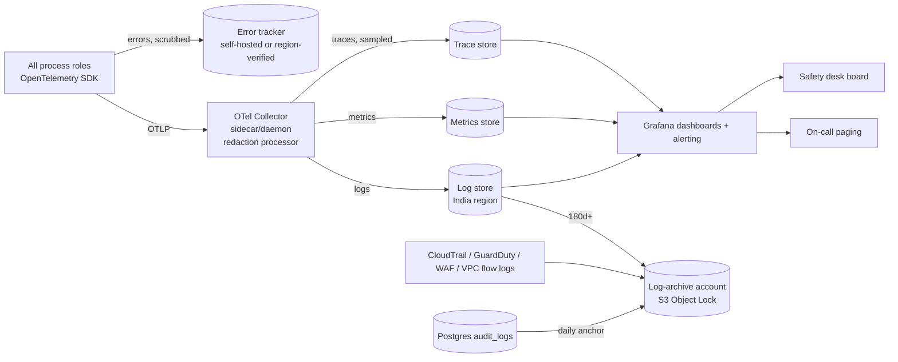

# Phase 1 · 11 — Observability, SLOs & Detection

> Status: **DRAFT for founder review** · Date: 2026-10-08
> Authoritative logs are stored **in India** (ap-south-1) and kept for **≥ 180 days** (CERT-In Directions 2022 ⚖️). Third-party observability tools receive only scrubbed telemetry.

---

## 1. Telemetry architecture



**Redaction happens twice:** (1) in-process, via the **allowlist logger** (only declared fields of declared types can be logged), and (2) in the collector, via a regex/PII processor as a safety net (phone patterns, 6-digit codes adjacent to "otp", JWT patterns, IFSC/account patterns). Hits in (2) raise a `pii_leak_detected` alert, because they mean (1) failed.

---

## 2. Structured logging

Format: JSON, one event per line.

```json
{ "ts": "2026-10-08T10:15:02.123Z", "level": "info", "svc": "api", "env": "prod", "ver": "2026.10.08-3f2a1c",
  "event": "visit.arrived", "module": "jobs",
  "request_id": "…", "trace_id": "…", "span_id": "…", "correlation_id": "…",
  "actor_type": "TECHNICIAN", "actor_ref": "u_7c1e…(hashed)", "city": "NSK",
  "visit_id": "…", "job_ref": "J-7K3P9QX", "outcome": "SUCCESS", "duration_ms": 41 }
```

- IDs (UUIDs, job refs) **may** be logged. They aren't PII by themselves, and access to logs is restricted.
- `actor_ref` is a keyed hash of the user ID (rotatable), so log readers can't trivially join to the users table without access.
- Levels: `error` (actionable), `warn` (degraded), `info` (business events, request summaries), `debug` (off in prod; sampling-only on demand, still allowlisted).
- Request logs: method, route template (`/v1/customer/jobs/:id`), status, latency, sizes, client version, rate-limit class, **no bodies, no query strings with values** (route params are templated).

### 2.1 Must NEVER appear in logs, traces, metrics labels, error reports or analytics

| Category | Examples |
|---|---|
| Authentication secrets | OTP codes, IVR PINs, app PINs, refresh tokens, access tokens (full or partial beyond a 6-char fingerprint), session IDs/cookies, WebAuthn assertions, API keys, provider secrets, webhook signatures, KMS plaintext keys, peppers |
| Passwords | Any (break-glass, provider consoles) |
| Personal identifiers | Phone numbers (log `phone_bidx` fingerprint or last 2 digits only), names, email addresses, full addresses, landmarks, access notes, geo coordinates (log locality ID instead) |
| Identity documents | Document numbers, images, BGV report contents, Aadhaar data of any kind |
| Financial | Bank account numbers, UPI VPAs (log masked `••1234`), card data (never received), PA secrets |
| Sensitive attributes | Gender, health/safety incident descriptions, investigation notes, complaint text, problem descriptions, ratings comments |
| Content | Request/response bodies, uploaded file contents, audio, transcripts, AI prompts/responses (these live only in the restricted `ai_requests` store) |
| Customer codes | Start/completion codes |

Enforcement: allowlist logger (typed log schemas per event) + collector redaction + **CI test that runs the full E2E suite with canary PII values and fails if any canary appears in captured logs/traces/errors** ([13 §6](13-testing-strategy.md)).

---

## 3. Metrics

Naming: `app_<module>_<metric>_<unit>`. Labels are bounded (city, channel, status, route template). **Never user IDs as labels.**

| Area | Key metrics |
|---|---|
| HTTP (RED) | `http_requests_total{route,status,role}`, `http_request_duration_seconds` (histogram), `http_rate_limited_total{class}` |
| Booking funnel | `app_jobs_created_total{channel,city}`, `app_jobs_duplicate_warnings_total`, `app_jobs_cancelled_total{stage,initiator}` |
| Matching | `app_matching_time_to_assign_seconds{urgency,city}`, `app_matching_offers_per_assignment`, `app_matching_exhausted_total`, `app_matching_parity_ratio{zone,device_mode}`, `app_offer_outcome_total{channel,outcome}` |
| Visits | `app_visit_on_time_ratio`, `app_visit_no_show_total{party}`, `app_code_failures_total{kind}`, `app_presence_overrides_total` |
| Quotes | `app_quote_presented_total`, `app_quote_decision_total{decision,channel}`, `app_quote_time_to_decision_seconds`, `app_quote_deviation_bps` (histogram) |
| Payments | `app_payment_intents_total{status}`, `app_payment_webhook_lag_seconds`, `app_ledger_invariant_failures_total` (must be 0), `app_recon_exceptions_open{category}`, `app_refunds_total{status}`, `app_payouts_total{status}` |
| Voice | `app_ivr_step_latency_seconds`, `app_calls_total{purpose,outcome,provider}`, `app_ivr_task_success_ratio{flow}`, `app_ivr_input_errors_total{node}`, `app_ivr_pin_failures_total`, `app_call_cost_paise_total{purpose}` |
| Comms | `app_notifications_total{channel,status}`, `app_otp_sent_total`, `app_otp_conversion_ratio`, `app_fallback_used_total{from,to}` |
| Safety | `app_sos_raised_total{channel}`, `app_sos_ack_seconds` |
| Platform | `app_outbox_lag_seconds`, `app_queue_depth{job}`, `app_queue_job_failures_total{job}`, `app_dead_letters_open`, `app_timer_sweeper_recovered_total` (should be ~0), `app_circuit_state{provider}` |
| DB | connections per role, lock waits, replication lag, slow queries (pg_stat_statements export), partition headroom |
| Security | `app_auth_failures_total{reason}`, `app_refresh_reuse_total`, `app_authz_denied_total{module,reason}`, `app_pii_reveals_total{role}`, `app_webhook_signature_failures_total{provider}`, `app_integrity_failures_total` |

---

## 4. Tracing

- OpenTelemetry across: HTTP handler → application service → repository (SQL spans with statement **templates**, no parameters) → outbox → queue job → provider adapter.
- Context propagated through outbox events (`correlation_id`, `causation_id`, and W3C trace context stored in event metadata). A booking can be followed from tap → matching → IVR call → acceptance.
- Sampling: 100% for errors and slow requests (tail-based at the collector), 10% baseline, 100% for payment and IVR flows (low volume, high value).

---

## 5. SLOs & error budgets (V1, monthly)

| SLO | SLI | Target | Error budget (30 d) |
|---|---|---|---|
| Booking API availability | successful (non-5xx) `POST /customer/jobs` + `GET /customer/jobs/*` | 99.9% | 43 min |
| Technician API availability | non-5xx on `/v1/technician/*` | 99.9% | 43 min |
| **Voice webhook path** | IVR step responses delivered < 2 s and non-error | **99.95%** | 21.6 min |
| IVR step latency | p95 < 800 ms | 99% of 5-min windows | — |
| Offer dispatch latency | match decision → push sent or call initiated | 95% < 10 s | — |
| Quote approval propagation | `QuoteApproved` → technician notified | p95 < 5 s | — |
| Payment webhook processing | received → ledger posted | 99% < 60 s | — |
| Outbox lag | commit → relayed | p99 < 5 s | — |
| SOS alerting (engineering) | SOS raised → pager + board alert | 100% < 10 s (any miss = SEV1 review) | 0 |
| SOS human acknowledgement (operational) | alert → safety desk ack | 95% < 2 min | tracked by ops |
| Payout execution | approved payouts submitted the same day | 99.5% | — |
| Ledger correctness | invariant violations | **0** | 0 (any = SEV2) |

**Error-budget policy:** budget > 50% consumed mid-month → reliability work prioritised in the next sprint. Budget exhausted → feature releases frozen for that surface (security fixes excepted) until a review is done. The voice and SOS paths have the strictest policy.

---

## 6. Alerts (initial)

Alerting is on **SLO burn rates** (multi-window: 1 h/5 min fast burn, 6 h/30 min slow burn) plus specific conditions:

| Alert | Severity | Route |
|---|---|---|
| SOS raised (any channel) | P1 (business) | Safety desk board + phones (not engineering) |
| SOS alert pipeline failure / SOS ack > 2 min | SEV1 | Engineering on-call + safety lead |
| Voice path error budget fast burn | SEV1 | Eng on-call |
| Booking/technician API fast burn | SEV2 | Eng on-call |
| Ledger invariant failure | SEV2 | Eng + finance. Payout batches auto-blocked |
| Payment amount mismatch / SUSPENSE posting | SEV2 | Eng + finance |
| Webhook signature failures spike | SEV2 (security) | Security + eng |
| OTP send anomaly (volume 3σ / conversion < x%) | SEV2 (security/cost) | Security + eng. Auto bot-gate |
| Refresh-token reuse spike | SEV2 (security) | Security |
| Admin PII reveal anomaly (> N/h per admin, off-hours) | SEV3 (security) | Security lead |
| Break-glass activation | SEV1 (security) | All founders + security |
| Telephony circuit open | SEV2 | Eng on-call + ops (manual dispatch SOP) |
| Matching parity < 0.85 (3 days) | SEV4 (product) | City manager |
| Visits UNFULFILLED > threshold/hour | SEV3 (ops) | Dispatch lead |
| Outbox lag > 30 s / dead letters > 0 (critical consumers) | SEV2/SEV3 | Eng |
| Timer sweeper recovering many timers | SEV3 | Eng (timers being lost) |
| `pii_leak_detected` from the collector | SEV2 (privacy) | Security + DPO |
| DB replication lag / storage / connection saturation | SEV2 | Eng |
| Certificate expiry < 21 d, secret rotation overdue | SEV3 | Eng |

Every alert links to a **runbook**. Alerts without runbooks aren't allowed in production.

---

## 7. Dashboards

1. **City live ops** (dispatch): open visits by state and SLA, unfulfilled, offers in flight by channel, technicians online/checked-in by zone (counts, not identities), SOS panel.
2. **Customer journey funnel:** landing → booking → assigned → arrived → quote → approved → completed → paid → rated, by city/channel.
3. **Technician health:** parity ratios, earnings distribution (anonymised percentiles), unreachable rates, IVR task success, payout status.
4. **Voice:** calls by purpose/outcome/provider, step latency, node error heatmap, cost per job.
5. **Money:** captures, settlements, refunds, chargebacks, recon exceptions, cash held aging, payout batches.
6. **Platform:** RED per role, DB, queue, outbox, circuit breakers, error budget burn.
7. **Security:** auth failures, OTP volumes/conversion, authz denials by module, PII reveals, webhook signature failures, WAF blocks, GuardDuty findings.

---

## 8. Audit logs (distinct from operational logs)

- Stored in `compliance.audit_logs` (DB, append-only, hash-chained per monthly partition): `row_hash = SHA-256(prev_hash ‖ canonical(row))`.
- **Daily anchor:** the last hash of each partition is written to the WORM `audit-archive` bucket (Object Lock compliance mode) and to a security channel message. Tampering with history breaks the chain at the next verification.
- Verification job (daily): recompute chains for the last 2 days + a random 1% sample of older partitions → alert on mismatch.
- **What's audited:** auth events, all admin actions, PII reveals, disclosure events (separate table), approvals, state transitions by humans, config/pricing/rules/matching changes, role grants, payout-method changes, refunds, payouts, data-rights actions, break-glass, retention runs, exports.
- Access: auditor + security admin (read). City managers read their city's operational audit entries. **Audit reads are themselves audited.**
- Retention: 1 year hot (DB) → archived to WORM until 8 years (⚖️ confirm).

---

## 9. Incident detection (security & fraud signals)

| Signal | Source | Response |
|---|---|---|
| One IP/device touching many accounts | auth logs | bot-gate, block, review |
| Technician fetching many visits/jobs not assigned | authz denials | lock session, investigate (BOLA probe) |
| Same bank account/UPI across technicians | `payout_methods.account_bidx` | fraud case, hold activation |
| Payout-method change → payout within cooling-off attempt | workforce/payments | blocked by design + alert |
| New device + payout method + high balance | identity/payments | hold + agent verification call |
| Cash denial rate per technician | payments/trust | review |
| Quote deviation outliers per technician | diagnosis | coaching/audit |
| Rating bursts / reciprocal rating patterns | trust | exclude from aggregates, review |
| Start-code entered before ETA / impossible travel | jobs | review |
| pHash duplicates across jobs | files | review |
| OTP volume anomalies | comms | auto bot-gate |
| Admin reveal anomalies | backoffice | security review |
| GuardDuty / IAM anomalies / CloudTrail root usage | AWS | SEV1 security |

Signals create `trust.fraud_signals` rows. Automated actions are limited to **protective holds** (pause a payout method activation, bot-gate, session lock). Sanctions are always human decisions.
