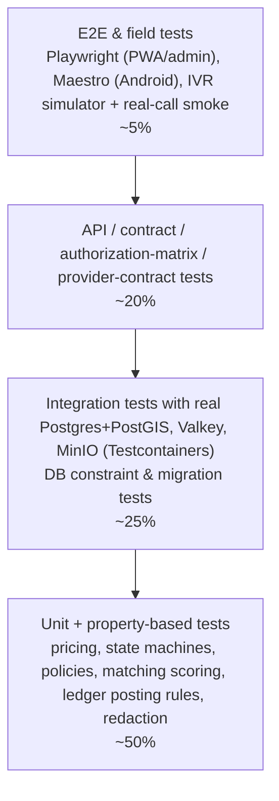

# Phase 1 · 13 — Testing Strategy

> Status: **DRAFT for founder review** · Date: 2026-10-08
> Rule: **every business invariant (INV-xx, L-xx) and every authorization-matrix cell has an automated test.** A phase is not done until its tests are green in CI.

---

## 1. Testing pyramid

Plus cross-cutting suites that don't fit the pyramid: **security**, **load**, **failure/chaos**, **accessibility**, **localisation**, **low-end device**, **offline/network**, **telephony field tests**.

---

## 2. Test types, tools and gates

| Suite | Scope | Tools (proposed) | Runs | Gate |
|---|---|---|---|---|
| Unit | Pure domain logic | Vitest | every PR | required; coverage ≥ 90% on `pricing`, `jobs` state machines, `diagnosis` quote rules, `payments` posting rules, `policy` modules, redaction |
| Property-based | Pricing totals, rounding/splits, state machines, ledger postings | fast-check | every PR | required |
| Integration | Module + DB + queue + outbox | Testcontainers (Postgres 17+PostGIS, Valkey, MinIO) | every PR | required |
| Database | Constraints, triggers, grants, partitions, migrations up on a realistic dataset | SQL-level tests (pgTAP or TS harness), `squawk` | every PR touching `db/` | required |
| Architecture fitness | Module import rules, cross-schema query detection, TCP allowlist | dependency-cruiser, query-tag analyzer | every PR | required |
| API/contract | OpenAPI conformance, error model, idempotency semantics, pagination, strictness | Supertest + schema validators; Schemathesis fuzzing (nightly) | PR / nightly | required |
| Authorization matrix | Every endpoint × actor × in/out-of-scope object | generated from the policy registry + 05 §11 | every PR | required |
| Provider contract | PA, telephony, SMS, WhatsApp, maps, KYC adapters vs sandboxes + recorded fixtures | adapter test kits | nightly + before release | required for release |
| E2E | Thin-slice journeys across PWA, app, IVR simulator, admin | Playwright, Maestro, IVR simulator | nightly + pre-release | required for release |
| Security | SAST, SCA, secrets, IaC, image scans, DAST, abuse suite (§5) | Semgrep, OSV-Scanner/Dependabot, gitleaks, Trivy/Checkov, OWASP ZAP | PR (static), nightly (DAST) | high/critical block |
| Mobile security | MASVS checks, storage, logs, backup flags | MobSF + manual | per app release | required |
| Load | Booking bursts, matching cascades, webhook storms, IVR concurrency, payout batch | k6 | pre-pilot, per major release | SLOs met at 5× pilot peak |
| Failure/chaos | Provider outages, DB failover, Valkey loss, duplicate/out-of-order webhooks, worker crash mid-cascade | toxiproxy, fault-injection flags, game days | weekly in staging, quarterly game day | required pre-pilot |
| Accessibility | WCAG 2.2 AA (automated + manual TalkBack), text scaling 200% | axe-core, Lighthouse CI, manual | PR (auto), per phase (manual) | required |
| Localisation | Missing keys, truncation, Indic rendering, number/currency formats, IVR prompt completeness per locale | pseudo-locale builds, catalog completeness checks, native review | PR (auto), per release (manual) | required |
| Low-end device | Cold start, memory, APK size, jank on 2–3 GB devices (Android 8–14) | device lab (≥ 4 real devices), Firebase Test Lab | per app release | budgets in §9 (≤ 4 s cold start, ≤ 30 MB APK) |
| Offline / network | 2G/3G throttling, packet loss, airplane-mode transitions, replay ordering | network conditioner, Android emulator profiles | per app release | required |
| Telephony | Flow-definition tests, simulator E2E, real-call smoke on staging numbers, field usability | IVR simulator, scheduled real calls | PR (flows), nightly (smoke), pre-launch (field) | required |
| Privacy | Canary-PII leak scan of logs/traces/errors, retention jobs, erasure completeness | custom harness | nightly | required |

---

## 3. Critical business invariants: automated tests

| Invariant | Test(s) |
|---|---|
| Customer cannot approve someone else's quote (INV-08) | API: customer B approves A's version → 404. Signed link for A used with an OTP to B's number → impossible (OTP goes to the job number). Property: random actor/job pairs |
| Technician cannot access another technician's job (INV-12/17) | Matrix: technician B GET/POST on A's visit → 404. After release, A loses access. After the window closes, the address is absent |
| Technician cannot change approved prices (INV-05) | API: PUT diagnosis after submit → 409. Direct SQL UPDATE on `quote_items` as `app_*` → permission denied. Trigger test on `quote_versions` columns |
| Invoice cannot differ from the approved quote (INV-09/10) | Property: for random item sets, usage ≤ quoted, bill ≤ approved + policy fees. DB check on invoice/bill consistency. Attempted UPDATE of an invoice → denied |
| Refund cannot exceed the collected amount (INV-12) | Concurrency test: 10 parallel partial refunds summing > captured → only those within the limit succeed. DB CHECK |
| Ledger must remain balanced (INV-11, L1–L10) | Unbalanced insert → transaction aborts (deferred trigger). Property: every posting rule balances for random inputs. Nightly invariant job test |
| Payout method change triggers security controls (INV-26) | Add method → step-up required, cooling-off set, notifications sent (3 channels), payout during cooling-off goes to the previous method / is held, security event emitted. Agent-initiated → approval request created |
| Admin cannot approve their own high-risk change (INV-19) | Same admin requests + approves → 403 + DB CHECK violation if bypassed. Grants: grantee can't approve own grant |
| One active assignment per visit (INV-01) | 50 concurrent accepts of a wave → exactly one assignment. Unique index violation path tested |
| Technician capacity (INV-03) | Concurrent accepts for overlapping visits → ≤ capacity |
| Presence proof required (INV-14/15) | Arrive without code → 400. 5 wrong codes → locked. Override needs an approval request |
| Repair requires approved quote (INV-04) | Complete a repair visit with RO in CHANGE_PENDING → 409. Attach same-visit repair without approval → impossible |
| Only latest version approvable (INV-06) | Approve v1 after v2 presented → 409 QUOTE_CHANGED. Hash mismatch → 409 |
| Price snapshot immutability (INV-21) | Activate a new rate card after quote creation → quote unchanged |
| Disclosure window (INV-17) | Time-travel tests: before window → no address. During → address + disclosure_event. After → none. IVR playback outside window → refused |
| Cash equals amount due (INV-24) | Record a different amount → 422. Customer denies → dispute created |
| Diagnosis payout regardless of outcome (INV-23) | Reject quote → technician payable credited once (idempotent on event replays) |
| Gender never in scoring (INV-20) | Matching feature allowlist test: scoring function signature has no attribute inputs. Mutation test (changing gender doesn't change scores/ranks) |
| No wallet (INV-28) | Account-type allowlist rejects any stored-value subtype |
| Idempotent booking | 5 identical POSTs with the same key → 1 job, identical responses. Different keys, same `clientRequestId` → 1 job |
| Durable timers | Kill the worker after offer creation → restart → offer expires on time (± sweeper interval). Missed timer recovered by the sweeper |

---

## 4. Authorization matrix tests

- The policy registry exports every endpoint with its declared policy. CI fails if an endpoint has no policy (default deny).
- Generator builds cases from [05 §11](05-auth-authorization.md#11-authorization-matrix-v1): for each (endpoint, actor role) → (a) an in-scope object expecting success, (b) an out-of-scope object (other customer / other technician / other city / unlinked agent) expecting 404/403, (c) wrong state expecting 409.
- Fixtures: two cities, two customers, three technicians (app, IVR, unlinked), one agent, every admin role per city.
- Admin: each role × each admin endpoint × own city / other city.
- Expected count: several thousand cases, parallelised (< 5 min).

---

## 5. Security test cases (abuse catalogue; each is an automated test unless marked manual)

| # | Case | Expected |
|---|---|---|
| ST-01 | Enumerate `/customer/jobs/{id}` with random/foreign UUIDv7s | 404, rate-limited, denial metric |
| ST-02 | Technician requests the visit address before acceptance / after the window | address fields absent |
| ST-03 | Offer accept after expiry; accept someone else's offer | 409 / 404 |
| ST-04 | Mass assignment: `status`, `totalPayable`, `technicianId`, `role`, `customerVerified` in bodies | 400 unknown field |
| ST-05 | Modify quote items via API after PRESENTED | 409. SQL-level denied |
| ST-06 | Approve with a stale content hash | 409 QUOTE_CHANGED |
| ST-07 | Replay an approval request with the same Idempotency-Key and different body | 422 |
| ST-08 | OTP brute force (6 attempts); OTP reuse; expired OTP | generic failure; challenge invalidated |
| ST-09 | OTP flood from one IP / many phones | limits + breaker + bot-gate |
| ST-10 | Refresh token reuse | family revoked, 401, security event |
| ST-11 | JWT `alg=none`, HS256 with public key, wrong `aud`, expired | 401 |
| ST-12 | CSRF on PWA mutations without token / wrong Origin | 403 |
| ST-13 | Stored XSS payloads in problem text, complaint text, names → render in PWA/admin | inert text. No CSP violation |
| ST-14 | SSRF payloads in any string field (`http://169.254.169.254`) | never fetched. Egress proxy denial if attempted |
| ST-15 | Upload EICAR, polyglot JPEG/HTML, SVG with script, zip bomb, 50 MB file, mismatched MIME, EXIF GPS image | rejected / stripped |
| ST-16 | Signed URL reuse after expiry; URL for another user's file | 403 |
| ST-17 | Forged payment webhook (bad signature); valid signature but amount mismatch vs PA fetch | rejected / SUSPENSE + alert |
| ST-18 | Duplicate and out-of-order webhooks (captured before authorized) | single posting, correct final state |
| ST-19 | Parallel refunds exceeding the captured amount | capped |
| ST-20 | Payout method change then immediate payout | payout to the old method / held |
| ST-21 | Admin self-approval; approve with modified payload | 403 / hash mismatch |
| ST-22 | Admin from city A accessing city B job | 404 |
| ST-23 | PII reveal without reason; reveal over the hourly limit | 400 / 429 + alert |
| ST-24 | IVR: caller-ID-only attempt to hear an address; 5 wrong PINs; DTMF injection via forged flow webhook | PIN prompt; lockout; signature rejection |
| ST-25 | Start-code brute force via app and IVR | lock after 5 + ops alert |
| ST-26 | Prompt injection payloads in problem text/voice transcript | output within enum. No state change |
| ST-27 | Rate-limit bypass via `X-Forwarded-For` spoofing | ignored (trusted proxy only) |
| ST-28 | Access a deleted user's data with an old token | 401. PII unreadable |
| ST-29 | GraphQL/other unexpected routes, HTTP verb tampering, path traversal in file keys | 404/405 |
| ST-30 | Logs/traces/errors after the full E2E with canary PII/OTP/tokens | zero canary hits |
| ST-31 (manual) | External penetration test (web, API, Android, IVR) | no open high/critical before pilot |
| ST-32 (manual) | Social-engineering drill on support (change payout / reveal address) | SOP followed |

---

## 6. Payment tests
- PA sandbox flows: success, failure, pending → success late, pending → expired, double payment, refund full/partial, refund failure, chargeback won/lost (simulated), payout success/failure/reversal.
- Reconciliation tests with synthetic settlement files covering every exception category.
- Ledger property tests: random sequences of business events → balances satisfy L1–L10. Replays are idempotent.

## 7. Concurrency tests
- Offer acceptance races (wave, cascade with late IVR accept).
- Quote approval racing a new version presentation.
- Cancellation racing an arrival.
- Refunds/payout batch build racing a cash confirmation.
- Optimistic-lock conflicts on profile/address edits.
- Lock-ordering deadlock detection: randomised interleavings in integration tests with `deadlock_timeout` monitoring.

## 8. Telephony & IVR tests
- **Flow definition tests:** every node, every edge, invalid/timeout paths, max repeats, call drop at each node (state assertions after reconnect).
- **Simulator E2E:** offer → accept → hotline address playback (PIN) → arrive (code) → diagnosis desk bridge → complete → cash → customer cash confirmation, for each supported locale.
- **Provider failover test:** primary breaker open → secondary used. Both down → manual dispatch path.
- **Real-call smoke** (staging numbers, nightly): place an offer call to a test handset (automated answering device), DTMF accept, verify DB state.
- **Synthetic SOS test** (production, hourly): call the SOS line from a monitored test number → verify the incident path in a test-flagged mode, and verify provider static fallback monthly.
- **Field usability** (pre-launch gate): ≥ 15 basic-phone technicians, ≥ 90% unaided task success, measured per node drop-off.

## 9. Low-end device, offline & network
- Device lab: at least one each of Android 8/10/12/14 on 2–3 GB RAM devices popular in the pilot region.
- Budgets: cold start ≤ 4 s, offer screen interactive ≤ 1 s after push, APK ≤ 30 MB, memory ≤ 150 MB, works at 200% font scale.
- Offline: accept offline → queued → rejected later with an explanation. Arrive offline → replay ordering. Photos uploaded in the background with resume. Local purge at window close.
- Network: 2G (250 kbps / 800 ms RTT), lossy 3G, captive portals. The PWA works with the cached shell and shows clear retry states.

## 10. Accessibility & localisation
- Automated axe on every page (0 serious/critical violations).
- Manual TalkBack scripts for booking, tracking, approval, payment, SOS (customer) and offer/accept/arrive/complete/SOS (technician).
- Localisation: 100% key coverage per supported locale, Indic font rendering checks, IVR prompt completeness per flow and locale, number/amount reading in TTS fallback.
- **Moderated usability tests** with target users (≥ 10 customers incl. ≥ 3 aged 55+, ≥ 8 technicians incl. basic-phone) at the end of Phases 5/6.

## 11. Load & failure targets (pre-pilot)
- 5× expected pilot peak: 50 bookings/min burst, 200 concurrent IVR calls, 1,000 webhook events/min, payout batch of 2,000 technicians in < 10 min.
- Failure drills: RDS failover during booking (no duplicates, clients retry), Valkey down (rate limiter fallback, IVR continuity), PA timeout storm (circuit opens, pay-later path), telephony outage (failover), worker crash mid-cascade (sweeper recovery), clock skew on clients.

## 12. Catalog coverage tests (catalog revision, ADR-020)
- E2E thin-slice scenarios cover **three categories**: Plumbing, Electrical and a **non-AC appliance (Refrigerator not cooling)**. The AC two-visit scenario is kept as a regression test.
- Config tests: enabling/disabling a service type for a city (via `service_rules.enabled`) changes catalog API output, booking validation and matching **without a code change or deploy**.
- Matching tests: a REFRIGERATOR visit never offers to RO-only or AC-only technicians. A repair requiring `GAS_REFRIGERATION` excludes refrigerator technicians without that specialization. `can_diagnose`/`can_repair` are respected per service type.
- IVR tests: keypad repair codes resolve within the visit's service type. The same digits under a different service type map to a different item.
- Seed/fixture data includes at least 3 appliance service types with distinct specializations, so tests don't accidentally encode AC-only assumptions.

## 13. Test data & environments
- **No production PII in any non-production environment**, ever. Synthetic data generators produce realistic Indian names/localities (from public, non-personal datasets) and fake numbers in reserved test ranges.
- Provider sandboxes only in dev/test/staging. Fixed-code OTP test numbers are allowed only where `env != prod` (startup assertion).
- Seeded scenario packs for the thin slice (cities, zones, localities, catalog, rate card, technicians of each device mode).
