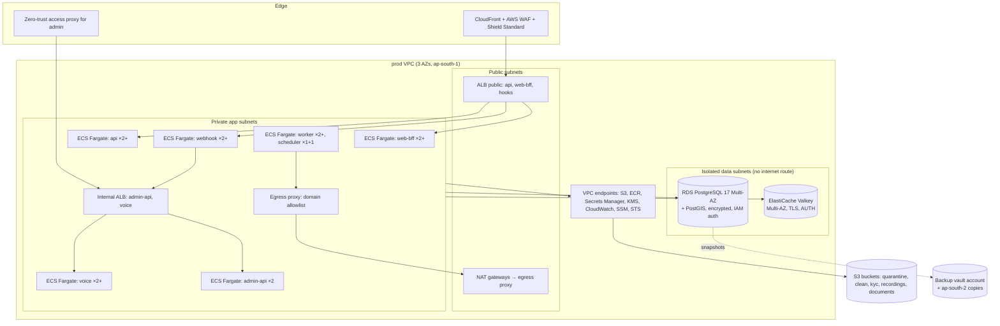

# Phase 1 · 14 — Deployment, Infrastructure & Operations

> Status: **DRAFT for founder review** · Date: 2026-10-08
> No secrets in source control. Everything is defined in Infrastructure as Code. Production is reachable for change only through the pipeline (or audited break-glass).

---

## 1. Environments

| Env | Purpose | Data | Providers | Who deploys |
|---|---|---|---|---|
| **Development** (`local` + shared `dev`) | Local: Docker Compose (Postgres+PostGIS, Valkey, MinIO, provider fakes, IVR simulator). Shared `dev`: continuous integration of `main` | Synthetic | Fakes / sandboxes | Auto on merge |
| **Test** (`test`) | QA automation, E2E, device-lab runs, IVR simulator + test phone numbers, chaos experiments | Synthetic scenario packs (reset nightly) | Sandboxes | Auto, promoted from `dev` by the pipeline after checks |
| **Staging** (`staging`) | Production-like release candidates. Same Terraform modules and sizes scaled down. Load tests, DAST, pen test target, DR drills | Synthetic (production-shaped volumes) | Sandboxes + real test numbers (telephony/SMS on test DLT templates) | Pipeline promotion of the **same image digest** |
| **Production** (`prod`) | Live | Real | Live | Pipeline with 2-person approval |

Phase 0 described dev/staging/prod; the separate **Test** environment is added per the founder's brief (README §6, C-08).

---

## 2. AWS architecture (ap-south-1 Mumbai primary)

### 2.1 Account structure (AWS Organizations)
```
Root (no workloads; SCPs)
├── Security OU: security-tooling (GuardDuty/Security Hub admin), log-archive (CloudTrail, Config, VPC flow, WAF, app logs; Object Lock)
├── Infrastructure OU: shared-services (ECR, CI OIDC roles, egress proxy AMIs), backup-vault (cross-account, vault lock)
├── Workloads OU: dev, test, staging, prod (one account each)
└── Sandbox OU: individual engineer sandboxes (no data, budget-capped)
```
**SCPs:** deny leaving the org; deny disabling CloudTrail/GuardDuty/Config; deny regions other than ap-south-1/ap-south-2 (plus global services); deny root user actions; deny public S3 ACLs; require IMDSv2; deny creating IAM users with access keys in workload accounts.

### 2.2 Production topology



| Component | Choice | Notes |
|---|---|---|
| Compute | ECS on Fargate (ARM64/Graviton) | One service per process role. Min 2 tasks for public roles across AZs. Read-only root filesystem. Non-root user. No SSH. |
| Load balancing | Public ALB (via CloudFront only, prefix-list restricted) + internal ALB | TLS 1.2+. Security groups per role. |
| Database | RDS PostgreSQL 17, Multi-AZ, gp3, Performance Insights, pgaudit | Parameter group: `log_min_duration_statement`, `idle_in_transaction_session_timeout`, `statement_timeout` per role. |
| Cache | ElastiCache Valkey, Multi-AZ, encryption in transit/at rest | Ephemeral only. |
| Storage | S3 with SSE-KMS, Block Public Access, VPC endpoint policies | See [10](10-files-and-data.md). |
| Egress | Squid/Envoy egress proxy with a domain allowlist (PA, telephony, SMS, WhatsApp, FCM, maps, KYC, AI, IdP) | SSRF containment. Logs to log-archive. |
| DNS/TLS | Route 53, ACM | Brand-neutral internal names. Public domains from brand config. |
| Admin access | Cloudflare Access or AWS Verified Access in front of the internal ALB | Device posture + IdP. |
| Human infra access | SSM Session Manager (no bastion SSH), JIT via IAM Identity Center permission sets, session recording to log-archive | No standing prod access. |

### 2.3 Encryption & keys
- KMS customer-managed keys per data class: `db`, `pii-field` (envelope for app-level encryption), `files-general`, `files-kyc`, `recordings`, `logs`, `backup`, `jwt-signing` (asymmetric ECC_NIST_P256), `audit`.
- Key policies separate key administrators from key users. Automatic rotation for symmetric keys. JWT key rotation every 90 days with overlap (`kid`).
- TLS everywhere, including ALB → tasks (re-encrypt), tasks → RDS (`sslmode=verify-full`) and tasks → Valkey.

### 2.4 Secrets
- AWS Secrets Manager per environment. Injected into ECS tasks as secrets (never baked into images or task definitions in plaintext).
- RDS credentials rotated automatically (or IAM DB auth). Provider API keys rotated every 90 days and on staff exit (runbook per provider).
- **gitleaks** pre-commit and CI (blocking), GitHub push protection, Trivy secret scanning of images.
- Mobile/PWA: only publishable keys, restricted by app signature/referrer.
- Developers never hold production secrets. Break-glass only.

### 2.5 IAM
- One task role per process role with least privilege (e.g., `webhook` can write only to raw-event tables via its DB role and has no S3 access. `worker-kyc` alone can decrypt `files-kyc`).
- CI: GitHub OIDC → per-environment deploy roles with permissions limited to ECS deploy, ECR push and specific Terraform state. Production roles are assumable only from protected environments.
- IAM Access Analyzer + quarterly review of unused permissions.

---

## 3. CI/CD pipeline

```mermaid
flowchart LR
  PR[Pull request] --> CHK[lint · typecheck · unit · property · integration · DB/migration lint · arch fitness · authZ matrix · SAST · SCA · secrets · IaC scan · bundle budgets]
  CHK -->|2 reviews for sensitive paths| MERGE[merge to main]
  MERGE --> BUILD[build image once → SBOM → sign (cosign) → Trivy scan → push ECR (immutable tags)]
  BUILD --> DEV[deploy dev → smoke]
  DEV --> TEST[deploy test → E2E · IVR simulator · nightly DAST]
  TEST --> STG[deploy staging (same digest) → E2E · load (scheduled) · ZAP baseline]
  STG -->|2-person approval · change ticket| PROD[prod: migrations task → rolling/blue-green per role → canary checks → full]
  PROD --> VERIFY[post-deploy SLO watch 30 min → auto-rollback on burn]
```

| Topic | Policy |
|---|---|
| Branching | Trunk-based. Short-lived branches. Protected `main` (no direct pushes, signed commits, required checks, CODEOWNERS). |
| Reviews | 1 reviewer default. **2 reviewers** for `identity`, `backoffice`, `payments`, `ledger`, `pricing`, `compliance`, `voice` flows, `db/migrations`, IaC, CI config. |
| Build | Reproducible builds. `npm ci` with lockfile. `--ignore-scripts` + allowlist. Dependency provenance (npm audit signatures). SBOM (CycloneDX) per image. Images signed with cosign. **ECS has no native admission control**, so enforcement is: the pipeline verifies cosign signatures before deploy + only the pipeline deploy role may register task definitions/update services (IAM) + digests pinned + an EventBridge/Config rule alerts on any unsigned/unknown digest (X-26/SR-16). |
| Promotion | **The same image digest** moves dev → test → staging → prod. No rebuilds. |
| Production release | Change ticket + 2-person approval + release notes. Deploy windows avoid peak hours (configurable). Freeze during incidents. |
| Rollout | ECS rolling with minimum healthy 100% / max 200% for public roles. **Blue/green (CodeDeploy)** for `voice` with test traffic (a synthetic IVR call) before shifting. Feature flags for risky features. |
| Rollback | Automatic on health-check failure or SLO fast burn within 30 min. Manual one-click redeploy of the previous digest. **DB rollback = forward fix.** The expand/contract discipline keeps the previous app version compatible with the current schema. |
| Migrations | Separate ECS task with the `migrator` role, run before code deploy. `lock_timeout` 3 s, retries. Destructive steps (contract phase) only in a later release after verification. Migration dry-run on staging with production-shaped data. |
| Mobile | EAS Build → signed with Play App Signing → internal track → closed testing (pilot technicians) → staged rollout 5/20/50/100%. Server-enforced `min_supported_version`. OTA (JS-only) updates signed, staged and kill-switchable. Never ship native permission changes via OTA. |
| Infrastructure | Terraform/OpenTofu in a separate repo/folder with remote state (S3 + DynamoDB lock, encrypted). `plan` in PR (Checkov/tfsec scan), `apply` via pipeline with approval. Drift detection nightly. |

---

## 4. Security operations

| Area | Practice |
|---|---|
| Container security | Distroless/minimal base images, pinned digests, non-root, read-only FS, no shell in prod images, Trivy scan (block critical/high with known fixes), weekly rebuilds for base-image patches |
| Dependency scanning | Dependabot/Renovate (grouped weekly), OSV-Scanner in CI. Critical CVE SLA: patch within 48 h if exploitable, 7 days otherwise |
| SAST | Semgrep with custom rules (raw SQL concatenation, `dangerouslySetInnerHTML`, logging of forbidden fields, missing policy decorators, `Math.random` for codes) |
| DAST | OWASP ZAP baseline nightly on test/staging, authenticated scans weekly. External pen test before pilot and annually |
| Vulnerability management | Single tracker. SLAs: critical 7 days, high 30 days, medium 90 days. Exceptions need security sign-off with an expiry |
| Cloud posture | Security Hub (CIS + AWS Foundational), AWS Config conformance packs, GuardDuty (incl. S3, RDS, ECS runtime), IAM Access Analyzer |
| Responsible disclosure | `security.txt`, a disclosure page, triage SLA 72 h. Bug bounty after the pilot |

---

## 5. Backups, PITR & disaster recovery

| Item | Policy |
|---|---|
| RDS | Automated backups + **PITR 35 days**. Daily snapshots copied to the **backup-vault account** (vault lock, compliance mode, 35-day minimum) and to **ap-south-2 (Hyderabad)**. Monthly snapshots retained 12 months (⚖️ align with retention policy; crypto-shredding keeps erased subjects unreadable in old backups). |
| S3 | Versioning. Cross-region replication for `documents` and `audit-archive` to ap-south-2. Uploads (photos) are not replicated (re-creatable or non-critical; retention-bound). |
| Valkey | No backup (ephemeral by design). |
| Config/IaC | Git + Terraform state versioning. |
| Secrets/KMS | Multi-region keys for `backup` and `db` snapshot copies. Secrets replicated to ap-south-2. |
| **Targets (V1)** | **RPO ≤ 5 min** (PITR). **RTO ≤ 4 h** for full-region loss (warm-standby IaC, not hot). In-region AZ failure: RTO ≤ 5 min (Multi-AZ). |
| DR runbook | Declare DR → restore the latest snapshot/PITR into ap-south-2 → Terraform apply the prod stack in ap-south-2 (pre-tested module) → re-point DNS → telephony webhooks updated (pre-configured secondary URLs) → verify with synthetic checks → re-apply the erasure ledger (subjects erased after the snapshot time). |
| **DR tests** | Monthly: restore a random daily snapshot into an isolated restore account and run integrity checks (ledger invariants, row counts, hash chains). **Twice a year:** full regional failover rehearsal in staging. Results recorded with measured RTO/RPO. |

---

## 6. Incident response

- Severity matrix (SEV1–SEV4) and on-call rotation (primary/secondary engineering). A separate **safety desk** rotation handles SOS (an operational function, not engineering).
- **Runbooks:** data breach (suspected/confirmed) · admin compromise · payout fraud · OTP/SMS pumping · telephony outage/takeover · PA outage · DB failover/corruption · ransomware/account compromise · AI provider misbehaviour · PII in logs · region outage.
- **Regulatory clocks** (⚖️ confirm): CERT-In reporting within **6 hours** of noticing a reportable incident. DPDP Rules breach intimation to the Data Protection Board and affected Data Principals without delay, with a detailed report within 72 hours. Payment incidents follow the PA's/RBI-related obligations via the PA. Pre-drafted notices in English + launch languages.
- **Evidence preservation:** CloudTrail/log-archive immutable. Snapshot the affected resources before remediation. Chain of custody. Legal holds on relevant data.
- **Post-incident:** blameless review within 5 working days, action items tracked to closure, threat model updated.
- **Exercises:** tabletop before pilot (the 5 assumed-breach scenarios in [12 §15](12-threat-model.md#15-assumed-breach-scenarios-tabletop-before-launch)), then twice a year. SOS end-to-end drill monthly.

---

## 7. Cost guardrails (pilot)
- AWS Budgets per account with alerts at 50/80/100%. Cost anomaly detection.
- Fargate ARM64. Right-size after 2 weeks of production metrics. Savings plans after 3 months of stable usage.
- Telephony/SMS/WhatsApp/AI spend tracked per job (business metric) with daily caps and alerts.
- Order of magnitude for pilot infrastructure (excl. telephony/SMS/PA/AI usage fees): **roughly USD 1,000–2,500/month** with Multi-AZ RDS, NAT, WAF, observability and four environments (dev/test scaled to zero off-hours). To be validated in Phase 2 with real quotes and startup credits.
