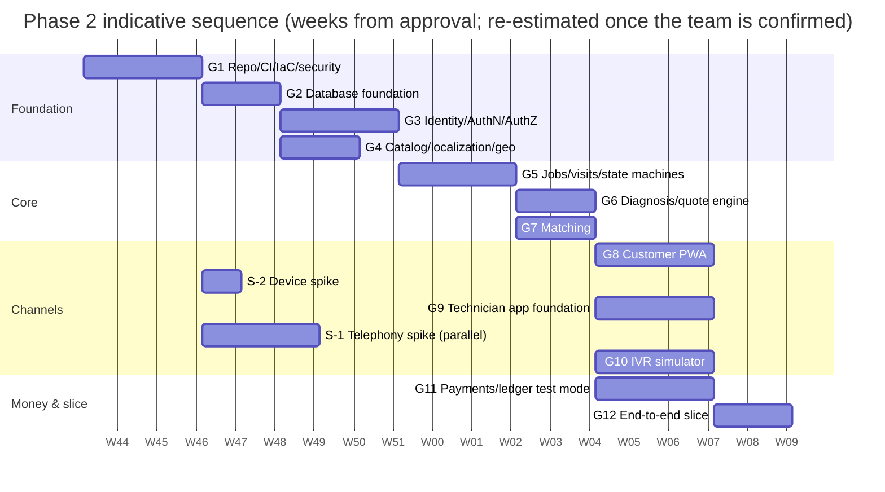

# Phase 2 · 01 — Implementation Plan: Foundation + Thin Vertical Slice

> Status: **DRAFT for founder approval** · Date: 2026-10-08 · **No feature code until this plan is approved.**

---

## 1. Objective
Move from architecture to a **secure, small, working vertical slice**: one production-shaped end-to-end workflow per scenario in [05-first-slice-spec](05-first-slice-spec.md), running in `dev`/`test`/`staging` only. **We are not building the whole marketplace.**

## 2. Non-goals (Phase 2)
No production environment · no real customers, PII, payments, telephony, KYC · no final pricing · no tax logic · no waves · no Care Visit/benefits · no AI beyond flagged category/symptom suggestions and transcription assistance through fake/sandbox providers · no customer native app · no marketing site.

## 3. Engineering rules (from the founder brief, enforced in CI or review)
1. Security first. 2. No secrets in source control. 3. No production credentials in development. 4. No real customer PII in non-production. 5. No real payments. 6. No production telephony. 7. No production KYC. 8. No public S3 buckets. 9. No direct database access from clients. 10. No trust in client-supplied business rules. 11. All state changes server-authorised. 12. All critical mutations idempotent. 13. All critical workflows restart-safe. 14. Every authorization rule tested. 15. Every business invariant tested.

Enforcement mapping: 2/8 → gitleaks, Config rules (Gate 1) · 3/4/6/7 → environment startup assertions + adapter loading rules ([02 §4](02-repository-structure.md#4-configuration--secrets)) · 9 → no DB network path from clients, frontend import rules (B7) · 10/11 → strict DTOs, server pricing, policy registry (B11) · 12 → idempotency metadata (B12) · 13 → durable timers + kill-worker tests · 14 → authZ matrix generator · 15 → INV/L test suites per gate.

## 4. Workstreams and sequencing

Indicative total **≈ 16–20 weeks** with the assumed team (tech lead, 2–3 backend, 1 frontend, 1 mobile, 1 QA/automation, part-time DevOps + designer). The dates are placeholders from an assumed start. **The start date and staffing are founder actions.**

| Workstream | Owner (role) | Gates |
|---|---|---|
| Platform & security | Tech lead + DevOps | 1, 2, 3 |
| Core domain | Backend | 4, 5, 6, 7, 11 |
| Customer experience | Frontend + designer | 8 |
| Technician experience | Mobile + designer | S-2, 9 |
| Voice | Backend (voice) | S-1, 10 |
| Quality | QA/automation | all (matrix, invariants, E2E, device lab) |

## 5. Definition of done (every gate)
Exit criteria met with evidence · errata items for the gate applied to code **and** to the Phase 1 doc (for errata-only items) · threat-model delta reviewed · tests green in CI · no high/critical security findings open · tech-debt register updated · gate review recorded ([03 §14](03-phase-2-gates.md#14-gate-review-template)).

## 6. AI in Phase 2 (strictly limited)
- Allowed: **category suggestion, symptom suggestion, transcription assistance**, all behind flags (default **off**) and the `ai` module's provider port, using a **fake provider** in `dev`/`test`. Any real provider requires SR-15 conditions (India-region/self-hosted for audio, DPA, consent).
- Outputs are closed enums with confidence and are **suggestions only**. Customer/ops confirmation is required.
- AI **may not** set prices, approve quotes, assign penalties, decide disputes, determine safety outcomes, or change any job state.

## 7. Pricing in Phase 2
The pricing engine is **fully configurable**. The Model B and Model C fixture configs exist **only for tests**. Model A isn't approved. Rate-card activation shows simulator-based margin warnings. **No final values in code or migrations.**

## 8. Data & environments
`dev` (shared integration) · `test` (QA, E2E, simulator, chaos) · `staging` (release candidates, provider sandboxes). **No `prod`.** Synthetic data only (generators in `@hsp/testing`). Sandbox credentials only, stored in Secrets Manager.

## 9. Risks during Phase 2 and mitigations
| Risk | Mitigation |
|---|---|
| S-1 fails for all shortlisted providers | Evaluate more providers. Accept an "equivalent mechanism" only with founder sign-off. IVR stays simulator-only and the pilot uses agent-assisted operation |
| S-2 fails (RN performance) | Switch the technician app to Kotlin (ADR-004 fallback). Gate 9 slips ~3 weeks |
| Scope creep toward the full marketplace | The slice spec is the contract. Additions need founder approval |
| Boundary erosion under pressure | Fitness tests are blocking from Gate 1 |
| Legal answers change money flows | Payments stay sandbox-only. The ledger is model-agnostic |
| Telugu content delays | Content owner + native reviewers identified before Gate 8 (founder action) |

## 10. Reporting
Weekly written update (gates, risks, blocked items). Gate review per gate. Founder demo at Gates 3, 8, 10, 12.
